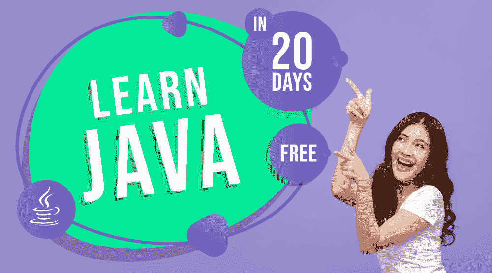

# 20 天内自主学习 Java 免费！

> 原文:[https://www . geesforgeks . org/learn-Java-20 天自主学习-免费/](https://www.geeksforgeeks.org/learn-java-on-your-own-in-20-days-free/)

事实上，JAVA 是 IT 世界中要求最高的编程语言之一。据统计，全球约有 700-800 万 JAVA 开发人员，而且这个数字还在快速增长。不用说，JAVA 在科技市场上有很多职业机会，毫无疑问，在即将到来的时代，这种语言也将保持需求。此外，所有想在编程领域做大的有抱负的开发人员都可以考虑 JAVA。此外，你可以通过遵循相关的途径和真正的努力工作&来有效地学习这种特殊的语言。

在进一步讨论之前，让我们先来看看语言的起源。 [**JAVA**](https://www.geeksforgeeks.org/java/) 由**詹姆斯·高斯林**于 1995 年在*太阳微系统*开发，语言运行在不同的平台上，如 **Windows** 、 **Mac** 、 **Linux** 等。该语言主要用于构建企业级网络应用和安卓应用。此外，与各种其他语言相比，JAVA 开发人员的工资相对较高。在本文中，我们将让您了解在短短 20 天内学习 JAVA 所需遵循的 ***结构化路线图或课程！***

### 1.从基础开始(第 1 天)

无论是 JAVA 还是任何其他编程语言，在进入核心概念之前，您总是需要**理解语言**的本质和基础。你可以从介绍这种语言、它的特点、应用等开始。同时，您还需要知道如何在系统中设置 Java 环境，并且可以考虑创建、编译和执行您的第一个 JAVA 程序。它将帮助你熟悉语言的基本语法和其他方面。您还可以探索几个集成开发环境，如 *Eclipse* 、 *Netbeans* 等。

*   [爪哇简介&其特色](https://www.geeksforgeeks.org/java/)
*   [Java 虚拟机(JVM)](https://www.geeksforgeeks.org/jvm-works-jvm-architecture/)
*   [设置 JAVA 环境](https://www.geeksforgeeks.org/setting-environment-java/)
*   [JAVA 中的 Hello World 程序](https://www.geeksforgeeks.org/beginning-java-programming-with-hello-world-example/)
*   【JAVA 集成开发环境

### 2.学习数据类型、变量和条件语句(第 2-3 天)

一旦你完成了基础知识，现在你需要学习其他几个重要的概念，这些概念可以被认为是在学习任何语言之前的先决条件。你需要知道*如何在 JAVA 中声明变量*、*如何在 JAV* A 中实现条件语句、*修饰符&运算符等。还建议您了解 JAVA 中循环语句的实现。此外，为了更好地理解概念，你可以根据特定主题的相关性**练习几个基本程序**。*

*   [数据类型](https://www.geeksforgeeks.org/data-types-in-java/) | [变量](https://www.geeksforgeeks.org/variables-in-java/)
*   [条件语句](https://www.geeksforgeeks.org/decision-making-javaif-else-switch-break-continue-jump/)
*   [JAVA 中的循环](https://www.geeksforgeeks.org/loops-in-java/)
*   [修饰符](https://www.geeksforgeeks.org/access-and-non-access-modifiers-in-java/) | [操作符](https://www.geeksforgeeks.org/operators-in-java/)
*   程序:[数字交换](https://www.geeksforgeeks.org/java-program-to-swap-two-variables/)、[阶乘](https://www.geeksforgeeks.org/java-program-for-factorial-of-a-number/)、[斐波那契数列](https://www.geeksforgeeks.org/java-program-for-program-for-fibonacci-numbers/)等。

### 3.理解 JAVA 中的数组和字符串操作(第 4-5 天)

好了，现在往前走一步，开始学习 JAVA 中的*数组*、*字符串*等概念。您需要了解如何创建一个数组&来访问它的元素、JAVA 中的字符串以及其他相关概念。同时， **JAVA** 中数组的工作方式与 **C/C++** 不同，因为在 JAVA 中所有数组都是动态分配的，还有各种其他特性。另外，您可以在这里探索一些额外的技巧，如*类型转换*、*变量范围*等。让你的概念更加清晰。

*   [数组](https://www.geeksforgeeks.org/arrays-in-java/) | [字符串](https://www.geeksforgeeks.org/strings-in-java/)
*   [Java 中的数组 vs 数组列表](https://www.geeksforgeeks.org/array-vs-arraylist-in-java/)
*   [变量范围](https://www.geeksforgeeks.org/variable-scope-in-java/)
*   [Java 中的类型转换](https://www.geeksforgeeks.org/type-conversion-java-examples/)
*   [Java 中的 Switch 语句](https://www.geeksforgeeks.org/switch-statement-in-java/)

### 4.熟悉类、对象和方法(第 6-8 天)

看完上面提到的主题，你会有一个像样的基础，这是学习任何编程语言所必需的。现在，你需要理解 JAVA 的基本构造块，即类和对象。你需要彻底理解 JAVA 中的类是什么，如何创建一个对象等等。此外，您需要了解 JAVA 中的方法，它们的意义是什么，以及如何创建和使用它们。您还需要了解构造函数，这是 JAVA 编程的关键部分。

*   [类&对象](https://www.geeksforgeeks.org/classes-objects-java/)
*   [Java 中的方法](https://www.geeksforgeeks.org/methods-in-java/)
*   [方法重载](https://www.geeksforgeeks.org/overloading-in-java/) | [方法重载](https://www.geeksforgeeks.org/overriding-in-java/)
*   [JAVA 中的参数传递](https://www.geeksforgeeks.org/parameter-passing-techniques-in-java-with-examples/)
*   [Java 中的构造函数](https://www.geeksforgeeks.org/constructors-in-java/)

### 5.准备好接受 OOPs 概念(第 9-10 天)

现在，是时候进入 JAVA 编程的核心了–**面向对象编程(OOPs)概念**。JAVA 是一种面向对象的编程语言，基于各种原则工作，如*多态性*、*继承*、*封装*和*抽象*。你需要掌握这些范例来更有效地学习语言。此外，您将能够理解诸如重载、重写等主题。更可信的是，一旦你理解了 OOPs 的概念。

*   [继承](https://www.geeksforgeeks.org/inheritance-in-java/) | [封装](https://www.geeksforgeeks.org/encapsulation-in-java/)
*   [多态性](https://www.geeksforgeeks.org/polymorphism-in-java/) | [运行时多态性](https://www.geeksforgeeks.org/dynamic-method-dispatch-runtime-polymorphism-java/)
*   [抽象](https://www.geeksforgeeks.org/abstraction-in-java-2/)
*   [超级关键词](https://www.geeksforgeeks.org/super-keyword/) | [此关键词](https://www.geeksforgeeks.org/this-reference-in-java/) | [最终关键词](https://www.geeksforgeeks.org/final-keyword-java/)
*   [关联、合成和聚合](https://www.geeksforgeeks.org/association-composition-aggregation-java/)

### 6.了解 JAVA 中的接口和软件包(第 11-13 天)

在浏览了 OOPs 概念之后，现在您需要更深入地了解 JAVA 编程世界。要求你覆盖*接口*、*包*、*抽象类*等主题。确切地说，接口也可以有方法和变量，但是在接口中声明的方法默认是抽象的。另一方面，Java 中的包是封装一组类、子包和接口的过程。在这里，您还可以涵盖其他几个主题，例如 Java 中抽象类和接口的区别、嵌套接口等。

*   [接口](https://www.geeksforgeeks.org/interfaces-in-java/) | [包](https://www.geeksforgeeks.org/packages-in-java/)
*   [嵌套界面](https://www.geeksforgeeks.org/interface-nested-class-another-interface/) | [标记界面](https://www.geeksforgeeks.org/marker-interface-java/)
*   [抽象类](https://www.geeksforgeeks.org/abstract-classes-in-java/)
*   [抽象类&界面](https://www.geeksforgeeks.org/difference-between-abstract-class-and-interface-in-java/)的区别
*   [爪哇。时间](https://www.geeksforgeeks.org/tag/java-time-package/)，[爪哇。郎](https://www.geeksforgeeks.org/java-lang-package-java/)、[爪哇。数学](https://www.geeksforgeeks.org/tag/java-math-package/)等套餐

### 7.浏览异常处理、输入/输出流和多线程概念(第 14-16 天)

现在，是时候理解一些概念了，比如如何处理 Java 中的异常和警告–*异常处理*、程序两个或多个部分的并发执行–*多线程*、JAVA 中的输入输出流–*I/O 流*等等。此外，您需要学习 Java 中的*正则表达式* (Regex)，用于定义可用于搜索、操作和编辑文本的字符串模式。这些概念对于理解 JAVA 的深层功能非常重要，在程序或项目开发中也起着至关重要的作用。

*   [异常处理](https://www.geeksforgeeks.org/exceptions-in-java/)
*   [异常类型](https://www.geeksforgeeks.org/types-of-exception-in-java-with-examples/)
*   [JAVA 中的多线程](https://www.geeksforgeeks.org/multithreading-in-java/)
*   [JAVA 中的正则表达式](https://www.geeksforgeeks.org/regular-expressions-in-java/)
*   [JAVA 中的文件处理](https://www.geeksforgeeks.org/file-handling-in-java-with-crud-operations/)

### 8.了解收集框架、AWT 和 SWING(第 17-20 天)

好的，现在你需要强调你在以上阶段所学的所有概念和理论知识的实现方面。您需要了解集合框架，它定义了几个类和接口来将一组对象表示为一个单元。同时，您还需要熟悉 JAVA 中的抽象窗口工具包(AWT)和 Swing，以便使用图形用户界面(GUI)处理几个小项目和大项目。

*   [Java 中的集合](https://www.geeksforgeeks.org/collections-in-java-2/)
*   [Java 中的泛型](https://www.geeksforgeeks.org/generics-in-java/)
*   [Java Swing |简单计算器](https://www.geeksforgeeks.org/java-swing-simple-calculator/)
*   [Java AWT](https://www.geeksforgeeks.org/java-awt-windowstatelistener/)
*   [JAVA 项目](https://www.geeksforgeeks.org/computer-science-projects/#Java)

因此，这是进入 JAVA 编程世界需要遵循的一个完整的路线图。同时，按照上述阶段，各地有近 **40 个话题**，也就是说你每天只需要**覆盖 2 个话题** *(没那么难！)*在**短短 20 天内覆盖整个课程！！**现在，你还在等什么？**现在就开始学习 JAVA】把你所有的努力和奉献都放在上面，让它得到指挥。**