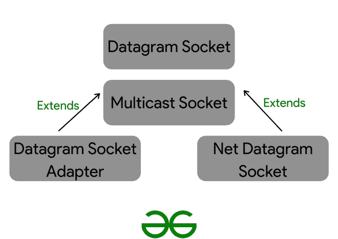

# Java 中的遗留 Socket API

> 原文:[https://www.geeksforgeeks.org/legacy-socket-api-in-java/](https://www.geeksforgeeks.org/legacy-socket-api-in-java/)

Java Socket API 已经存在了二十多年。在此期间，它一直在维护和更新，但即使是保存最完好的代码最终也必须升级，以跟上当代技术的发展。Java 13 中处理套接字交互的基本类已经被重新实现，以利用 Java 的当前状态，同时也为未来的发展做准备。

#### 什么是套接字应用编程接口，它是如何工作的？

Java 套接字 API *(java.net.ServerSocket 和 java.net.Socket)* 中的对象为您提供了对服务器侦听的套接字和传递数据的套接字的直接控制。

**服务器套接字**可用于等待端口上的连接请求，如果被接受，则返回可用于读写数据的套接字对象。这两个类都使用基于 SOCKS 的实现，繁重的工作由 SocketImpl 的内部实现完成。这段代码学习和使用起来很简单，但是从 Java 1.0 时代就已经存在了。较旧的 Java 和 C 代码的这种结合使得自其开始以来默认线程堆栈大小的增加成为必要，并且随着时间的推移出现了稳定性和并发性的困难。我们已经到了唯一可行的选择是彻底重建的阶段。

### 实现遗留套接字应用编程接口

这个 JEP 提议用一个新的 NioSocketImpl 实现来替换 SocketImpl 实现。该解决方案使用与 NIO(新 I/O)实现相同的体系结构，并与当前的缓冲区缓存方法相连接，消除了对线程堆栈的需求。这些修改还包括几个额外的有益修改，如 java.lang.ref。如果 SocketImpl 实现在尚未关闭的套接字上被垃圾收集，并且在轮询时套接字处于非阻塞模式时发生超时操作，那么将使用更干净的方法来关闭套接字。

创建了一个系统属性来利用原始实现，以便在重新实现已经使用了 20 多年的技术时减少遇到困难的机会。

如果设置了***use PlainSockeTimpl = true***，将使用之前的实现。

需要注意的是 **SocketImpl** 是过去指定不足的历史 SPI 技术；当前版本尽可能模拟未定义的行为。但是，在使用新实现时，有一些边缘情况可能会失败，如下所示。除了两个之外，所有这些都可以通过使用上面提到的系统属性来修复。**文件输入流**和**文件输出流**的先前实现返回输入和输出流，用于扩展它们。目前的实施情况并非如此。

使用另一种(自定义或平台)套接字层的服务器套接字不接受返回套接字层的连接。



图 1。传统套接字概述

### 那么，这样做有什么好处呢？

先前的实施难以维持和加强；但是，既然已经进行了这些改进，Java Socket API 将更容易维护。由于更好的维护，套接字代码的可靠性应该得到提高。NIO 的实现也是在较低的级别完成的，这允许 Socket 和 ServerSocket 类保持不变。

这些修改不仅使维护这段代码变得更容易，而且还使实现面向未来。一个名为“织布机项目”的项目目前正在 JDK 进行。这个项目引入了纤维的概念，这是一种看待线的新颖方式(在我们之前的项目织机文章中了解更多)。当项目织布机发布时，NIO 实现将能够利用它，而先前的实现将不适合这个目的。因为 NIO 实现使用 java.util.concurrent 锁，而不是同步方法，这是可以想象的。

通过运行实例化套接字和服务器套接字的类，可以看到这个调试输出。以下是默认的(新的)外观:

## Java 语言(一种计算机语言，尤用于创建网站)

```
java -XX:+TraceClassLoading JEP353  | grep Socket
[0.033s][info   ][class,load] java.net.Socket source: jrt:/java.base
[0.035s][info   ][class,load] java.net.SocketOptions source: jrt:/java.base
[0.035s][info   ][class,load] java.net.SocketImpl source: jrt:/java.base
[0.039s][info   ][class,load] java.net.SocketImpl$Lambda$1/0x0000000800b50840 source: java.net.SocketImpl
[0.042s][info   ][class,load] sun.net.PlatformSocketImpl source: jrt:/java.base
[0.042s][info   ][class,load] sun.nio.ch.NioSocketImpl source: jrt:/java.base
[0.043s][info   ][class,load] sun.nio.ch.SocketDispatcher source: jrt:/java.base
[0.044s][info   ][class,load] java.net.DelegatingSocketImpl source: jrt:/java.base
[0.044s][info   ][class,load] java.net.SocksSocketImpl source: jrt:/java.base
[0.044s][info   ][class,load] java.net.ServerSocket source: jrt:/java.base
[0.045s][info   ][class,load] jdk.internal.access.JavaNetSocketAccess source: jrt:/java.base
[0.045s][info   ][class,load] java.net.ServerSocket$1 source: jrt:/java.base
```

#### 使用套接字的开关表达式

**示例#1**

## Java 语言(一种计算机语言，尤用于创建网站)

```
System.out.println(switch (args[0]) {
    // a simple switch case
        case "1" -> 1;
    case "2" -> 2;
    default -> args[0].length();
});
```

**输出:**

```
//This Switch case prints accordingly
//User entered 1
->1
```

**例 2**

## Java 语言(一种计算机语言，尤用于创建网站)

```
System.out.println(switch (args[0]) {
case "1":
    yield 1;
case "2":
    yield 2;
default: {
    int len = args[0].length();
    yield len;
}
});
```

**输出:**

```
//This Switch case prints accordingly
//User entered 1
-> yield 1
```