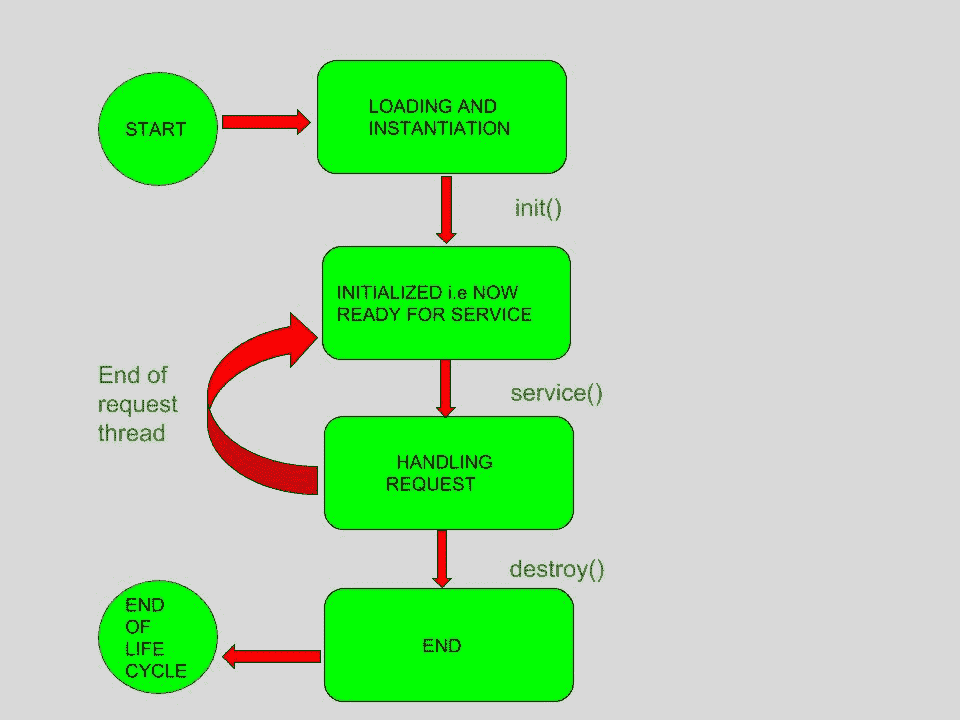
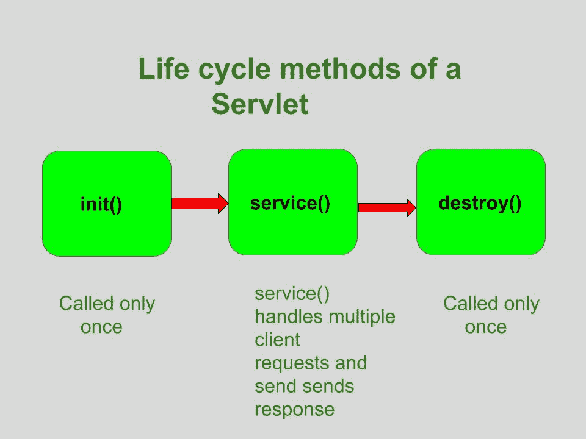

# Servlet 的生命周期

> 原文:[https://www.geeksforgeeks.org/life-cycle-of-a-servlet/](https://www.geeksforgeeks.org/life-cycle-of-a-servlet/)

一个 Servlet 的整个生命周期是由 **Servlet 容器**管理的，它使用 **javax.servlet.Servlet** 接口来理解 Servlet 对象并管理它。因此，在创建 Servlet 对象之前，让我们首先了解 Servlet 对象的生命周期，这实际上是了解 Servlet 容器如何管理 Servlet 对象。

**Servlet 生命周期的阶段**:Servlet 生命周期主要经历四个阶段，

*   正在加载一个 Servlet。
*   正在初始化 Servlet。
*   请求处理。
*   摧毁 Servlet。

让我们详细看看这些阶段:

1.  **Loading a Servlet**: The first stage of the Servlet lifecycle involves loading and initializing the Servlet by the Servlet container. The Web container or Servlet Container can load the Servlet at either of the following two stages :
    *   初始化上下文，用零或正整数值配置 Servlet。
    *   如果 Servlet 不是前一阶段，它可能会延迟加载过程，直到网络容器确定需要这个 Servlet 来服务请求。

    在这个阶段，Servlet 容器执行两个操作:

    *   **加载:**加载 Servlet 类。
    *   **实例化:**创建一个 Servlet 实例。为了创建 Servlet 的新实例，容器使用了无参数构造函数。

    

2.  **Initializing a Servlet**: After the Servlet is instantiated successfully, the Servlet container initializes the instantiated Servlet object. The container initializes the Servlet object by invoking the **Servlet.init(ServletConfig)** method which accepts ServletConfig object reference as parameter.

    在成功实例化**Servlet . init(Servlet config)**对象之后，Servlet 容器只调用一次**Servlet . init(Servlet config)**方法。此方法用于初始化资源，如 JDBC 数据源。

    现在，如果 Servlet 初始化失败，它将通过抛出**Servlet 异常**或**不可用异常**来通知 Servlet 容器。

3.  **Handling request**: After initialization, the Servlet instance is ready to serve the client requests. The Servlet container performs the following operations when the Servlet instance is located to service a request :
    *   它创建 **ServletRequest** 和 **ServletResponse** 对象。在这种情况下，如果这是一个 HTTP 请求，那么 Web 容器将创建 **HttpServletRequest** 和 **HttpServletResponse** 对象，它们分别是 **ServletRequest** 和 **ServletResponse** 对象的子类型。
    *   在创建请求和响应对象之后，它通过传递请求和响应对象来调用 Servlet.service(ServletRequest，ServletResponse)方法。

    处理请求时的**服务()**方法可能会抛出**服务异常**或**不可用异常**或**异常**。

4.  **Destroying a Servlet**: When a Servlet container decides to destroy the Servlet, it performs the following operations,
    *   它允许当前在 Servlet 实例的服务方法中运行的所有线程完成它们的作业并被释放。
    *   在当前运行的线程完成它们的工作之后，Servlet 容器调用 Servlet 实例上的 **destroy()** 方法。

    执行 **destroy()** 方法后，Servlet 容器释放这个 Servlet 实例的所有引用，这样它就可以进行垃圾收集了。

**Servlet 生命周期方法**

Servlet 有三种生命周期方法:

*   init()
*   服务()
*   销毁()



让我们详细看看这些方法:

1.  **init()方法**:Servlet 容器调用 **Servlet.init()** 方法，表示这个 Servlet 实例已经实例化成功，即将投入使用。

    ```
    //init() method

    public class MyServlet implements Servlet{
       public void init(ServletConfig config) throws ServletException {
            //initialization code
       }
        //rest of code
    }

    ```

2.  **服务()方法**:调用 Servlet 的**服务()**方法通知 Servlet 客户端请求。

    ```
    // service() method

    public class MyServlet implements Servlet{
        public void service(ServletRequest res, ServletResponse res)
        throws ServletException, IOException {
                // request handling code
        }
        // rest of code
    }

    ```

    *   该方法使用 **ServletRequest** 对象收集客户端请求的数据。
    *   该方法使用 **ServletResponse** 对象生成输出内容。
3.  **destroy() method**: The **destroy()** method runs only once during the lifetime of a Servlet and signals the end of the Servlet instance.

    ```
    //destroy() method

    public void destroy()

    ```

    一旦 **destroy()** 方法被激活，Servlet 容器就会释放 Servlet 实例。

**Servlet 生命周期:**
Servlet 生命周期可以定义为 Servlet 从创建到销毁的各个阶段。
servlet 生命周期由以下几个阶段组成:

*   Servlet 是天生的
*   Servlet 已初始化
*   Servlet 已经准备好服务了
*   Servlet 正在服务
*   Servlet 还没有准备好服务
*   Servlet 被销毁

**生命周期方法:**
生命周期方法是那些用来控制 servlet 生命周期的方法。这些方法在 servlets 的整个生命周期中以特定的顺序被调用。
类 **Servlet** 提供了控制和监督 Servlet 生命周期的方法。Servlet 接口中有三种生命周期方法。具体如下:

*   **init()方法:**
    1.  一个 servlet 的生命从这里开始。
    2.  这个方法只被调用一次来加载 servlet。因为它在生命周期中只被调用一次，所以“连接架构”代码被写在它里面，因为我们只想要一次与数据库的连接。
        **现在出现的问题是:-**
        Q .为什么我们不能在构造函数内部编写连接的架构代码，因为构造函数在其整个生命周期中也只运行一次？
        俺们。假设如果连接没有建立，那么我们可以从 init()抛出一个异常，其余的步骤停止执行。但是在我们不能使用的构造函数中，抛出它的原型，否则就是一个错误。

*   该方法只接收一个参数，即 **ServletConfig** 对象。*   这个方法有可能抛出 ServletException。*   一旦 servlet 被初始化，它就可以处理客户端请求了。*   The prototype for the init() method:

    ```
    public void init(ServletConfig con)throws ServletException{ }
    ```

    其中 **con** 是 ServletConfig 对象

    **注意:-** 在 servlet 的程序中，我们使用 init()的非参数化版本。

    **现在，问题出现了:-**
    问:为什么建议使用 init()的非参数化版本，而不是上面看到的参数化版本？
    Ans。要回答这个问题，我们必须深入细节。像开发人员一样思考，也就是说，这其中一定有合理的理由，答案会让你大吃一惊。前来回答:

    **APPROACH 1**
    每当 servlet 的生命周期方法开始执行时，即当 public void init(ServletConfig con)抛出 ServletException 得到调用时，我们的类 public void init(servletconfigcon)抛出 ServletException 得到调用，但我们必须运行初始化 ServletConfig 对象的代码，该对象写在“HttpServlet”方法中 public void init(ServletConfig con)抛出 ServletException，即:
    HttpServlet 类的编码如下:

    ```
    public void init(ServletConfig con) throws ServletException
    {
       //code to initialise ServletConfig object

    init();  //This HttpServlet has 2 init() one which is parameterized and the other one is non 
             //parameterized.But this non parameterized version of init() has a blank body. 
             //So this call is useless. 

    }

    ```

    现在看看我们班的编码

    ```
    public void init(ServletConfig con) throws ServletException
    {
    super.init(con);  //Since,our class init() will run first,but to run HttpServlet init() we
                     // have used super keyword.And Database connectivity code will be their
    }

    ```

    **注意:-** 如我们所见，我们总共要进行 3 次 init()调用。首先调用我们的类的 init()，然后调用 HttpServlet 类，然后调用 HttpServlet 类的非参数化版本。

    但是现在，我们将通过更少的通话次数实现同样的目标:

    **init()的参数化和非参数化版本的编码将保持不变。**但是在我们的类中，我们将覆盖 init()的非参数化版本，而不是覆盖 init()的参数化版本**。**

    让我们看看我们的类 init()的非参数化版本的编码:

    ```
    public void init() throws ServletException  
    {
       //database connectivity code
    }

    ```

    **注意:**由于这个方法 public void init()抛出了 ServletException，所以我们有来自 HttpServlet 类的 override，它的编码如下:

    ```
    public void init() throws ServletException  
    {
       //empty body
    }

    ```

    由于它的主体是空白的，因此它被称为**“辅助方法”**，因为它用于覆盖目的。

    现在，当 servlet 开始执行其方法时，它将调用 init()的参数化版本。由于我们不必重写参数化版本，因此它将调用参数化版本的 init()。由于 HttpServlet 的 init()的参数化版本的编码与上面相同，因此，从那里开始，它将调用 init()(即 init 的非参数化版本)。它将调用我们的类 init()的非参数化版本，代码继续。
    **现在，如您所见，init()调用的总数为 2，比第一种方法少。因此，与第一种方法相比，第二种方法的执行时间更少，维护堆栈对中央处理器来说也不那么麻烦，而且速度也有所提高。**
    因此，强烈建议覆盖 init()的非参数化版本。虽然两者都将运行，但由于效率第一的方法很少使用，在第一种方法中，我们也必须使用超级关键字。因此，在下面提到的程序中，我们已经覆盖了 init()的非参数化版本。

    *   **服务()方法:**
    1.  service()方法是提供客户端和服务器之间连接的最重要的执行方法。
    2.  web 服务器调用 service()方法来处理来自客户端(web 浏览器)的请求，并将响应发送回客户端。
    3.  这个方法决定了 Http 请求的类型(GET、POST、PUT、DELETE 等)。) .
    4.  这个方法还调用各种其他方法，比如 doGet()、doPost()、doPut()、doDelete()等。按要求。
    5.  此方法接受两个参数。
    6.  The prototype for this method:

        ```
        public void service(ServletRequest req, ServletResponse resp) 
        throws ServletException, IOException { }
        ```

        在哪里

        *   **req** 是 ServletRequest 对象，它封装了从客户端到服务器的连接
        *   **resp** 是 ServletResponse 对象，它封装了从服务器到客户端的连接*   **destroy() method :**
    1.  destroy()方法只调用一次。
    2.  它在 servlet 生命周期的末尾被调用。
    3.  此方法执行各种任务，例如关闭与数据库的连接、释放分配给 servlet 的内存、释放分配给 servlet 的资源以及其他清理活动。
    4.  当调用此方法时，垃圾收集器开始工作。
    5.  这个方法的原型是:

        ```
        public void destroy() { // Finalization code...}
        ```

    下面是一个用 Java 演示 Servlet 的示例程序:

    ```
    // Java program to show servlet example
    // Importing required Java libraries
    import java.io.*;
    import javax.servlet.*;
    import javax.servlet.http.*;

    // Extend HttpServlet class
    public class AdvanceJavaConcepts extends HttpServlet 
    { 
       private String output;

       // Initializing servlet 
       public void init() throws ServletException 
       {
          output = "Advance Java Concepts";
       }

       // Requesting and printing the output
       public void doGet(HttpServletRequest req, 
                        HttpServletResponse resp)
          throws ServletException, IOException 
          {
             resp.setContentType("text/html");
             PrintWriter out = resp.getWriter();
             out.println(output);
          }

          public void destroy() 
          {
             System.out.println("Over");
          }
    }
    ```