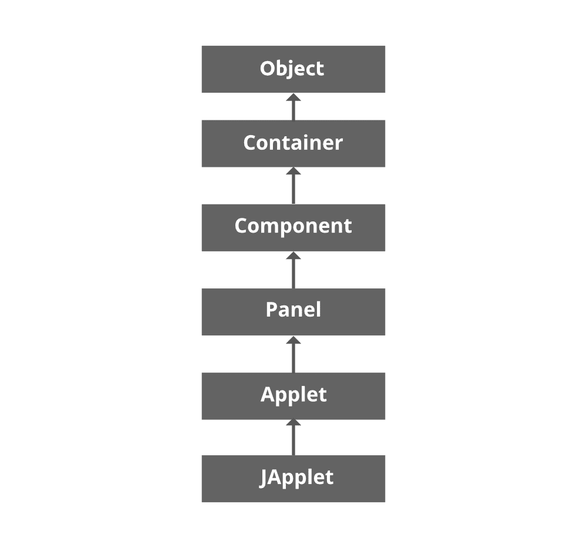

# Java 小程序的生命周期

> 原文:[https://www.geeksforgeeks.org/life-cycle-of-java-applet/](https://www.geeksforgeeks.org/life-cycle-of-java-applet/)

小程序是可以嵌入到网页中的 Java 程序。它在网络浏览器内部运行，在客户端工作。applet 是使用 APPLET 或 OBJECT 标记嵌入到 HTML 页面中的，并托管在网络服务器上。小程序的整个生命周期由小程序容器管理。所有小程序都是 java.applet.Applet 类的子类(直接或间接)。小程序不是独立的程序。它们在网络浏览器或小程序浏览器中运行。

*   小程序生成动态内容
*   小程序在客户端工作
*   响应时间快


我们可以在名为**小程序查看器**的标准小程序查看器工具的帮助下查看我们的小程序。与 java 程序的一般执行和输出不同，applet 的执行不是从 main()方法开始的，applet 窗口的输出也不是由 System.out.println()提供的。相反，它是用各种抽象窗口工具包(AWT)方法来处理的，例如 drawL()。

让我们先看看 Applet 的层次结构，然后再进入 java applet 生命周期的各个阶段，如下所示:



**Java 小程序生命周期中的阶段**

*   初始化小程序
*   启动小程序
*   绘制小程序
*   停止小程序
*   销毁小程序

> **注意:**为了实现 Applet，我们需要导入 awt 包:
> 
> ```java
> java.awt.applet.*;
> ```

**小程序的生命周期**

**步骤 1:** 初始化

```java
public void init() 
```

> 没有什么主要的方法不同于我们普通的 java 程序。每个小程序都将从 init()方法开始执行。它只执行一次

**第二步:**开始

```java
public void start()
```

> 调用 init()方法 start()方法后。浏览器最大化时执行

**第三步:**上色

```java
public void paint (Graphics g)
```

> Paint 方法用于在小程序上显示内容。我们可以为小程序创建对象或组件，或者我们可以直接在小程序上写一条消息。它将把图形类作为参数。

**第四步:**停止

```java
public void stop()
```

> stop()方法用于停止小程序。它在浏览器最小化时执行。

**第五步:**摧毁

```java
public void destroy()
```

> destroy()方法用于完全关闭小程序。当小程序关闭**d**时执行

**实施:**

java Applet 的实现可以通过以下两种方式完成:

1.  使用超文本标记语言文件
2.  小程序查看器工具

**方式一:**使用 HTML 文件

## 超文本标记语言

```java
<HTML>
<applet>
code,width,height
</applet>
</HTML>
```