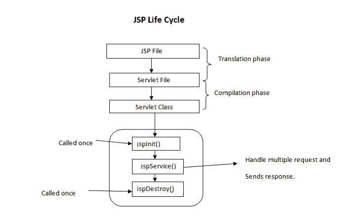

# JSP 的生命周期

> 原文:[https://www.geeksforgeeks.org/life-cycle-of-jsp/](https://www.geeksforgeeks.org/life-cycle-of-jsp/)

一个 Java 服务器页面生命周期被定义为从它的创建开始的过程，这个过程后来被转换成一个 servlet，然后 servlet 生命周期开始发挥作用。这个过程一直持续到毁灭。

JSP 生命周期涉及以下步骤:

*   将 JSP 页面翻译成 Servlet
*   JSP 页面的编译(将 JSP 编译成 test.java)
*   分类加载(test.class 测试类)
*   实例化(生成的 Servlet 的对象被创建)
*   初始化(jspInit()方法由容器调用)
*   请求处理(_jspService()由容器调用)
*   JSP 清理(jspDestroy()方法由容器调用)

> 我们可以覆盖 jspInit()，jspDestroy()，但是不能覆盖 _jspService()方法。

**JSP 页面到 Servlet 的翻译:**

这是 JSP 生命周期的第一步。这个翻译阶段处理 JSP 的语法正确性。这里的 test.jsp 文件被翻译成了 test.java 文。

**JSP 页面的编译:**

这里生成的 java servlet 文件(test.class)被编译成一个类文件(test.class)。

**分类装载:**

已经从 JSP 源加载的 Servlet 类现在被加载到容器中。

**实例化:**

这里生成了类的一个实例。容器通过提供对请求的响应来管理一个或多个实例。

**初始化:**

jspInit()方法在从 JSP 生成 Servlet 实例之后的生命周期中只调用一次。

**请求处理:**

_jspService()方法用于服务 JSP 引发的请求。它将请求和响应对象作为参数。不能重写此方法。

**JSP 清理:**

为了从容器的使用中移除 JSP 或者销毁 servlets 的方法，使用了 jspDestroy()方法。这个方法被调用一次，如果你需要执行任何清理任务，比如关闭打开的文件，释放数据库连接可以被覆盖。