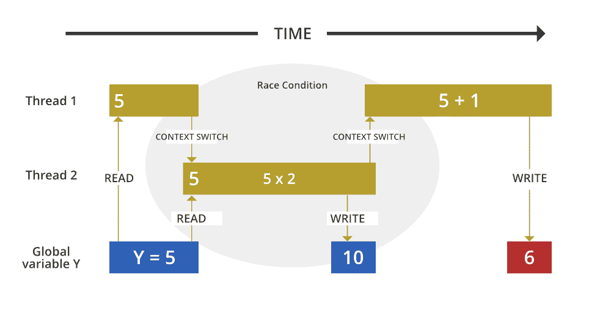

# 同步的限制和多线程中静态同步的使用

> 原文:[https://www . geesforgeks . org/同步的限制和多线程中静态同步的使用/](https://www.geeksforgeeks.org/limitations-of-synchronization-and-the-uses-of-static-synchronization-in-multithreading/)

[多线程](https://www.geeksforgeeks.org/multithreading-in-java/)Java 的特性是这个概念围绕的特性，因为它允许同时执行程序的两个或多个部分，以最大限度地利用 CPU。这种程序的每个部分都称为线程。因此，线程是进程中的轻量级进程，众所周知，线程可以通过使用下面列出的两种机制来创建:

1.  [扩展线程类](https://www.geeksforgeeks.org/multithreading-in-java/)
2.  [实现可运行界面](https://www.geeksforgeeks.org/implement-runnable-vs-extend-thread-in-java/)

如果多个线程同时访问一个资源，那么就有可能出现数据争用或错误输出。让我们借助一个故事来理解这一点。让我们以多线程中的数据竞赛为例来了解同步的局限性和静态同步的用途。让我们直接用多线程中的数据竞赛来打发时间。



**实施:**

舒巴姆和沙米斯塔正在计划约会，并试图预订电影票。不幸的是，只有一张票。一个天才的 Java 程序员 Shubham 知道一个窍门，他同时向他们两个要了一张票。天真的订票系统分配了 2 个线程，并通过 book 方法传递它们。在程序的最后，他们两个每人得到了一张票，剩下的票数是-1！

**图解:**多线程中的数据竞速

## Java 语言(一种计算机语言，尤用于创建网站)

```java
// Java program to show Data racing in multithreading.

// Helper class 1
class book {
    int tickets = 1;
    // method to book movie ticket
    void book(int request, String name)
    {
        // logic to book ticket
        if (tickets >= request) {
            System.out.println(name + " booked " + request
                               + " ticket.");
            tickets = tickets - 1;
            System.out.println("Tickets left: " + tickets);
        }
        else {
            System.out.println("No tickets are available.");
        }
    }
}
// Helper class 2, extending Thread class.
// book method is called from this class using the object
// passed from main class.
class myThread extends Thread {
    book obj;
    int n;
    String name;
    myThread(book obj, String name, int n)
    {
        this.obj = obj;
        this.n = n;
        this.name = name;
    }
    // runs threads
    public void run() { obj.book(n, name); }
}
// Driver class
public class GFG {
    // Driver method
    public static void main(String[] args)
    {
        // Creating object "obj" of book class and passing
        // it to myThread class
        book obj = new book();
        myThread t1 = new myThread(obj, "Shubham", 1);
        myThread t2 = new myThread(obj, "Sharmistha", 1);
        // When a program calls the start() method, a new
        // thread is created and then the run() method is
        // executed.

        // Starting threads created above
        t1.start();
        t2.start();
    }
}
```

**输出-**

```java
Shubham booked 1 ticket.
Sharmistha booked 1 ticket.
Tickets left: 0
Tickets left: -1
```

门票数量不能为负数。为了解决这个问题，工程师们提出了同步概念。

**同步-** 我们为对象提供一个锁，并声明一个敏感区域(retract 方法)。一个对象可以有多个线程，但是敏感区域一次只能被一个线程访问。

**图解:**利用同步处理多线程导致的数据争用。

## Java 语言(一种计算机语言，尤用于创建网站)

```java
// Java program to handle data racing due to
// multithreading using synchronization.

// Helper class 1
class book {
    int tickets = 1;
    // synchronized method to book movie ticket
    synchronized void book(int request, String name)
    {
        // logic to book ticket
        if (tickets >= request) {
            System.out.println(name + " booked " + request
                               + " ticket.");
            tickets = tickets - 1;
            System.out.println("Tickets left: " + tickets);
        }
        else {
            System.out.println("No tickets are available.");
        }
    }
}
// Helper class 2, extending Thread class.
// book method is called from this class using the object
// passed from main class.
class myThread extends Thread {
    book obj;
    int n;
    String name;
    myThread(book obj, String name, int n)
    {
        this.obj = obj;
        this.n = n;
        this.name = name;
    }
    // runs threads
    public void run() { obj.book(n, name); }
}
// Driver class
public class GFG {
    // Driver method
    public static void main(String[] args)
    {
        // Creating object "obj" of book class and passing
        // it to myThread class
        book obj = new book();
        myThread t1 = new myThread(obj, "Shubham", 1);
        myThread t2 = new myThread(obj, "Sharmistha", 1);
        // When a program calls the start() method, a new
        // thread is created and then the run() method is
        // executed.

        // Starting threads created above
        t1.start();
        t2.start();
    }
}
```

**输出-**

```java
Shubham booked 1 ticket.
Tickets left: 0
No tickets are available.
```

**同步的限制:**

如果我们有多个线程从 1 个对象比同步将处理数据赛车或坏输出。**如果从多个对象分配多个线程会发生什么？**这将再次导致输出不良或数据争用。

**说明:**从多个对象分配多个线程时同步的缺点。

## Java 语言(一种计算机语言，尤用于创建网站)

```java
// Java program to illustrate limitations of
// synchronization.

// Helper class 1
class book {
    int tickets = 1;
    // synchronized method to book movie ticket
    synchronized void book(int request, String name)
    {
        // logic to book ticket
        if (tickets >= request) {
            System.out.println(name + " booked " + request
                               + " ticket.");
            tickets = tickets - 1;
            System.out.println("Tickets left: " + tickets);
        }
        else {
            System.out.println("No tickets are available.");
        }
    }
}
// Helper class 2, extending Thread class.
// book method is called from this class using the object
// passed from main class.
class myThread extends Thread {
    book obj;
    int n;
    String name;
    myThread(book obj, String name, int n)
    {
        this.obj = obj;
        this.n = n;
        this.name = name;
    }
    // runs threads
    public void run() { obj.book(n, name); }
}
// Driver class
public class GFG {
    // Driver method
    public static void main(String[] args)
    {
        // Creating multiple objects "obj" and "obj2" of
        // book class and passing it to myThread class.
        book obj = new book();
        book obj2 = new book();
        myThread t1 = new myThread(obj, "Shubham", 1);
        myThread t2 = new myThread(obj2, "Sharmistha", 1);
        // When a program calls the start() method, a new
        // thread is created and then the run() method is
        // executed.

        // Starting threads created above
        t1.start();
        t2.start();
    }
}
```

**输出-**

```java
Shubham booked 1 ticket.
Tickets left: 0
Sharmistha booked 1 ticket.
Tickets left: 0
```

我们只有一张票，但由于数据竞赛，他们都成功预订了！为了解决这个问题，我们需要研究静态同步。

**静态同步-** 假设我们有 5 个对象。每个对象都有多个线程。现在敏感区域一次将被 5 个线程访问！

为了解决这个问题，工程师们提出了静态同步的想法。我们为类提供了一个锁。该类一次将选择 1 个对象。该对象将依次选择 1 个线程，并通过敏感区域。

**图解:**使用静态同步处理数据竞速。

## Java 语言(一种计算机语言，尤用于创建网站)

```java
// Java program to handle data racing using static
// synchronization.

// Helper class 1
class book {
    static int tickets = 1;
    // static synchronized method to book movie ticket
    static synchronized void book(int request, String name)
    {
        // logic to book ticket
        if (tickets >= request) {
            System.out.println(name + " booked " + request
                               + " ticket.");
            tickets = tickets - 1;
            System.out.println("Tickets left: " + tickets);
        }
        else {
            System.out.println(
                name + ", No tickets are available.");
        }
    }
}
// Helper class 2, extending Thread class.
// book method is called from this class using the object
// passed from main class.
class myThread extends Thread {
    book obj;
    int n;
    String name;
    myThread(book obj, String name, int n)
    {
        this.obj = obj;
        this.n = n;
        this.name = name;
    }
    // runs Threads
    public void run() { obj.book(n, name); }
}
// Driver class
public class GFG {
    // Driver method
    public static void main(String[] args)
    {
        // Creating object "obj" of book class and passing
        // it to myThread class
        book obj = new book();
        book obj2 = new book();
        myThread t1 = new myThread(obj, "Shubham", 1);
        myThread t2 = new myThread(obj2, "Sharmistha", 1);
        // When a program calls the start() method, a new
        // thread is created and then the run() method is
        // executed.

        // Starting threads created above
        t1.start();
        t2.start();
    }
}
```

**输出-**

```java
Shubham booked 1 ticket.
Tickets left: 0
Sharmistha, No tickets are available.
```

利用静态同步，我们准备了一个防止非法订票的系统。

**结论-**

> 1.  When we own **multiple threads** from a single **object** , we can use **synchronization** to lock the object to pass through one thread at a time to prevent bad output.
> 2.  If **multiple threads** are allocated from **multiple objects** , then we can't use synchronization. In this case, providing the lock to the object will lead to data competition. We need to use **to statically synchronize** and provide a lock for the class. This class will select one object at a time. This object will select one thread in turn and pass it to the sensitive area.