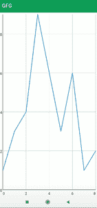

# 安卓中的线图视图，示例

> 原文:[https://www . geesforgeks . org/line-graph-view-in-Android-with-example/](https://www.geeksforgeeks.org/line-graph-view-in-android-with-example/)

如果您正在寻找一个视图来表示一些统计数据，或者在您的应用程序中寻找一个显示图形的用户界面，那么在本文中，我们将在我们的安卓应用程序中创建一个**线图视图。**

### 我们将在本文中构建什么？

我们将在我们的安卓应用程序中构建一个简单的折线图视图，并将在我们的应用程序中显示一些示例数据。下面给出了一个示例图像，以了解本文中要做什么。请注意，我们将使用 **Java** 语言来实现这个项目。



### **分步实施**

**第一步:创建新项目**

要在安卓工作室创建新项目，请参考[如何在安卓工作室创建/启动新项目](https://www.geeksforgeeks.org/android-how-to-create-start-a-new-project-in-android-studio/)。注意选择 **Java** 作为编程语言。

**第二步:将依赖项添加到 build.gradle(模块:app)文件**

导航到**渐变脚本>构建.渐变(模块:应用)**，并在依赖项部分添加以下依赖项。

> 实现' com.jjoe64:graphview:4.2.2 '

添加这个依赖项后，同步您的项目，现在我们将开始实现它。

**步骤 3:使用 activity_main.xml 文件**

导航到**应用程序> res >布局> activity_main.xml** 并将下面的代码添加到该文件中。下面是 **activity_main.xml** 文件的代码。

## 可扩展标记语言

```
<?xml version="1.0" encoding="utf-8"?>
<RelativeLayout 
    xmlns:android="http://schemas.android.com/apk/res/android"
    xmlns:tools="http://schemas.android.com/tools"
    android:layout_width="match_parent"
    android:layout_height="match_parent"
    tools:context=".MainActivity">

    <!--line graph view where we will 
        be displaying our data-->
    <com.jjoe64.graphview.GraphView
        android:id="@+id/idGraphView"
        android:layout_width="match_parent"
        android:layout_height="wrap_content"
        android:layout_alignParentTop="true" />

</RelativeLayout>
```

**第四步:使用****MainActivity.java 文件**

转到**MainActivity.java**文件，参考以下代码。以下是**MainActivity.java**文件的代码。代码中添加了注释，以更详细地理解代码。

## Java 语言(一种计算机语言，尤用于创建网站)

```
import android.os.Bundle;

import androidx.appcompat.app.AppCompatActivity;

import com.jjoe64.graphview.GraphView;
import com.jjoe64.graphview.series.DataPoint;
import com.jjoe64.graphview.series.LineGraphSeries;

public class MainActivity extends AppCompatActivity {

    // creating a variable 
    // for our graph view.
    GraphView graphView;

    @Override
    protected void onCreate(Bundle savedInstanceState) {
        super.onCreate(savedInstanceState);

        // on below line we are initializing our graph view.
        graphView = findViewById(R.id.idGraphView);

        // on below line we are adding data to our graph view.
        LineGraphSeries<DataPoint> series = new LineGraphSeries<DataPoint>(new DataPoint[]{
                // on below line we are adding 
                // each point on our x and y axis.
                new DataPoint(0, 1),
                new DataPoint(1, 3),
                new DataPoint(2, 4),
                new DataPoint(3, 9),
                new DataPoint(4, 6),
                new DataPoint(5, 3),
                new DataPoint(6, 6),
                new DataPoint(7, 1),
                new DataPoint(8, 2)
        });

        // after adding data to our line graph series.
        // on below line we are setting 
        // title for our graph view.
        graphView.setTitle("My Graph View");

        // on below line we are setting 
        // text color to our graph view.
        graphView.setTitleColor(R.color.purple_200);

        // on below line we are setting
        // our title text size.
        graphView.setTitleTextSize(18);

        // on below line we are adding 
        // data series to our graph view.
        graphView.addSeries(series);
    }
}
```

现在运行您的应用程序，并查看应用程序的输出。

### **输出:**

