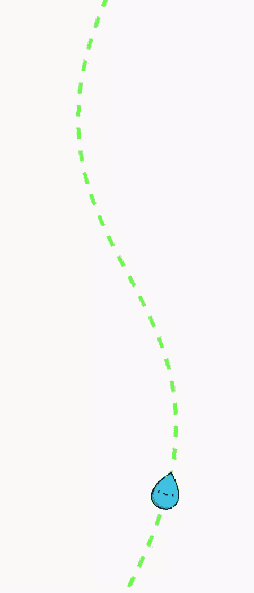

# 安卓中的线性动画视图，示例

> 原文:[https://www . geesforgeks . org/lineanimationview-in-Android-with-example/](https://www.geeksforgeeks.org/lineanimationview-in-android-with-example/)

**LineAnimationView** 是一个帮助获取用户注意力的动画库。它对于创建非常漂亮的动画非常有用。在这个动画中，一个对象从底部出现并到达顶部。线性动画视图的一些有用特性和应用包括:

*   如果您希望用户等待一段时间，请使用此视图。
*   [ProgressBar](https://www.geeksforgeeks.org/progressbar-in-kotlin/) 可以用来代替这个，但是因为它独特的 UI，它会吸引用户，因此用户会等待足够的时间。
*   它还为开发人员提供了完全的控制。
*   可以根据需要在线性动画视图中添加可绘制的内容。



#### 方法

*   **第一步:**在根 **[build.gradle](https://www.geeksforgeeks.org/android-build-gradle/)** 文件中添加支持库(不在模块 build.gradle 文件中)。这个库 **jitpack** 是一个新颖的包库。它是为 JVM 而做的，因此 [github](https://www.geeksforgeeks.org/ultimate-guide-git-github/) 和 [bigbucket](https://www.geeksforgeeks.org/bitbucket-vs-github-vs-gitlab/) 中存在的任何库都可以直接在应用程序中使用。

    ```java
    allprojects {           
     repositories {           
            maven { url 'https://jitpack.io' }           
         }          
    }           
    ```

*   **第二步:**在 **[build.gradle](https://www.geeksforgeeks.org/android-build-gradle/)** 文件中添加支持库，并在依赖项部分添加依赖项。

    ```java
    implementation 'com.github.tushar09:LineAnimation:1.1.9'          
    ```

*   **第三步:**将 png 文件粘贴到**可绘制文件夹**中，并将其添加到 **activity_main.xml** 文件中的 **LineAnimaionView** 中。从这个 [**链接**](https://www.flaticon.com/search?word=water) 下载 png 文件。
*   **第四步:**在 **activity_main.xml** 文件中添加以下代码。在此文件中，将**线性动画视图**添加到布局中。

    ## activity _ main . XML

    ```java

    <?xml version="1.0" encoding="utf-8"?>
    <androidx.constraintlayout.widget.ConstraintLayout
        xmlns:android="http://schemas.android.com/apk/res/android"
        xmlns:app="http://schemas.android.com/apk/res-auto"
        xmlns:tools="http://schemas.android.com/tools"
        android:layout_width="match_parent"
        android:layout_height="match_parent"
        tools:context=".MainActivity">

        <com.captaindroid.lineanimation.Animator
            android:id="@+id/lineAnimatorView"
            android:layout_width="match_parent"
            android:layout_height="match_parent"
            app:dashPathSize="12dp"
            app:dashPathGap="12dp"
            app:pathColor="@color/colorAccent"
            app:pathStrokeWidth="4dp"
            app:drawable="@drawable/ic_water"
            app:enableDashPath="true"
            app:drawableAminationSpeed="5"
            app:repeatable="true"
            app:layout_constraintBottom_toBottomOf="parent"
            app:layout_constraintLeft_toLeftOf="parent"
            app:layout_constraintRight_toRightOf="parent"
            app:layout_constraintTop_toTopOf="parent" />

    </androidx.constraintlayout.widget.ConstraintLayout>
    ```

*   **第五步:**在**MainActivity.java**文件中添加以下代码。在此文件中，将**路径列表器**添加到**线性动画视图**中。

    ## MainActivity.java

    ```java
    package org.geeksforgeeks.lineanimation;

    import androidx.appcompat.app.AppCompatActivity;
    import android.graphics.Path;
    import android.os.Bundle;
    import com.captaindroid.lineanimation.Animator;
    import com.captaindroid.lineanimation.utils.OnPathListener;

    public class MainActivity extends AppCompatActivity
                         implements OnPathListener {
        private Animator animator;
        @Override
        protected void onCreate(Bundle savedInstanceState) {
            super.onCreate(savedInstanceState);
            setContentView(R.layout.activity_main);
            animator = findViewById(R.id.lineAnimatorView);
            animator.startAnimateArrow();
        }

        @Override
        public Path setOnPathUpdateListener(int bitmapPositionX,
                                            int bitmapPositionY) {
            // create a new Path object
            Path p = new Path();

            // moveTo(float x, float y) takes two parameter
            // The x and y are the start of a new contour
            // moveTo set the beginning of the next 
            // contour to the point (x,y)
            p.moveTo(animator.getWidth() / 2, 0);

            // cubicTo(float x1, float y1, float x2, float y2,
            // float x3, float y3) takes six parameter
            // The x1 and y1 are the 1st control 
            // point on a cubic curve
            // The x2 and y2 are the 2nd control 
            // point on a cubic curve
            // The x3 and y3 are the end point
            // on a cubic curve
            // Add a cubic bezier from the last point,
            // approaching control points
            // (x1,y1) and (x2,y2), and ending at (x3,y3).
            // If no moveTo() call has been
            // made for this contour, the first point is
            // automatically set to (0,0).
            p.cubicTo(0, animator.getHeight() / 2, animator.getWidth(),
              animator.getHeight() / 2, 
              animator.getWidth() / 2, animator.getHeight());

            return p;
        }

        @Override
        public void setOnAnimationCompleteListener() {

        }
    }
    ```

    #### 输出：在模拟器上运行

    <video class="wp-video-shortcode" id="video-460679-1" width="320" height="540" preload="metadata" controls=""><source type="video/mp4" src="https://media.geeksforgeeks.org/wp-content/uploads/20200717213258/Record_2020-07-17-21-23-27_c2034bcc1b514a83dba1cdfbfc3693e71.mp4?_=1">[https://media . geesforgeks . org/WP-content/uploads/20200717213258/Record _ 2020-07-17-21-23-27 _ c 2034 bcc1b 514 a 83 DBA 1 cdbfc 3693 e 71 . MP4](https://media.geeksforgeeks.org/wp-content/uploads/20200717213258/Record_2020-07-17-21-23-27_c2034bcc1b514a83dba1cdfbfc3693e71.mp4)</video>