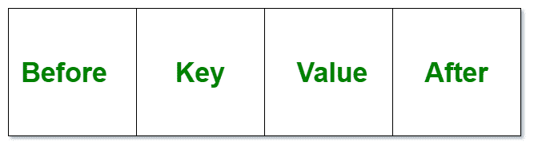

# Java 中的 linked hashmap

> 原文:[https://www.geeksforgeeks.org/linkedhashmap-class-in-java/](https://www.geeksforgeeks.org/linkedhashmap-class-in-java/)

**链接散列表** **类**就像[散列表](https://www.geeksforgeeks.org/java-util-hashmap-in-java/)一样，有一个额外的特性，保持插入其中的元素的顺序。HashMap 提供了快速插入、搜索和删除的优势，但是它从来没有维护过 LinkedHashMap 提供的插入的轨迹和顺序，在那里元素可以按照它们的插入顺序被访问。

**链接哈希表的重要特征如下:**

*   LinkedHashMap 包含基于键的值。它实现了 Map 接口并扩展了 HashMap 类。
*   它只包含独特的元素。
*   它可能有一个空键和多个空值。
*   它是非同步的。
*   它与 HashMap 相同，但有一个额外的特性，即它保持插入顺序。例如，当我们用 HashMap 运行代码时，我们得到了不同的元素顺序。

**申报:**

```java
public class LinkedHashMap<K,​V> extends HashMap<K,​V> implements Map<K,​V>
```

这里 **K** 为关键对象类型， **V** 为数值对象类型

*   **K**–地图中按键的类型。
*   **V**–映射图中映射的值的类型。

实现[映射< K，V >](https://www.geeksforgeeks.org/map-interface-java-examples/) 接口，扩展 [HashMap < K，V >](https://www.geeksforgeeks.org/java-util-hashmap-in-java-with-examples/) 类。虽然链接哈希表的层次结构在以下媒体中描述为跟随 **:**


### LinkedHashMap 如何在内部工作？

LinkedHashMap 是 **HashMap** 类的扩展，它实现了**映射**接口。因此，该类被声明为:

```java
public class LinkedHashMap 
extends HashMap 
implements Map 
```

在这个类中，数据以节点的形式存储。LinkedHashMap 的实现非常类似于[双链表](https://www.geeksforgeeks.org/doubly-linked-list/)。因此，LinkedHashMap 的每个节点都表示为:



*   [**hash:**](https://www.geeksforgeeks.org/hashing-set-1-introduction/) 所有的输入键都被转换成一个 Hash，Hash 是键的一种较短的形式，这样搜索和插入更快。
*   **Key:** 由于这个类扩展了 HashMap，数据以键值对的形式存储。因此，这个参数是数据的关键。
*   **值:**每个键都有一个与之关联的值。此参数存储键的值。由于泛型，这个值可以是任何形式。
*   **下一步:**由于 LinkedHashMap 存储了插入顺序，因此它包含到 LinkedHashMap 的下一个节点的地址。
*   **Previous:** 该参数包含 LinkedHashMap 的前一个节点的地址。

### **同步链接哈希表**

LinkedHashMap 的实现不同步。如果多个线程同时访问链接的哈希映射，并且至少有一个线程在结构上修改了该映射，则必须在外部同步该映射。这通常是通过同步一些自然封装地图的对象来实现的。如果不存在这样的对象，应该使用**collections . synchronized map**方法“包装”地图。这最好在创建时完成，以防止对地图的意外非同步访问:

```java
Map m = Collections.synchronizedMap(new LinkedHashMap(...));
```

### LinkedHashMap 类的构造函数

为了创建一个 **LinkedHashMap** ，我们需要创建一个 LinkedHashMap 类的对象。LinkedHashMap 类由各种构造函数组成，这些构造函数允许创建数组列表。以下是此类中可用的构造函数:

**1。LinkedHashMap():** 用于构造默认的 LinkedHashMap 构造函数。

```java
LinkedHashMap<K, V> lhm = new LinkedHashMap<K, V>();
```

**2。LinkedHashMap(int capacity):** 用于初始化具有指定容量的特定 LinkedHashMap。

```java
LinkedHashMap<K, V> lhm = new LinkedHashMap<K, V>(int capacity);
```

**3。LinkedHashMap(地图** <？延伸 **K** ，？扩展 **V** >地图 **):** 它用于用指定地图的元素初始化特定的链接散列表。

```java
LinkedHashMap<K, V> lhm = new LinkedHashMap<K, V>(Map<? extends K,​? extends V> map);
```

**4。LinkedHashMap(int capacity，float fillRatio):** 用于初始化 LinkedHashMap 的容量和填充比率。填充率也称为**负载系数**是一个决定何时自动增加链接哈希表大小的指标。默认情况下，该值为 0.75，这意味着当地图已满 75%时，地图的大小会增加。

```java
LinkedHashMap<K, V> lhm = new LinkedHashMap<K, V>(int capacity, float fillRatio);
```

**5。LinkedHashMap(int capacity，float fillRatio，boolean Order):** 这个构造函数也用于初始化 LinkedHashMap 的容量和填充比，以及是否遵循插入顺序。

```java
LinkedHashMap<K, V> lhm = new LinkedHashMap<K, V>(int capacity, float fillRatio, boolean Order);
```

这里，对于 ***顺序属性*** ，对于最后一个访问顺序传递 true，对于插入顺序传递 false。

### 链接哈希表的方法

<figure class="table">

| 

方法

 | 

描述

 |
| --- | --- |
| 包含值(对象值) | 如果此映射将一个或多个键映射到指定值，则返回 true。 |
| entrySet() | 返回此映射中包含的映射的集合视图。 |
| [获取(对象键)](https://www.geeksforgeeks.org/linkedhashmap-get-method-in-java/) | 返回指定键映射到的值，如果此映射不包含键映射，则返回 null。 |
| 密钥集() | 返回此地图中包含的键的集合视图。 |
| [移除旧支架(地图。词条< K，V >老大)](https://www.geeksforgeeks.org/linkedhashmap-removeeldestentry-method-in-java/) | 如果此地图应删除其最早的条目，则返回 true。 |
| 值() | 返回此地图中包含的值的集合视图。 |

</figure>

> **应用程序:**由于 LinkedHashMap 使用了 Doubly LinkedList 来维护插入顺序，因此我们可以通过覆盖[removeelderstantry()](https://www.geeksforgeeks.org/linkedhashmap-removeeldestentry-method-in-java/)方法来实现 LRU 缓存功能，以便在向映射中添加新映射时强制实施自动移除过时映射的策略。这允许您使用自己定义的一些标准来终止数据。

**示例:**

## Java 语言(一种计算机语言，尤用于创建网站)

```java
// Java Program to Demonstrate Working of LinkedHashMap

// Importing required classes
import java.util.*;

// LinkedHashMapExample
public class GFG {

    // Main driver method
    public static void main(String a[])
    {

        // Creating an empty LinkedHashMap
        LinkedHashMap<String, String> lhm
            = new LinkedHashMap<String, String>();

        // Adding entries in Map
        // using put() method
        lhm.put("one", "practice.geeksforgeeks.org");
        lhm.put("two", "code.geeksforgeeks.org");
        lhm.put("four", "quiz.geeksforgeeks.org");

        // Printing all entries inside Map
        System.out.println(lhm);

        // Note: It prints the elements in same order
        // as they were inserted

        // Getting and printing value for a specic key
        System.out.println("Getting value for key 'one': "
                           + lhm.get("one"));

        // Getting size of Map using size() method
        System.out.println("Size of the map: "
                           + lhm.size());

        // Checking whether Map is empty or not
        System.out.println("Is map empty? "
                           + lhm.isEmpty());

        // Using containsKey() method to check for a key
        System.out.println("Contains key 'two'? "
                           + lhm.containsKey("two"));

        // Using containsKey() method to check for a value
        System.out.println(
            "Contains value 'practice.geeks"
            + "forgeeks.org'? "
            + lhm.containsValue("practice"
                                + ".geeksforgeeks.org"));

        // Removing entry using remove() method
        System.out.println("delete element 'one': "
                           + lhm.remove("one"));

        // Printing mappings to the console
        System.out.println("Mappings of LinkedHashMap : "
                           + lhm);
    }
}
```

**Output**

```java
{one=practice.geeksforgeeks.org, two=code.geeksforgeeks.org, four=quiz.geeksforgeeks.org}
Getting value for key 'one': practice.geeksforgeeks.org
Size of the map: 3
Is map empty? false
Contains key 'two'? true
Contains value 'practice.geeksforgeeks.org'? true
delete element 'one': practice.geeksforgeeks.org
Mappings of LinkedHashMap : {two=code.geeksforgeeks.org, four=quiz.geeksforgeeks.org}
```