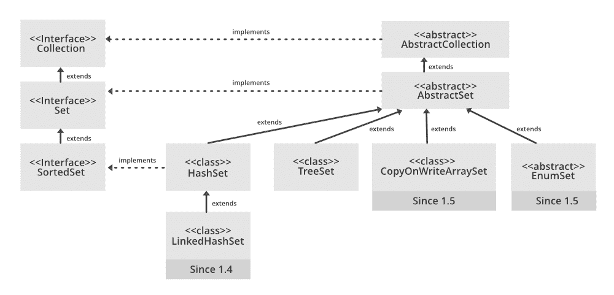

# 用示例链接 Java 中的 hashset

> 原文:[https://www . geeksforgeeks . org/link edhashset-in-Java-with-examples/](https://www.geeksforgeeks.org/linkedhashset-in-java-with-examples/)

链接哈希集是[哈希集](https://www.geeksforgeeks.org/hashset-in-java/)的有序版本，它维护所有元素的双向链表。当需要维护迭代顺序时，使用这个类。当迭代一个 [HashSet](https://www.geeksforgeeks.org/hashset-in-java/) 时，顺序是不可预测的，而 LinkedHashSet 让我们按照元素插入的顺序迭代元素。当使用迭代器循环遍历 LinkedHashSet 时，元素将按照插入的顺序返回。

**链接哈希集的层次结构**



**类型参数:**

*   **E**–该集合维护的元素类型

**所有实现的接口:**

*   **可序列化**
*   **可克隆**，
*   **可重复<E>T1】**
*   **集合<E>T1】**
*   [设定<E>T1](https://www.geeksforgeeks.org/set-in-java/) 

**申报:**

```java
public class LinkedHashSet<E> extends HashSet<E> implements Set<E>, Cloneable, Serializable

```

*   仅包含像 [HashSet](https://www.geeksforgeeks.org/hashset-in-java/) 这样的独特元素。它扩展了 [HashSet](https://www.geeksforgeeks.org/hashset-in-java/) 类并实现了 Set 接口。
*   保持插入顺序。

### LinkedHashSet 类的构造函数:

**1。LinkedHashSet():** 此构造函数用于创建默认的 HashSet

> LinkedHashSet <e>hs = new LinkedHashSet <e>（）;</e></e>

**2。LinkedHashSet(集合 C):** 用于用集合 C 的元素初始化 HashSet

> LinkedHashSet <e>hs = new LinkedHashSet <e>（Collection c）;</e></e>

**3。LinkedHashSet(int size):** 用于用参数中提到的整数初始化 LinkedHashSet 的大小。

> LinkedHashSet <e>hs = new LinkedHashSet <e>（int size）;</e></e>

**4。LinkedHashSet(int capacity，float fillRatio):** 可以用参数中提到的参数来初始化容量和填充比，也称为 LinkedHashSet 的负载容量。当元素数量超过哈希集的容量时，将乘以填充比，从而扩展 LinkedHashSet 的容量。

> linkedinhashset<e>hs =新 linkedinhashset<e>(int capacity，int fill ratio)；</e></e>

**示例:**

## Java 语言(一种计算机语言，尤用于创建网站)

```java
// Java Program to illustrate the LinkedHashSet
import java.util.LinkedHashSet; 

public class LinkedHashSetExample 
{  

      // Main Method
    public static void main(String[] args) 
    {  
        LinkedHashSet<String> linkedset = 
                           new LinkedHashSet<String>();  

        // Adding element to LinkedHashSet  
        linkedset.add("A");  
        linkedset.add("B");  
        linkedset.add("C");  
        linkedset.add("D"); 

        // This will not add new element as A already exists 
        linkedset.add("A"); 
        linkedset.add("E");  

        System.out.println("Size of LinkedHashSet = " +
                                    linkedset.size());  
        System.out.println("Original LinkedHashSet:" + linkedset);  
        System.out.println("Removing D from LinkedHashSet: " +
                            linkedset.remove("D"));  
        System.out.println("Trying to Remove Z which is not "+
                            "present: " + linkedset.remove("Z"));  
        System.out.println("Checking if A is present=" + 
                            linkedset.contains("A"));
        System.out.println("Updated LinkedHashSet: " + linkedset);  
    }  
}  
```

**输出:**

```java
Size of LinkedHashSet=5
Original LinkedHashSet:[A, B, C, D, E]
Removing D from LinkedHashSet: true
Trying to Remove Z which is not present: false
Checking if A is present=true
Updated LinkedHashSet: [A, B, C, E]

```

### 对 LinkedHashSet 类执行各种操作

让我们看看如何在 LinkedHashSet 上执行一些常用的操作。

**1。添加元素:**为了给 LinkedHashSet 添加一个元素，我们可以使用 [add()](https://www.geeksforgeeks.org/linkedhashset-add-method-in-java-with-examples/?ref=rp) 方法。这与 HashSet 不同，因为在 HashSet 中，插入顺序不被保留，而是保留在 LinkedHashSet 中。

## Java 语言(一种计算机语言，尤用于创建网站)

```java
// Java program for adding
// elements to LinkedHashSet
import java.util.*;
import java.io.*;

class AddingElementsToLinkedHashSet {

    public static void main(String[] args)
    {
        // create an instance of
        // LinkedHashSet
        LinkedHashSet<String> hs
            = new LinkedHashSet<String>();

        // Elements are added using add() method
        // insertion order is maintained
        hs.add("Geek");
        hs.add("For");
        hs.add("Geeks");

        // print elements to the console
        System.out.println("LinkedHashSet : " + hs);
    }
}
```

**Output:**

```java
LinkedHashSet : [Geek, For, Geeks]
```

**2。移除元素:**可以使用[移除()](https://www.geeksforgeeks.org/linkedhashset-remove-method-in-java/?ref=rp)方法从链接的哈希集中移除值。

## Java 语言(一种计算机语言，尤用于创建网站)

```java
// Java program to remove elements
// from LinkedHashSet
import java.io.*;
import java.util.*;

class RemoveElementsFromLinkedHashSet {

    public static void main(String[] args)
    {
        // create an instance of
        // LinkedHashSet
        LinkedHashSet<String> hs
            = new LinkedHashSet<String>();

        // Elements are added using add() method
        hs.add("Geek");
        hs.add("For");
        hs.add("Geeks");
        hs.add("A");
        hs.add("B");
        hs.add("Z");

        // print elements to the console
        System.out.println("Initial HashSet " + hs);

        // Removing the element b
        hs.remove("B");

        System.out.println("After removing element " + hs);

        // Returns false if the element is not present
        System.out.println(hs.remove("AC"));
    }
}
```

**Output:**

```java
Initial HashSet [Geek, For, Geeks, A, B, Z]
After removing element [Geek, For, Geeks, A, Z]
false
```