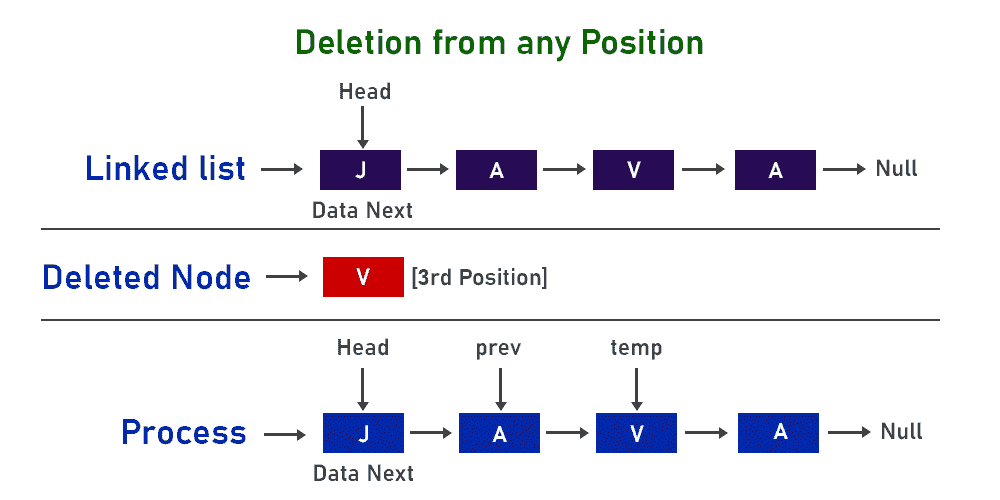

# Java 中的 LinkedList remove()方法

> 原文:[https://www . geesforgeks . org/linked list-remove-method-in-Java/](https://www.geeksforgeeks.org/linkedlist-remove-method-in-java/)

众所周知，链表是一种存储数据的方式，它包含多组节点，其中每个节点包含数据和地址部分，其中地址部分负责节点的链接，因此形成了一个链表，现在我们可以在上面执行操作。现在，我们希望仅使用[链接列表](https://www.geeksforgeeks.org/linked-list-in-java/)类的 remove()方法删除一个节点。

插图:



**该类中存在的 remove()方法的类型:**

1.  里面没有争论
2.  将索引作为参数传递
3.  将对象作为参数传递

让我们通过提供一个干净的 java 程序来讨论它们，如下所示:

### 类型 1:移除()方法

它用于从链接列表中移除元素。该元素将从链表的开头或头部移除。

**语法:**

```java
LinkedList.remove()
```

**参数:**该函数不取任何参数。

**返回值:**该方法返回列表的头部或列表头部存在的元素。

**示例:**

## Java 语言(一种计算机语言，尤用于创建网站)

```java
// Java Program to Illustrate remove() method
// of LinkedList class
// Default removal from the last of List

// Importing required classes
import java.io.*;
import java.util.LinkedList;

// Main class
public class GFG {

    // Main driver method
    public static void main(String args[])
    {

        // Creating an empty LinkedList of String type
        LinkedList<String> list = new LinkedList<String>();

        // Adding elements in the list
        // Using add() method
        list.add("Geeks");
        list.add("for");
        list.add("Geeks");
        list.add("10");
        list.add("20");

        // Printing the elements inside LinkedList
        System.out.println("LinkedList:" + list);

        // Removing the head from List
        // using remove() method
        list.remove();

        // Printing the final elements inside Linkedlist
        System.out.println("Final LinkedList:" + list);
    }
}
```

**Output:** 

```java
LinkedList:[Geeks, for, Geeks, 10, 20]
Final LinkedList:[for, Geeks, 10, 20]
```

### 类型 2:移除(整数索引)方法

它用于从特定位置或索引中移除链表中的元素。

**语法:**

```java
LinkedList.remove(int index)
```

**参数:**参数*索引*是整数数据类型，指定要从链接列表中删除的元素的位置。

**返回值:**刚从列表中删除的元素。

**例**

## Java 语言(一种计算机语言，尤用于创建网站)

```java
// Java Program to Illustrate remove() when position of
// element is passed as parameter
import java.io.*;
import java.util.LinkedList;

public class LinkedListDemo {
    public static void main(String args[])
    {

        // Creating an empty LinkedList
        LinkedList<String> list = new LinkedList<String>();

        // Use add() method to add elements in the list
        list.add("Geeks");
        list.add("for");
        list.add("Geeks");
        list.add("10");
        list.add("20");

        // Output the list
        System.out.println("LinkedList:" + list);

        // Remove the head using remove()
        list.remove(4);

        // Print the final list
        System.out.println("Final LinkedList:" + list);
    }
}
```

**Output:** 

```java
LinkedList:[Geeks, for, Geeks, 10, 20]
Final LinkedList:[Geeks, for, Geeks, 10]
```

### 类型 3:移除(对象 0)方法

它用于从链表中删除任何特定的柠檬。

**语法:**

```java
LinkedList.remove(Object O)
```

**参数:**参数 *O* 是链表的对象类型，指定要从列表中删除的元素。

**返回值:**如果在列表中找到指定的元素，则返回真。

**例**

## Java 语言(一种计算机语言，尤用于创建网站)

```java
// Java Program to Illustrate remove() method

// Importing required classes
import java.io.*;
import java.util.LinkedList;

// Main class
public class GFG {

    // Main driver method
    public static void main(String args[])
    {
        // Creating an empty LinkedList of string type
        LinkedList<String> list = new LinkedList<String>();

        // Adding elements in the list
        // using add() method
        list.add("Geeks");
        list.add("for");
        list.add("Geeks");
        list.add("10");
        list.add("20");

        // Printing the elements before removal
        // inside above created LinkedList object
        System.out.println("LinkedList:" + list);

        // Removing the head
        // using remove() method
        list.remove("Geeks");
        list.remove("20");

        // Printing the final elements after removal
        // inside above LinkedList object
        System.out.println("Final LinkedList:" + list);
    }
}
```

**Output:** 

```java
LinkedList:[Geeks, for, Geeks, 10, 20]
Final LinkedList:[for, Geeks, 10]
```