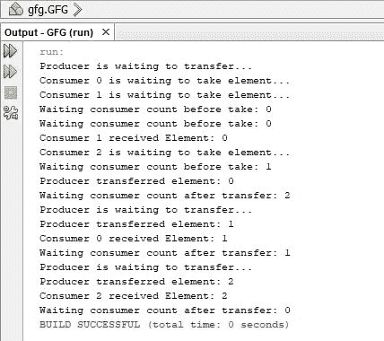

# Java 中的 LinkedTransferQueue getWaitingConsumerCount()方法，示例

> 原文:[https://www . geeksforgeeks . org/link edtransferqueue-getwaitingconsumercount-method-in-Java-with-examples/](https://www.geeksforgeeks.org/linkedtransferqueue-getwaitingconsumercount-method-in-java-with-examples/)

**T1。getWaitingConsumerCount()** 方法返回等待通过 [take()](https://www.geeksforgeeks.org/linkedtransferqueue-take-method-in-java/) 或定时轮询从[链接的 TransferQueue](https://www.geeksforgeeks.org/linkedtransferqueue-in-java-with-examples/) (LTQ)接收元素的消费者数量。这里的消费者将阅读 LTQ 中的元素。生产者将向零担订单中添加元素。只有当多个线程正在运行时，即生产者正在传输消息而消费者正在同时接收消息时，该方法才会有用。消费者会尝试阅读零担的头部。如果不能(空 LTQ 或人头已取)，则称其为*等待*。消费者会等到他们读到头，或者等到某个时间限制过去。当生产者通过转移()增加零担时，称之为*阻塞*。这意味着生产者必须等到消费者读取该元素时，才能向 LTQ 添加另一个元素。

**语法:**

```java
public int getWaitingConsumerCount()

```

**参数:**该方法不接受参数。

**返回值:**该方法返回一个 *int* 值，该值是等待 LTQ 头的消费者数量，通过 take()获得。

**示例:**下面的程序使用一个生产者和 3 个消费者。制作人发送 3 条信息。首先呼叫 take()的消费者将收到最新消息。因此，该程序的不同执行会导致不同的消费者获得不同的消息。

```java
// Java program to show LinkedTransferQueue
// getWaitingConsumerCount() method

import java.util.concurrent.*;

public class GFG {

    // create object of LinkedTransferQueue
    LinkedTransferQueue<Integer> LTQ
        = new LinkedTransferQueue<>();

    class Producer implements Runnable {

        @Override
        public void run()
        {
            for (int i = 0; i < 3; i++) {
                try {
                    System.out.println("Producer is"
                                       + " waiting to transfer...");

                    // add 0, 1, 2 to LTQ
                    LTQ.transfer(i);
                    System.out.println("Producer "
                                       + "transferred element: " + i);

                    // display how many consumers are waiting
                    // after producer has transferred element
                    System.out.println("Waiting consumer "
                                       + "count after transfer: "
                                       + LTQ
                                             .getWaitingConsumerCount());
                }
                catch (InterruptedException e) {
                    e.printStackTrace();
                }
            }
        }
    }

    class Consumer implements Runnable {
        int id;
        Consumer(int id)
        {
            this.id = id;
        }

        @Override
        public void run()
        {
            try {
                System.out.println("Consumer "
                                   + id
                                   + " is waiting to "
                                   + "take element...");

                // display how many consumers are waiting
                // before a consumer has taken element from LTQ
                System.out.println("Waiting consumer"
                                   + " count before take: "
                                   + LTQ
                                         .getWaitingConsumerCount());

                Integer s = LTQ.take();
                System.out.println("Consumer "
                                   + id
                                   + " received Element: "
                                   + s);
            }
            catch (InterruptedException e) {
                e.printStackTrace();
            }
        }
    }

    public static void main(String[] args) throws InterruptedException
    {
        // class object to keep common LTQ for all consumers
        //(alternative: LTQ can be declared static)
        GFG obj = new GFG();

        // enabling multiple threads
        ExecutorService exService
            = Executors.newFixedThreadPool(3);

        // declare one producer and 3 consumers
        Producer producer = obj.new Producer();
        Consumer consumer0 = obj.new Consumer(0);
        Consumer consumer1 = obj.new Consumer(1);
        Consumer consumer2 = obj.new Consumer(2);

        // start producer and consumers
        exService.execute(producer);
        exService.execute(consumer0);
        exService.execute(consumer1);
        exService.execute(consumer2);

        // stop
        exService.shutdown();
    }
}
```

**输出:**


**注:**显示 NetBeans 8.2 中的输出。建议在本地试用这个例子，因为它使用多线程。在线集成开发环境服务器可能不支持这一点，或者让您添加这样的负载，导致时间限制超出错误。

**参考:**[https://docs . Oracle . com/javae/9/docs/API/Java/util/concurrent/linked transfer queue . html # getwaitingconsumer count】](https://docs.oracle.com/javase/9/docs/api/java/util/concurrent/LinkedTransferQueue.html#getWaitingConsumerCount--)