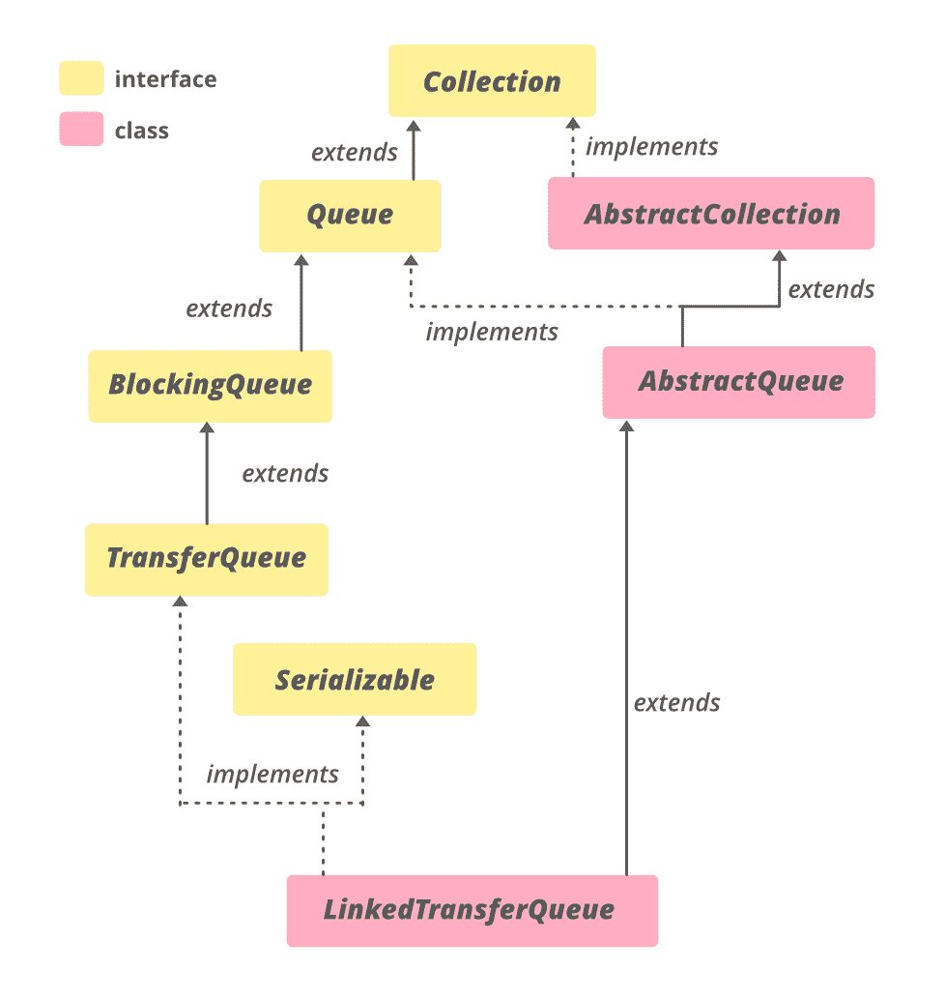

# 用示例链接 Java 中的 transferqueue

> 原文:[https://www . geeksforgeeks . org/link edtransferqueue-in-Java-with-examples/](https://www.geeksforgeeks.org/linkedtransferqueue-in-java-with-examples/)

Java 中的 **LinkedTransferQueue** 类是 [Java 收集框架](https://www.geeksforgeeks.org/collections-in-java-2/)的一部分。在 JDK 1.7 推出，属于 **java.util.concurrent** 包。它实现了**传输队列**，并提供了基于链接节点的无界功能。LinkedTransferQueue 中的元素按 FIFO 顺序排列，头部指向在队列中时间最长的元素，尾部指向在队列中时间最短的元素。由于其异步特性，size()遍历整个集合，因此它不是 O(1)时间操作。如果这个集合在遍历过程中被修改，它也可能给出不准确的大小。像添加全部、删除全部、保留全部、包含全部、等于和到数组这样的批量操作不能保证自动执行。例如，与 addAll 操作同时操作的迭代器可能只观察到一些添加的元素。

LinkedTransferQueue 使用了消息传递应用程序。消息将从生产者线程传递到消费者线程有两个方面。

1.  [put(E e)](https://www.geeksforgeeks.org/linkedtransferqueue-put-method-in-java/) :如果生产者想在不等待消费者的情况下将元素入队，则使用该方法。但是，如果队列已满，它会一直等到空间可用。
2.  [transfer(E e)](https://www.geeksforgeeks.org/linkedtransferqueue-transfer-method-in-java-with-examples/) :这个方法一般是把一个元素传递给一个正在等待接收的线程，如果没有线程在等待，那么就会等到一个线程进入等待状态，等待的线程一到达元素就会被传递到其中。

**链接传输队列的层次结构**



它实现了**可序列化**、**可迭代<E>T3】、**集合<E>T5】、[阻塞队列<E>T7】、**传输队列<E>T9】、**](https://www.geeksforgeeks.org/blockingqueue-interface-in-java/)**[队列<E>T11】接口并扩展了](https://www.geeksforgeeks.org/queue-interface-java/)[抽象队列<E>T13】和](https://www.geeksforgeeks.org/abstractqueue-in-java-with-examples/)[抽象集合<](https://www.geeksforgeeks.org/abstractcollection-in-java-with-examples/#:~:text=The%20AbstractCollection%20class%20in%20Java,iterator%20and%20the%20size%20methods.)******

**申报:**

> 公共类链接传输队列<e>扩展抽象队列<e>实现传输队列<e>，可序列化</e></e></e>

这里， **E** 是这个集合维护的元素类型。

### LinkedTransferQueue 的构造函数

为了创建 LinkedTransferQueue 的实例，我们需要从 **java.util.concurrent** 包导入。

**1。LinkedTransferQueue()** :此构造函数用于构造空队列。

> link transfer queue<e>ltq =新 link transfer queue<e>()；</e></e>

**2。LinkedTransferQueue(集合< E > c)** :这个构造函数用来构造一个队列，集合的元素作为参数传递。

> link transfer queue<e>【ltq =新 link transfer queue】<e>(集合<e>【c】；</e></e></e>

**示例 1:** 用 Java 说明 LinkedTransferQueue 的示例程序

## Java 语言(一种计算机语言，尤用于创建网站)

```
// Java Program Demonstrate LinkedTransferQueue

import java.util.concurrent.LinkedTransferQueue;
import java.util.*;

public class LinkedTransferQueueDemo {
    public static void main(String[] args)
        throws InterruptedException
    {
        // create object of LinkedTransferQueue
        // using LinkedTransferQueue() constructor
        LinkedTransferQueue<Integer> LTQ
            = new LinkedTransferQueue<Integer>();

        // Add numbers to end of LinkedTransferQueue
        LTQ.add(7855642);
        LTQ.add(35658786);
        LTQ.add(5278367);
        LTQ.add(74381793);

        // print Queue
        System.out.println("Linked Transfer Queue1: " + LTQ);

        // create object of LinkedTransferQueue
        // using LinkedTransferQueue(Collection c)
        // constructor
        LinkedTransferQueue<Integer> LTQ2
            = new LinkedTransferQueue<Integer>(LTQ);

        // print Queue
        System.out.println("Linked Transfer Queue2: " + LTQ2);
    }
}
```

**Output**

```
Linked Transfer Queue1: [7855642, 35658786, 5278367, 74381793]
Linked Transfer Queue2: [7855642, 35658786, 5278367, 74381793]
```

**例 2:**

## Java 语言(一种计算机语言，尤用于创建网站)

```
// Java code to illustrate
// methods of LinkedTransferQueue

import java.util.concurrent.LinkedTransferQueue;
import java.util.*;

public class LinkedTransferQueueDemo {
    public static void main(String[] args)
        throws InterruptedException
    {

        // create object of LinkedTransferQueue
        LinkedTransferQueue<Integer> LTQ
            = new LinkedTransferQueue<Integer>();

        // Add numbers to end of LinkedTransferQueue
        // using add() method
        LTQ.add(7855642);
        LTQ.add(35658786);
        LTQ.add(5278367);
        LTQ.add(74381793);

        // prints the Queue
        System.out.println("Linked Transfer Queue: " + LTQ);

        // prints the size of Queue after removal
        // using size() method
        System.out.println("Size of Linked Transfer Queue: "
                           + LTQ.size());

        // removes the front element and prints it
        // using poll() method
        System.out.println("First element: " + LTQ.poll());

        // prints the Queue
        System.out.println("Linked Transfer Queue: " + LTQ);

        // prints the size of Queue after removal
        // using size() method
        System.out.println("Size of Linked Transfer Queue: "
                           + LTQ.size());

        // Add numbers to end of LinkedTransferQueue
        // using offer() method
        LTQ.offer(20);

        // prints the Queue
        System.out.println("Linked Transfer Queue: " + LTQ);

        // prints the size of Queue after removal
        // using size() method
        System.out.println("Size of Linked Transfer Queue: "
                           + LTQ.size());
    }
}
```

**Output**

```
Linked Transfer Queue: [7855642, 35658786, 5278367, 74381793]
Size of Linked Transfer Queue: 4
First element: 7855642
Linked Transfer Queue: [35658786, 5278367, 74381793]
Size of Linked Transfer Queue: 3
Linked Transfer Queue: [35658786, 5278367, 74381793, 20]
Size of Linked Transfer Queue: 4
```

### 基本操作

**1。添加元素**

LinkedTransferQueue 提供了各种方法来添加或插入元素。分别是[加(E e)](https://www.geeksforgeeks.org/linkedtransferqueue-add-method-in-java/) 、[放(E e)](https://www.geeksforgeeks.org/linkedtransferqueue-put-method-in-java/) 、[献(E e)](https://www.geeksforgeeks.org/linkedtransferqueue-offer-method-in-java/) 、[转(E e)](https://www.geeksforgeeks.org/linkedtransferqueue-transfer-method-in-java-with-examples/) 。当 transfer()等待一个或多个接收线程时，add、put 和 offer 方法不关心其他线程是否访问队列。

## Java 语言(一种计算机语言，尤用于创建网站)

```
// Java Program Demonstrate adding
// elements to LinkedTransferQueue

import java.util.concurrent.*;

class AddingElementsExample {
    public static void main(String[] args)
    {

        // Initializing the queue
        LinkedTransferQueue<Integer> queue
            = new LinkedTransferQueue<Integer>();

        // Adding elements to this queue
        for (int i = 10; i <= 14; i++)
            queue.add(i);

        // Add the element using offer() method
        System.out.println("adding 15 "
            + queue.offer(15, 5, TimeUnit.SECONDS));

        // Adding elements to this queue
        for (int i = 16; i <= 20; i++)
            queue.put(i);

        // Printing the elements of the queue
        System.out.println(
            "The elements in the queue are:");
        for (Integer i : queue)
            System.out.print(i + " ");

        System.out.println();

        // create another queue to demonstrate transfer
        // method
        LinkedTransferQueue<String> g
            = new LinkedTransferQueue<String>();

        new Thread(new Runnable() {
            public void run()
            {
                try {
                    System.out.println("Transferring"
                                       + " an element");

                    // Transfer a String element
                    // using transfer() method
                    g.transfer("is a computer"
                               + " science portal.");
                    System.out.println(
                        "Element "
                        + "transfer is complete");
                }
                catch (InterruptedException e1) {
                    System.out.println(e1);
                }
                catch (NullPointerException e2) {
                    System.out.println(e2);
                }
            }
        })
            .start();

        try {

            // Get the transferred element
            System.out.println("Geeks for Geeks "
                               + g.take());
        }
        catch (Exception e) {
            System.out.println(e);
        }
    }
}
```

**Output**

```
adding 15 true
The elements in the queue are:
10 11 12 13 14 15 16 17 18 19 20 
Transferring an element
Geeks for Geeks is a computer science portal.
Element transfer is complete
```

**2。拆卸元件**

LinkedTransferQueue 提供的 [remove()](https://www.geeksforgeeks.org/linkedtransferqueue-remove-method-in-java/) 方法用于删除该队列中存在的元素。

## Java 语言(一种计算机语言，尤用于创建网站)

```
// Java Program Demonstrate removing
// elements of LinkedTransferQueue

import java.util.concurrent.LinkedTransferQueue;

class RemoveElementsExample {
    public static void main(String[] args)
    {
        // Initializing the queue
        LinkedTransferQueue<Integer> queue
            = new LinkedTransferQueue<Integer>();

        // Adding elements to this queue
        for (int i = 1; i <= 5; i++)
            queue.add(i);

        // Printing the elements of the queue
        System.out.println(
            "The elements in the queue are:");
        for (Integer i : queue)
            System.out.print(i + " ");

        // remove() method will remove the specified
        // element from the queue
        queue.remove(1);
        queue.remove(5);

        // Printing the elements of the queue
        System.out.println("\nRemaining elements in queue : ");
        for (Integer i : queue)
            System.out.print(i + " ");
    }
}
```

**Output**

```
The elements in the queue are:
1 2 3 4 5 
Remaining elements in queue : 
2 3 4 
```

**3。迭代**

LinkedTransferQueue 的[迭代器()](https://www.geeksforgeeks.org/linkedtransferqueue-iterator-method-in-java/)方法用于以正确的顺序返回该队列中元素的迭代器。

## Java 语言(一种计算机语言，尤用于创建网站)

```
// Java Program Demonstrate iterating
// over LinkedTransferQueue

import java.util.Iterator;
import java.util.concurrent.LinkedTransferQueue;

class LinkedTransferQueueIteratorExample {
    public static void main(String[] args)
    {

        // Initializing the queue
        LinkedTransferQueue<String> queue
            = new LinkedTransferQueue<String>();

        // Adding elements to this queue
        queue.add("Gfg");
        queue.add("is");
        queue.add("fun!!");

        // Returns an iterator over the elements
        Iterator<String> iterator = queue.iterator();

        // Printing the elements of the queue
        while (iterator.hasNext())
            System.out.print(iterator.next() + " ");
    }
}
```

**Output**

```
Gfg is fun!! 

```

### 链接传输队列的方法

<figure class="table">

| 

方法

 | 

描述

 |
| --- | --- |
| [加(E e)](https://www.geeksforgeeks.org/linkedtransferqueue-add-method-in-java/) | 在该队列的尾部插入指定的元素。 |
| [包含(对象 o)](https://www.google.com/url?client=internal-element-cse&cx=009682134359037907028:tj6eafkv_be&q=https://www.geeksforgeeks.org/linkedtransferqueue-contains-method-in-java/&sa=U&ved=2ahUKEwi08sCW1IvsAhWK6nMBHZB6D784ChAWMAZ6BAgEEAI&usg=AOvVaw0nDSjv1yjAGSyApBBM0OLp) | 如果此队列包含指定的元素，则返回 true。 |
| [沥水图(收藏<？超 E > c)](https://www.google.com/url?client=internal-element-cse&cx=009682134359037907028:tj6eafkv_be&q=https://www.geeksforgeeks.org/linkedtransferqueue-drainto-method-in-java/&sa=U&ved=2ahUKEwi5vp7y04vsAhUW_XMBHcv_CekQFjAEegQIBRAC&usg=AOvVaw0l7KcKHgiipIm5_mekf1A3) | 从此队列中移除所有可用元素，并将它们添加到给定集合中。 |
| [沥水图(收藏<？超 E > c，int maxElements)](https://www.google.com/url?client=internal-element-cse&cx=009682134359037907028:tj6eafkv_be&q=https://www.geeksforgeeks.org/linkedtransferqueue-drainto-method-in-java/&sa=U&ved=2ahUKEwi5vp7y04vsAhUW_XMBHcv_CekQFjAEegQIBRAC&usg=AOvVaw0l7KcKHgiipIm5_mekf1A3) | 从该队列中最多移除给定数量的可用元素，并将它们添加到给定集合中。 |
| [forEach(消费者<？超 E >动作)](https://www.google.com/url?client=internal-element-cse&cx=009682134359037907028:tj6eafkv_be&q=https://www.geeksforgeeks.org/linkedtransferqueue-foreach-method-in-java-with-examples/&sa=U&ved=2ahUKEwi08sCW1IvsAhWK6nMBHZB6D784ChAWMAB6BAgBEAI&usg=AOvVaw2BNHZ_BoRikgbuiOg5N8x1) | 对 Iterable 的每个元素执行给定的操作，直到所有元素都被处理完或者该操作引发异常。 |
| [【isempty()](https://www.google.com/url?client=internal-element-cse&cx=009682134359037907028:tj6eafkv_be&q=https://www.geeksforgeeks.org/linkedtransferqueue-isempty-method-in-java/&sa=U&ved=2ahUKEwi5vp7y04vsAhUW_XMBHcv_CekQFjAIegQIBhAB&usg=AOvVaw1Ykx_YqzqWk4BPnxx5wEK9) | 如果此队列不包含元素，则返回 true。 |
| [迭代器()](https://www.google.com/url?client=internal-element-cse&cx=009682134359037907028:tj6eafkv_be&q=https://www.geeksforgeeks.org/linkedtransferqueue-iterator-method-in-java/&sa=U&ved=2ahUKEwi5vp7y04vsAhUW_XMBHcv_CekQFjADegQICBAC&usg=AOvVaw0TIJg0BII6VOZR0aNI0a25) | 以适当的顺序返回这个队列中元素的迭代器。 |
| [报价(E e)](https://www.google.com/url?client=internal-element-cse&cx=009682134359037907028:tj6eafkv_be&q=https://www.geeksforgeeks.org/linkedtransferqueue-offer-method-in-java/&sa=U&ved=2ahUKEwi5vp7y04vsAhUW_XMBHcv_CekQFjAFegQIBBAC&usg=AOvVaw201xbbHJSP-TCImE20ayv2) | 在该队列的尾部插入指定的元素。 |
| [报价(E e，长超时，时间单位单位)](https://www.google.com/url?client=internal-element-cse&cx=009682134359037907028:tj6eafkv_be&q=https://www.geeksforgeeks.org/linkedtransferqueue-offer-method-in-java/&sa=U&ved=2ahUKEwi5vp7y04vsAhUW_XMBHcv_CekQFjAFegQIBBAC&usg=AOvVaw201xbbHJSP-TCImE20ayv2) | 在该队列的尾部插入指定的元素。 |
| [放(E e)](https://www.google.com/url?client=internal-element-cse&cx=009682134359037907028:tj6eafkv_be&q=https://www.geeksforgeeks.org/linkedtransferqueue-put-method-in-java/&sa=U&ved=2ahUKEwi08sCW1IvsAhWK6nMBHZB6D784ChAWMAV6BAgAEAI&usg=AOvVaw3UW16jBAjE_g1IaXumIRd8) | 在该队列的尾部插入指定的元素。 |
| [剩余容量()](https://www.google.com/url?client=internal-element-cse&cx=009682134359037907028:tj6eafkv_be&q=https://www.geeksforgeeks.org/linkedtransferqueue-remainingcapacity-method-in-java-with-examples/&sa=U&ved=2ahUKEwi08sCW1IvsAhWK6nMBHZB6D784ChAWMAh6BAgDEAE&usg=AOvVaw3T2VUlS4zvyz5j3KzV3wdB) | 总是返回整数。最大值，因为链接传输队列不受容量限制。 |
| [移除(物体 o)](https://www.google.com/url?client=internal-element-cse&cx=009682134359037907028:tj6eafkv_be&q=https://www.geeksforgeeks.org/linkedtransferqueue-remove-method-in-java/&sa=U&ved=2ahUKEwi5vp7y04vsAhUW_XMBHcv_CekQFjAHegQIAhAC&usg=AOvVaw3Tx2IaKSiNgBaQyANQSe94) | 从该队列中移除指定元素的单个实例(如果存在)。 |
| [移除所有(集合<？> c)](https://www.google.com/url?client=internal-element-cse&cx=009682134359037907028:tj6eafkv_be&q=https://www.geeksforgeeks.org/linkedtransferqueue-removeall-method-in-java-with-examples/&sa=U&ved=2ahUKEwi08sCW1IvsAhWK6nMBHZB6D784ChAWMAF6BAgIEAI&usg=AOvVaw1a0qGANF0R7YbNHhkEo01P) | 移除此集合中也包含在指定集合中的所有元素(可选操作)。 |
| [removeIf(谓语<？超 E >滤镜)](https://www.google.com/url?client=internal-element-cse&cx=009682134359037907028:tj6eafkv_be&q=https://www.geeksforgeeks.org/linkedtransferqueue-removeif-method-in-java-with-examples/&sa=U&ved=2ahUKEwi08sCW1IvsAhWK6nMBHZB6D784ChAWMAd6BAgCEAI&usg=AOvVaw27X3Hd-9sYyiRCtHW0id-a) | 移除此集合中满足给定谓词的所有元素。 |
| [零售(收藏<？> c)](https://www.google.com/url?client=internal-element-cse&cx=009682134359037907028:tj6eafkv_be&q=https://www.geeksforgeeks.org/linkedtransferqueue-retainall-method-in-java-with-examples/&sa=U&ved=2ahUKEwi5vp7y04vsAhUW_XMBHcv_CekQFjAGegQIAxAC&usg=AOvVaw3V6Ct7LMpTxne3cTYb6YbT) | 仅保留此集合中包含在指定集合中的元素(可选操作)。 |
| [尺寸()](https://www.google.com/url?client=internal-element-cse&cx=009682134359037907028:tj6eafkv_be&q=https://www.geeksforgeeks.org/linkedtransferqueue-size-method-in-java/&sa=U&ved=2ahUKEwi5vp7y04vsAhUW_XMBHcv_CekQFjACegQIBxAC&usg=AOvVaw0nixfCRl8_lCPXNQQDYiRt) | 返回此队列中的元素数量。 |
| [分流器()](https://www.google.com/url?client=internal-element-cse&cx=009682134359037907028:tj6eafkv_be&q=https://www.geeksforgeeks.org/linkedtransferqueue-spliterator-method-in-java/&sa=U&ved=2ahUKEwi08sCW1IvsAhWK6nMBHZB6D784ChAWMAl6BAgFEAE&usg=AOvVaw2qC1Ury5Eaz7g_y2HuLiM0) | 在该队列中的元素上返回一个[分隔符](https://www.geeksforgeeks.org/java-util-interface-spliterator-java8/)。 |
| [toaarray()](https://www.google.com/url?client=internal-element-cse&cx=009682134359037907028:tj6eafkv_be&q=https://www.geeksforgeeks.org/linkedtransferqueue-toarray-method-in-java-with-examples/&sa=U&ved=2ahUKEwi08sCW1IvsAhWK6nMBHZB6D784ChAWMAN6BAgJEAE&usg=AOvVaw1g1WDdG65ksnksA42rrKJt) | 按正确的顺序返回包含该队列中所有元素的数组。 |
| [toaarray(t[]a)](https://www.google.com/url?client=internal-element-cse&cx=009682134359037907028:tj6eafkv_be&q=https://www.geeksforgeeks.org/linkedtransferqueue-toarray-method-in-java-with-examples/&sa=U&ved=2ahUKEwi08sCW1IvsAhWK6nMBHZB6D784ChAWMAN6BAgJEAE&usg=AOvVaw1g1WDdG65ksnksA42rrKJt) | 按正确的顺序返回包含该队列中所有元素的数组；返回数组的运行时类型是指定数组的运行时类型。 |
| [转移(E e)](https://www.google.com/url?client=internal-element-cse&cx=009682134359037907028:tj6eafkv_be&q=https://www.geeksforgeeks.org/linkedtransferqueue-transfer-method-in-java-with-examples/&sa=U&ved=2ahUKEwiO6MS_1IvsAhWb8HMBHdCkAYM4FBAWMAJ6BAgHEAI&usg=AOvVaw0KO-5hy1V_b4FAmrXqp4FE) | 将元素传递给使用者，必要时等待。 |
| [try transfer(e)](https://www.google.com/url?client=internal-element-cse&cx=009682134359037907028:tj6eafkv_be&q=https://www.geeksforgeeks.org/linkedtransferqueue-trytransfer-method-in-java-with-examples/&sa=U&ved=2ahUKEwiO6MS_1IvsAhWb8HMBHdCkAYM4FBAWMAB6BAgAEAI&usg=AOvVaw0hnYAALky4PoGwzgHwS3eV) | 如果可能，立即将元素传输给等待的使用者。 |
| [尝试转移(E e，长超时，时间单位单位)](https://www.google.com/url?client=internal-element-cse&cx=009682134359037907028:tj6eafkv_be&q=https://www.geeksforgeeks.org/linkedtransferqueue-trytransfer-method-in-java-with-examples/&sa=U&ved=2ahUKEwiO6MS_1IvsAhWb8HMBHdCkAYM4FBAWMAB6BAgAEAI&usg=AOvVaw0hnYAALky4PoGwzgHwS3eV) | 如果有可能在超时之前将元素传输给使用者，则将元素传输给使用者。 |

</figure>

### java.util.AbstractQueue 类中声明的方法

<figure class="table">

| 

方法

 | 

描述

 |
| --- | --- |
| [addAll(收藏<？延伸 E > c)](https://www.geeksforgeeks.org/abstractqueue-addall-method-in-java-with-examples/) | 将指定集合中的所有元素添加到该队列中。 |
| [晴()](https://www.geeksforgeeks.org/abstractqueue-clear-method-in-java-with-examples/) | 从此队列中移除所有元素。 |
| [元素()](https://www.geeksforgeeks.org/abstractqueue-element-method-in-java-with-examples/) | 检索但不移除该队列的头。 |
| [移除()](https://www.geeksforgeeks.org/abstractqueue-remove-method-in-java-with-examples/#:~:text=The%20remove()%20method%20of,the%20head%20of%20this%20queue.&text=Parameters%3A%20This%20method%20does%20not,if%20the%20queue%20is%20empty.) | 检索并删除该队列的头。 |

</figure>

### java.util.AbstractCollection 类中声明的方法

<figure class="table">

| 

方法

 | 

描述

 |
| --- | --- |
| [包含所有(收藏<？> c)](https://www.geeksforgeeks.org/abstractcollection-containsall-method-in-java-with-examples/) | 如果此集合包含指定集合中的所有元素，则返回 true。 |
| [toString()](https://www.geeksforgeeks.org/abstractcollection-tostring-method-in-java-with-examples/) | 返回此集合的字符串表示形式。 |

</figure>

### 接口 Java . util . concurrent . blockingqueue 中声明的方法

<figure class="table">

| 

方法

 | 

描述

 |
| --- | --- |
| [轮询(长超时，时间单位单位)](https://www.geeksforgeeks.org/blockingqueue-poll-method-in-java-with-examples/) | 检索并删除该队列的头，如果需要某个元素变得可用，则等待指定的等待时间。 |
| [取()](https://www.geeksforgeeks.org/blockingqueue-take-method-in-java-with-examples/) | 检索并移除该队列的头，如有必要，等待直到某个元素变得可用。 |

</figure>

### 接口 java.util.Collection 中声明的方法

<figure class="table">

| 

方法

 | 

描述

 |
| --- | --- |
| [addAll(收藏<？延伸 E > c)](https://www.geeksforgeeks.org/collection-addall-method-in-java-with-examples/) | 将指定集合中的所有元素添加到此集合中(可选操作)。 |
| 清除() | 从此集合中移除所有元素(可选操作)。 |
| 包含所有(集合> c) | 如果此集合包含指定集合中的所有元素，则返回 true。 |
| 等于(对象 0) | 将指定的对象与此集合进行比较，看是否相等。 |
| hashCode() | 返回此集合的哈希代码值。 |
| 并行流() | 以此集合为源返回一个可能并行的流。 |
| 流() | 返回以此集合为源的顺序流。 |
| toArray (IntFunction <t>生成器)</t> | 使用提供的生成器函数分配返回的数组，返回包含此集合中所有元素的数组。 |

</figure>

### 接口 java.util.Queue 中声明的方法

<figure class="table">

| 

方法

 | 

描述

 |
| --- | --- |
| [元素()](https://www.geeksforgeeks.org/queue-element-method-in-java/) | 检索但不移除该队列的头。 |
| [peek()](https://www.geeksforgeeks.org/queue-peek-method-in-java/) | 检索但不移除该队列的头，如果该队列为空，则返回 null。 |
| [投票()](https://www.geeksforgeeks.org/queue-poll-method-in-java/) | 检索并删除该队列的头，如果该队列为空，则返回 null。 |
| [移除()](https://www.geeksforgeeks.org/queue-remove-method-in-java/#:~:text=The%20remove()%20method%20of,when%20the%20Queue%20is%20empty.) | 检索并删除该队列的头。 |

</figure>

### 接口 Java . util . concurrent . transfer queue 中声明的方法

<figure class="table">

| 

方法

 | 

描述

 |
| --- | --- |
| [get waitingconsuercount()](https://www.geeksforgeeks.org/linkedtransferqueue-getwaitingconsumercount-method-in-java-with-examples/) | 返回等待通过 [BlockingQueue.take()](https://www.geeksforgeeks.org/blockingqueue-take-method-in-java-with-examples/) 或定时[轮询](https://www.geeksforgeeks.org/blockingqueue-poll-method-in-java-with-examples/)接收元素的消费者的估计数量。 |
| haswaitingconsumer() | 如果至少有一个消费者等待通过 [BlockingQueue.take()](https://www.geeksforgeeks.org/blockingqueue-take-method-in-java-with-examples/) 或定时[轮询](https://www.geeksforgeeks.org/blockingqueue-poll-method-in-java-with-examples/)接收元素，则返回 true。 |

</figure>

**参考:**[https://docs . Oracle . com/en/Java/javase/11/docs/API/Java . base/Java/util/concurrent/linkedtransferqueue . html](https://docs.oracle.com/en/java/javase/11/docs/api/java.base/java/util/concurrent/LinkedTransferQueue.html)