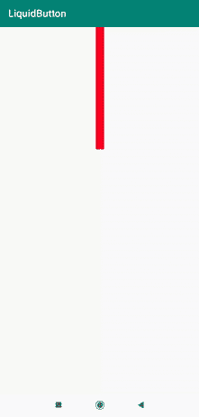

# 安卓中的液体按钮

> 原文:[https://www.geeksforgeeks.org/liquid-button-in-android/](https://www.geeksforgeeks.org/liquid-button-in-android/)

在本文中，我们将实现一个液体按钮库，这可以用来显示按钮上的动画。当用户成功完成一门课程或完成填写表单上的所有细节时，我们可以显示这个液体按钮，以良好的方式显示成功。让我们看看这个特性的实现。下面给出了一个 GIF 示例，来了解一下我们将在本文中做什么。注意，我们将使用 **Java** 语言来实现这个项目。



### **分步实施**

**第一步:创建新项目**

要在安卓工作室创建新项目，请参考[如何在安卓工作室创建/启动新项目](https://www.geeksforgeeks.org/android-how-to-create-start-a-new-project-in-android-studio/)。注意选择 **Java** 作为编程语言。

**第二步:添加依赖关系**

导航到**渐变脚本>构建.渐变(模块:应用)**，并在依赖项部分添加以下依赖项。

> 编译' com . gospellware . liquid button:liquid buttonlib:1 . 1 . 5 '

**步骤 3:使用 activity_main.xml 文件**

导航到**应用程序> res >布局> activity_main.xml** 并将下面的代码添加到该文件中。下面是 **activity_main.xml** 文件的代码。

## 可扩展标记语言

```
<?xml version="1.0" encoding="utf-8"?>
<RelativeLayout
    xmlns:android="http://schemas.android.com/apk/res/android"
    xmlns:tools="http://schemas.android.com/tools"
    android:layout_width="match_parent"
    android:layout_height="match_parent"
    tools:context=".MainActivity">

    <com.gospelware.liquidbutton.LiquidButton
        android:id="@+id/button"
        android:layout_width="wrap_content"
        android:layout_height="wrap_content"
        android:layout_centerInParent="true" />

</RelativeLayout>
```

**第四步:使用****MainActivity.java 文件**

转到**MainActivity.java**文件，参考以下代码。以下是**MainActivity.java**文件的代码。

## Java 语言(一种计算机语言，尤用于创建网站)

```
import android.os.Bundle;
import android.view.View;
import android.widget.Toast;

import androidx.appcompat.app.AppCompatActivity;

import com.gospelware.liquidbutton.LiquidButton;

public class MainActivity extends AppCompatActivity {

    @Override
    protected void onCreate(Bundle savedInstanceState) {
        super.onCreate(savedInstanceState);
        setContentView(R.layout.activity_main);
        final LiquidButton liquidButton = findViewById(R.id.button);
        liquidButton.setOnClickListener(new View.OnClickListener() {
            @Override
            public void onClick(View view) {
                LiquidButton btn = (LiquidButton) view;
                btn.startPour();
                btn.setFillAfter(true);
                btn.setAutoPlay(true);
            }
        });
        liquidButton.setPourFinishListener(new LiquidButton.PourFinishListener() {
            @Override
            public void onPourFinish() {
                Toast.makeText(MainActivity.this, "Finish", Toast.LENGTH_SHORT).show();
            }

            @Override
            public void onProgressUpdate(float progress) {
                liquidButton.changeProgress(progress);
            }
        });
    }
}
```

**输出:**

<video class="wp-video-shortcode" id="video-612668-1" width="640" height="360" preload="metadata" controls=""><source type="video/mp4" src="https://media.geeksforgeeks.org/wp-content/uploads/20210517140205/liquidb.mp4?_=1">[https://media.geeksforgeeks.org/wp-content/uploads/20210517140205/liquidb.mp4](https://media.geeksforgeeks.org/wp-content/uploads/20210517140205/liquidb.mp4)</video>