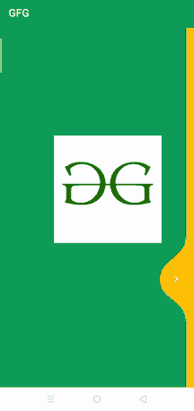
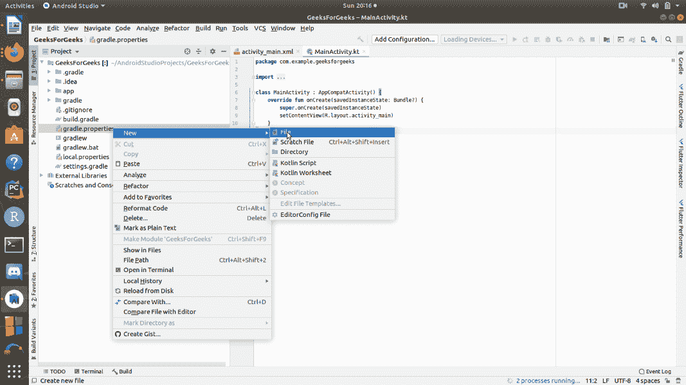

# 安卓中的液体刷动动画

> 原文:[https://www . geesforgeks . org/liquid-swipe-animation-in-Android/](https://www.geeksforgeeks.org/liquid-swipe-animation-in-android/)

**液体滑动动画**用于像水一样滑动页面，在屏幕上显示不同的设计和图案。它会创建一个浮动状态。液体滑动动画是一个非常流行的设计过程。移动可以帮助客户从您的用户界面设计中获得更长时间的灵感，并更积极地与内容进行协作。这种方法以一种新的方式为应用程序提供了流畅的外观。在本文中，我们将在 android studio 中开发 Liquid Swipe 动画效果。

### 我们将在本文中构建什么？

在本文中，我们将开发一个示例应用程序，在其活动上使用液体滑动动画效果。下面给出了一个示例 GIF，以了解我们将在本文中做什么。注意，我们将使用 **Java** 语言来实现这个项目。



### 逐步实施

**第一步:创建新项目**

要在安卓工作室创建新项目，请参考[如何在安卓工作室创建/启动新项目](https://www.geeksforgeeks.org/android-how-to-create-start-a-new-project-in-android-studio/)。注意选择 **Java** 作为编程语言。

**第二步:创建文件名 github.properties**

现在在**项目**文件夹中，转到**gradle . properties>New>File**然后创建一个名为 **github.properties.** 的新文件，下面提供了一个分步实现的图片，以供您参考。



**步骤 3:使用文件 github.properties**

在 **github.properties** 文件中添加下面写的代码行，但是请记住您必须将您的 **github 用户名**放在 **gpr.usr** 前面，将 **github 令牌**放在 **gpr.key** 前面。

## Java 语言(一种计算机语言，尤用于创建网站)

```java
gpr.usr = github_username_here
gpr.key = github_generated_token_here
```

**如何生成 Github 令牌？**

在您的 GitHub 帐户中，转到**设置>开发人员设置>个人访问令牌>生成一个新令牌**，并将生成的令牌放在**GPR . key**前面的**GitHub . propertrite**s 中

**第 4 步:添加 maven 存储库**

现在，转到根 **build.gradle(Project)** 并在 allprojects{ }部分中的 **jcenter()** 下面的存储库末尾添加这些行。

## Java 语言(一种计算机语言，尤用于创建网站)

```java
def githubProperties = new Properties()
    githubProperties.load(new FileInputStream(rootProject.file("github.properties")))
    repositories {
        maven {
            name = "GitHubPackages"

            url = uri("https://maven.pkg.github.com/Cuberto/liquid-swipe-android")
            credentials {
                /** Create github.properties in root project folder file with     
                ** gpr.usr=GITHUB_USER_ID & gpr.key=PERSONAL_ACCESS_TOKEN 
                ** Or set env variable GPR_USER & GPR_API_KEY if not adding a properties file**/
                username = githubProperties['gpr.usr'] ?: System.getenv("GPR_USER")
                password = githubProperties['gpr.key'] ?: System.getenv("GPR_API_KEY")
            }
      }
}
```

**第五步:添加依赖关系**

现在，导航到**渐变脚本>构建。渐变(模块:应用)**在依赖项部分添加下面的依赖项。

## Java 语言(一种计算机语言，尤用于创建网站)

```java
implementation 'com.cuberto:liquid-swipe:1.0.0'
implementation 'androidx.core:core-ktx:1.3.2'
implementation "org.jetbrains.kotlin:kotlin-stdlib:1.4.10"
```

最后，同步您的项目，现在我们拥有了实施过程中所需的一切，现在，开始实施吧。

**第六步:创建两个空白片段**

创建空白片段请参考[如何在安卓工作室](https://www.geeksforgeeks.org/how-to-create-a-new-fragment-in-android-studio/)创建新片段。按照链接中提供的步骤，为此应用程序创建两个空白片段。为了这篇文章，我们创建了两个名为**碎片 1** 和**碎片 2** 的碎片。

**第 7 步:使用 fragment_1.xml 文件**

转到 **app > res >布局> fragment_1.xml** 并将下面写的代码粘贴到 **fragment_1.xml** 文件中。

## 可扩展标记语言

```java
<?xml version="1.0" encoding="utf-8"?>
<FrameLayout 
    xmlns:android="http://schemas.android.com/apk/res/android"
    xmlns:tools="http://schemas.android.com/tools"
    android:layout_width="match_parent"
    android:layout_height="match_parent"
    android:background="#0F9D58"
    tools:context=".Fragment1">

    <!-- TODO: Update blank fragment layout -->

    <!-- Create a ImageView and set it's position -->
    <ImageView
        android:id="@+id/imageView2"
        android:layout_width="wrap_content"
        android:layout_height="wrap_content"
        android:layout_marginLeft="100dp"
        android:layout_marginTop="200dp"
        android:src="@drawable/geeksforgeeks2" />

</FrameLayout>
```

**第 8 步:使用 fragment_2.xml 文件**

接下来，转到 **app > res >布局> fragment_2.xml** 并将下面写的代码粘贴到 **fragment_2.xml** 文件中。

## 可扩展标记语言

```java
<?xml version="1.0" encoding="utf-8"?>
<FrameLayout 
    xmlns:android="http://schemas.android.com/apk/res/android"
    xmlns:tools="http://schemas.android.com/tools"
    android:layout_width="match_parent"
    android:layout_height="match_parent"
    android:background="#FFC107"
    tools:context=".Fragment2">

    <!-- TODO: Update blank fragment layout -->

</FrameLayout>
```

**第 9 步:创建一个类视图页面**

转到 **app > java >包名**，创建一个名为**viewPager.java**的新类，并在**视图页面**类中添加下面编写的代码。代码中添加了注释，以更详细地理解代码。

## Java 语言(一种计算机语言，尤用于创建网站)

```java
import androidx.annotation.NonNull;
import androidx.fragment.app.Fragment;
import androidx.fragment.app.FragmentManager;
import androidx.fragment.app.FragmentPagerAdapter;

public class viewPager extends FragmentPagerAdapter {

    // creation of constructor of viewPager class
    public viewPager(@NonNull FragmentManager fm, int behaviour) {
        super(fm, behaviour);
    }

    @NonNull

    @Override

    // create the getItem method of
    // FragmentPagerAdapter class
    public Fragment getItem(int position) {

        switch (position) {
            case 0:
                return new Fragment1();    // Fragment1 is the name of first blank fragment, 
                                           // you can replace its name with your created fragment name
            case 1:
                return new Fragment2();    // Fragment2 is the name of second blank fragment, 
                                           // you can replace its name with your created fragment name
        }
        return null;
    }

    @Override
    public int getCount() {
        return 2;
    }
}
```

**步骤 10:使用 activity_main.xml 文件**

现在，转到**应用程序> res >布局> activity_main.xml** 并将下面编写的代码粘贴到 **activity_main.xml** 文件中。

## 可扩展标记语言

```java
<?xml version="1.0" encoding="utf-8"?>
<RelativeLayout 
    xmlns:android="http://schemas.android.com/apk/res/android"
    xmlns:tools="http://schemas.android.com/tools"
    android:id="@+id/relative_layout"
    android:layout_width="match_parent"
    android:layout_height="match_parent"
    android:background="#0F9D58"
    tools:context=".MainActivity">

    <!-- apply LiquidPager on main activity -->
    <com.cuberto.liquid_swipe.LiquidPager
        android:id="@+id/pager"
        android:layout_width="match_parent"
        android:layout_height="match_parent"></com.cuberto.liquid_swipe.LiquidPager>

</RelativeLayout>
```

**步骤 11:使用 MainActivity.java 文件**

转到 **app > java >包名>MainActivity.java**文件，参考以下代码。以下是**MainActivity.java**文件的代码。代码中添加了注释，以更详细地理解代码。

## Java 语言(一种计算机语言，尤用于创建网站)

```java
import android.os.Bundle;

import androidx.appcompat.app.AppCompatActivity;

import com.cuberto.liquid_swipe.LiquidPager;

public class MainActivity extends AppCompatActivity {

    // declare LiquidPager
    LiquidPager pager;

    // declare viewPager
    viewPager viewPager;

    @Override
    protected void onCreate(Bundle savedInstanceState) {
        super.onCreate(savedInstanceState);
        setContentView(R.layout.activity_main);

        // definition of pager using method findViewById()
        pager = findViewById(R.id.pager);

        // calling the constructor of viewPager class
        viewPager = new viewPager(getSupportFragmentManager(), 1);
        pager.setAdapter(viewPager);
    }
}
```

仅此而已，现在应用程序已准备好安装在设备上。下面是应用程序的输出。

### 输出:

<video class="wp-video-shortcode" id="video-565477-1" width="640" height="360" preload="metadata" controls=""><source type="video/mp4" src="https://media.geeksforgeeks.org/wp-content/uploads/20210228223133/gfg_slider.mp4?_=1">[https://media.geeksforgeeks.org/wp-content/uploads/20210228223133/gfg_slider.mp4](https://media.geeksforgeeks.org/wp-content/uploads/20210228223133/gfg_slider.mp4)</video>