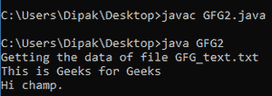

# 用示例从 Java 类路径加载资源

> 原文:[https://www . geesforgeks . org/loading-resources-from-class path-in-Java-with-example/](https://www.geeksforgeeks.org/loading-resources-from-classpath-in-java-with-example/)

资源是文件或图像或其他格式的东西的集合。Java 程序帮助我们加载这些文件或资源的映像，并对它们执行读写操作。例如，我们可以从任何资源目录加载一个文件，然后能够读取该文件的内容。基本上，我们主要集中在加载的主题上，而不是如何读取文件，但是我们将使用一些如何读取文件的想法来演示我们的示例。

加载资源和对资源执行操作主要有两种方式。我们可以以 inputstream 或 URL 格式加载文件(存在于 resources 文件夹中)，然后对它们执行操作。

所以基本上命名为:**[](https://www.geeksforgeeks.org/class-getresource-method-in-java-with-examples/)****和 [**的两个方法都是用来从类路径加载资源的。这些方法通常分别返回 URL 和输入流。这些方法存在于 java.lang.Class 包中。**](https://www.geeksforgeeks.org/class-getresourceasstream-method-in-java-with-examples/)******

****所以这里我们采取的是使用 [**classLoader()**](https://www.geeksforgeeks.org/classloader-in-java/) 方法获取绝对类路径。另外，我们在这里使用[**getClass()**](https://www.geeksforgeeks.org/writer-getclass-method-in-java-with-examples/)**方法来获取路径要被加载的类。基本上，它将是。我们代码的类文件。所以我们应该确保资源位于类的路径中。******

******因此，使用类路径从名称本身加载文件是通过结合所有上述方法来完成的。获取文件后，我们必须读取其内容，因此我们将对它们执行读取操作。******

> ******我们将使用 **obj.getClass()。getClassLoader()。getresourcassstream()**和 **obj.getClass()。getClassLoader()。getResource()** 方法分别获取文件的流和 URL，然后对其执行读取操作。******

****因此，这里需要考虑两个要点:****

1.  ****这里我们声明文件的公共类的对象，因为 getClass()方法是非静态的。所以我们不能在没有对象的情况下调用这个方法。****
2.  ****在下面的代码中，我们正在考虑一个名为 GFG_text.txt 的文件，它充当一个资源，我们正在注意这个资源与我们的资源在同一路径上。类文件。****

******代码 1:使用 getResourceAsStream()方法。******

## ****Java 语言(一种计算机语言，尤用于创建网站)****

```
**// Java program to load resources from Classpath
// using getResourceAsStream() method.

import java.io.*;
import java.nio.file.Files;

//save file as the name of GFG2
public class GFG2 {

    //main class
    public static void main(String[] args) throws Exception {

        // creating object of the class
        // important since the getClass() method is 
        // not static.
        GFG2 obj = new GFG2();

        // name of the resource
        // the resource is stored in our base path of the 
        // .class file.
        String fileName = "GFG_text.txt";

        System.out.println("Getting the data of file " + fileName);

        // declaring the input stream
        // and initializing the stream.
        InputStream instr = obj.getClass().getClassLoader().getResourceAsStream(fileName);

        // reading the files with buffered reader 
        InputStreamReader strrd = new InputStreamReader(instr);

        BufferedReader rr = new BufferedReader(strrd);

        String line;

        // outputting each line of the file.
        while ((line = rr.readLine()) != null) 
                System.out.println(line);
            } 
}**
```

 ****

上述程序的输出。

**代码 2:使用 getResource()方法。**

## Java 语言(一种计算机语言，尤用于创建网站)

```
// Java program to load resources from Classpath
// using getResource() method.

import java.io.*;
import java.net.URI;
import java.net.URISyntaxException;
import java.net.URL;
import java.nio.charset.StandardCharsets;
import java.nio.file.Files;
import java.util.List;

//save file as the name of GFG2
public class GFG2 {

    //main class
    public static void main(String[] args) throws Exception {

        // creating object of the class
        // important since the getClass() method is 
        // not static.
        GFG2 obj = new GFG2();

        // name of the resource
        // the resource is stored in our base path of the 
        // .class file.
        String fileName = "GFG_text.txt";

        System.out.println("Getting the data of file " + fileName);

        // getting the URL of the resource
        // and creating a file object to the given URL
        URL url = obj.getClass().getClassLoader().getResource(fileName);

        File file = new File(url.toURI());

        // reading the file data 
        // by creating a list of strings 
        // of each line
        List<String> line;

        // method of files class to read all the lines of the 
        // file specified.
        line = Files.readAllLines(file.toPath(), StandardCharsets.UTF_8);

        // reading the list of the line in the file.
        for(String s: line)
            System.out.println(s);
    }
}
```


第二个代码的输出。****