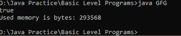
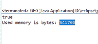

# Java 中本地 IDE 与在线 IDE 的对比

> 原文:[https://www . geesforgeks . org/local-ide-vs-online-ide-in-Java/](https://www.geeksforgeeks.org/local-ide-vs-online-ide-in-java/)

集成开发环境(IDE)是一种软件，它将普通的开发人员工具组合成一个单一的图形用户界面，用于开发应用程序(GUI)。集成开发环境通常由以下组件组成:

**1。源代码编辑器:**它是一个文本编辑器，可以帮助您编写软件代码，通过可视化提示突出语法，提供特定于语言的自动完成，并在您键入时检查错误。

**2。本地构建自动化:**自动化简单、可重复任务的实用程序，例如将计算机源代码编译为二进制代码、打包二进制代码以及运行自动化测试，作为创建软件本地构建供开发人员使用的一部分。

**3。调试器:**可以图形化显示原代码中 bug 位置的程序，用于测试其他程序。

**离线 IDE 或本地 IDE**

程序员使用各种离线 ide 来帮助他们更高效地学习和工作。

**1。** Eclipse 13 不仅仅是另一个 Java 编辑器。它最显著的好处是通过 tabbing 方法完成代码，这在编写文档时节省了大量时间。在编写项目代码时，它有一个内置的语法检查来纠正任何输入错误的单词。代码完成、模板、与各种供应链管理系统的集成，以及与构建系统的集成，都是我们对集成开发环境的期望。它有很多代码格式化和清理工具。在我看来，它的构建系统设计良好且直观。我们认为，这些是公司声誉的基础。它还有一个重构特性，可以定位和替换工作的函数、变量和类。

**2。**与其他 ide 相比，NetBeans 7 是一个免费的直观编辑器，可以做任何事情。它附带了一个简单的 Swing GUI 设计工具，允许您通过拖放按钮和文本框等组件来创建用户界面。缺点是加载速度慢，并且由于其特性，比其他 ide 消耗更多内存。

**3。**效率最高的离线编辑器是 IntelliJ IDEA 4，但不是免费的。它比大多数编辑都快，但是它有很多缺点。从系统中使用太多内存是一个显著的优势。

**在线 IDE**

在线编译器易于设置和使用。你只需要一个网络浏览器和一个活跃的互联网连接。从任何地方编译、保存和访问您的代码，而没有管理开销或资源限制。这些基于网络的应用程序可以使用任何网络连接或设备(独立于平台)从任何地方访问。编译程序的错误/输出可以更容易地存储。

**GeeksForGeeks IDE–**GeeksForGeeks 是最受欢迎的计算机科学门户，拥有大量优秀的文章，是学习和练习编码的最佳场所之一。它还附带了一个智能集成开发环境，允许您使用自定义输入以极快的速度运行代码。它有很多很酷的功能。在文本区域，您可以将代码编写或粘贴到任何流行的编程语言中，并在线运行。您还可以下载并生成代码的网址，以便于共享。

*   它非常轻，易于启动，加载时间最短。
*   根据您的喜好，将主题更改为浅色或深色。
*   轻松切换编程语言。
*   用 C++、Java、Python、Perl、Scala 和其他流行语言运行您的代码。
*   快捷方式可以帮助您节省时间。
*   在本地系统上安装代码。
*   即使在手机上，它也能很好地工作。
*   没有必要创建帐户来使用这项服务，因为它是完全匿名的。

### **离线和在线 IDE 的区别**

<figure class="table">

| 

**离线开发环境 （T1】**

 | 

**在线 IDE**

 |
| --- | --- |
| 在脱机集成开发环境中，可以从本地计算机访问项目 | 在在线集成开发环境中，项目可以从任何地方访问；不需要特殊的设置或配置。 |
| 由于所有信息都存储在本地电脑中，因此存在硬件限制。 | 没有硬件限制，因为所有信息都存储在云中。 |
| 超级快和互联网独立 | 需要互联网，与离线集成开发环境相比速度较慢，因为是通过互联网呈现的。 |
| 大多数本地 IDEs 允许用户通过安装插件来添加额外的功能，以帮助开发过程。 | 在线集成开发环境为完全配置的开发人员工作区提供了一个最喜欢的集成开发环境，以及为特定生产环境定制的环境设置。 |
| 为了避免出现配置漂移的情况，下载和安装这些附加文件时要格外小心。在这种情况下，由于库不匹配，离线 IDE 代码无法在生产环境中工作。 | 在线集成开发环境不容易出现配置漂移 |

</figure>

**示例:**

## Java 语言(一种计算机语言，尤用于创建网站)

```
import java.lang.*;
import java.util.*;
class GFG {
    private static final long MEGABYTE = 1024L * 1024L;

    public static long bytesToMegabytes(long bytes)
    {
        return bytes / MEGABYTE;
    }

    // Check for number prime or not
    static boolean isPrime(int n)
    {
        // Check if number is less than
        // equal to 1
        if (n <= 1)
            return false;

        // Check if number is 2
        else if (n == 2)
            return true;

        // Check if n is a multiple of 2
        else if (n % 2 == 0)
            return false;

        // If not, then just check the odds
        for (int i = 3; i <= Math.sqrt(n); i += 2) {
            if (n % i == 0)
                return false;
        }
        return true;
    }

    // Driver code
    public static void main(String[] args)
    {
        if (isPrime(19))
            System.out.println("true");
        else
            System.out.println("false");

        // Get the Java runtime
        Runtime runtime = Runtime.getRuntime();

        // Run the garbage collector
        runtime.gc();

        // Calculate the used memory
        long memory
            = runtime.totalMemory() - runtime.freeMemory();
        System.out.println("Used memory is bytes: "
                           + memory);
        System.out.println("Used memory is megabytes: "
                           + bytesToMegabytes(memory));
    }
}
```

**命令行输出**



**在 Eclipse IDE 中输出**



**极客主机集成开发环境中的输出**


这里你可以看到上面程序内存消耗的不同。