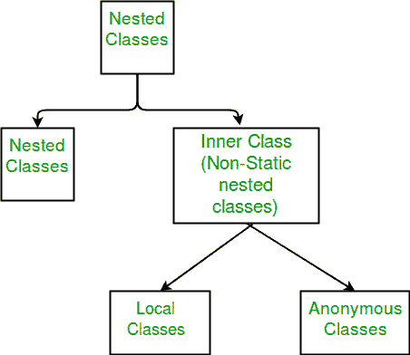

# Java 中的局部内部类

> 原文:[https://www.geeksforgeeks.org/local-inner-class-java/](https://www.geeksforgeeks.org/local-inner-class-java/)

**先决条件:**[Java 中的嵌套类](https://www.geeksforgeeks.org/nested-classes-java/)

局部内部类是在*块*中定义的内部类。通常，这个块是一个方法体。有时这个块可以是 for 循环或 if 子句。本地内部类不是任何封闭类的成员。它们属于定义它们的块，因此本地内部类不能有任何关联的访问修饰符。但是，它们可以标记为最终的或抽象的。这个类可以访问包含它的类的字段。本地内部类必须在定义它们的块中实例化。

**局部内类规则:**

1.  本地内部类的范围被限制在定义它们的*块*中。
2.  本地内部类**不能从创建它的*块*外部实例化。**
3.  直到 JDK 7，局部内部类只能访问**封闭块**的最终局部变量。然而，从 JDK 8，可以在局部内部类中访问封闭块的非最终局部变量。
4.  一个局部类可以访问它的**封闭类**的成员。
5.  本地内部类可以扩展抽象类或实现接口。



**声明局部内部类**:局部内部类可以在一个块内声明。这个块可以是方法体、初始化块、for 循环，甚至是 if 语句。

**访问成员:**本地内部类可以访问包含它的类的字段以及它所定义的块的字段。但是，这些类只有在声明为 final 或实际上是 final 时，才能访问包含它的块的变量或参数。一个变量的值一旦初始化就不会改变，这个变量实际上叫做最终变量。方法体内定义的局部内部类可以访问其参数。

**编译时会发生什么？**

编译包含本地内部类的程序时，编译器会生成两个。类文件，一个用于外部类，另一个用于引用外部类的内部类。编译器将这两个文件命名为:

*   外层
*   外部$ 1 内部类

**方法体内的声明**

## Java 语言(一种计算机语言，尤用于创建网站)

```
// Java program to illustrate
// working of local inner classes

public class Outer
{
    private void getValue()
    {
        // Note that local variable(sum) must be final till JDK 7
        // hence this code will work only in JDK 8
        int sum = 20;

        // Local inner Class inside method
        class Inner
        {
            public int divisor;
            public int remainder;

            public Inner()
            {
                divisor = 4;
                remainder = sum%divisor;
            }
            private int getDivisor()
            {
                return divisor;
            }
            private int getRemainder()
            {
                return sum%divisor;
            }
            private int getQuotient()
            {
                System.out.println("Inside inner class");
                return sum / divisor;
            }
        }

        Inner inner = new Inner();
        System.out.println("Divisor = "+ inner.getDivisor());
        System.out.println("Remainder = " + inner.getRemainder());
        System.out.println("Quotient = " + inner.getQuotient());
    }

    public static void main(String[] args)
    {
        Outer outer = new Outer();
        outer.getValue();
    }
}
```

**Output**

```
Divisor = 4
Remainder = 0
Inside inner class
Quotient = 5
```

> **注意:**局部类可以访问封闭块的局部变量和参数，这些变量和参数实际上是*最终的*。

例如，如果您在上述示例中的*内部*类构造函数或*内部*类的任何方法中添加突出显示的赋值语句:

```
public Inner()
{
   sum = 50;
   divisor = 4;
   remainder = sum%divisor;
}
```

因为这个赋值语句，变量*和*不再是*有效的最终*。因此，Java 编译器会生成类似于“从内部类引用的局部变量必须是最终的或者实际上是最终的”的错误消息

**if 语句中的声明**

## Java 语言(一种计算机语言，尤用于创建网站)

```
// Java program to illustrate Declaration of
// local inner classes inside an if statement

public class Outer
{
    public int data = 10;
    public int getData()
    {
        return data;
    }
    public static void main(String[] args)
    {
        Outer outer = new Outer();

        if(outer.getData() < 20)
        {
            // Local inner class inside if clause
            class Inner
            {
                public int getValue()
                {
                    System.out.println("Inside Inner class");
                    return outer.data;
                }
            }

            Inner inner = new Inner();
            System.out.println(inner.getValue());
        }
        else
        {
            System.out.println("Inside Outer class");
        }
    }
}
```

**Output**

```
Inside Inner class
10
```

**演示内部类的错误代码**

## Java 语言(一种计算机语言，尤用于创建网站)

```
// Java code to demonstrate that inner
// classes cannot be declared as static

public class Outer
{
    private int getValue(int data)
    {
        static class Inner
        {
            private int getData()
            {
                System.out.println("Inside inner class");
                if(data < 10)
                {
                    return 5;
                }
                else
                {
                    return 15;
                }
            }
        }

        Inner inner = new Inner();
        return inner.getData();
    }

    public static void main(String[] args)
    {
        Outer outer = new Outer();
        System.out.println(outer.getValue(10));
    }
}
```

**输出**

```
Compilation error
```

**解释:**上面的程序由于内部类不能声明为静态，导致编译错误。内部类与它们在其中定义的块相关联，而不是与外部类相关联(在本例中是外部类)。

## Java 语言(一种计算机语言，尤用于创建网站)

```
// Java code to demonstrate
// the scope of inner class

public class Outer
{
    private void myMethod()
    {
        class Inner
        {
            private void innerMethod()
            {
                System.out.println("Inside inner class");
            }
        }
    }

    public static void main(String[] args)
    {
        Outer outer = new Outer();
        Inner inner = new Inner();
        System.out.println(inner.innerMethod());
    }
}
```

**输出**

```
prog.java:20: error: cannot find symbol
        Inner inner = new Inner();
        ^
  symbol:   class Inner
  location: class Outer
```

**解释:**上面的程序导致编译错误，因为内部类的范围被限制在定义它们的块中。

本文由 **Mayank Kumar** 供稿。如果你喜欢 GeeksforGeeks 并想投稿，你也可以使用[write.geeksforgeeks.org](http://www.write.geeksforgeeks.org)写一篇文章或者把你的文章邮寄到 review-team@geeksforgeeks.org。看到你的文章出现在极客博客主页上，帮助其他极客。如果你发现任何不正确的地方，或者你想分享更多关于上面讨论的话题的信息，请写评论。