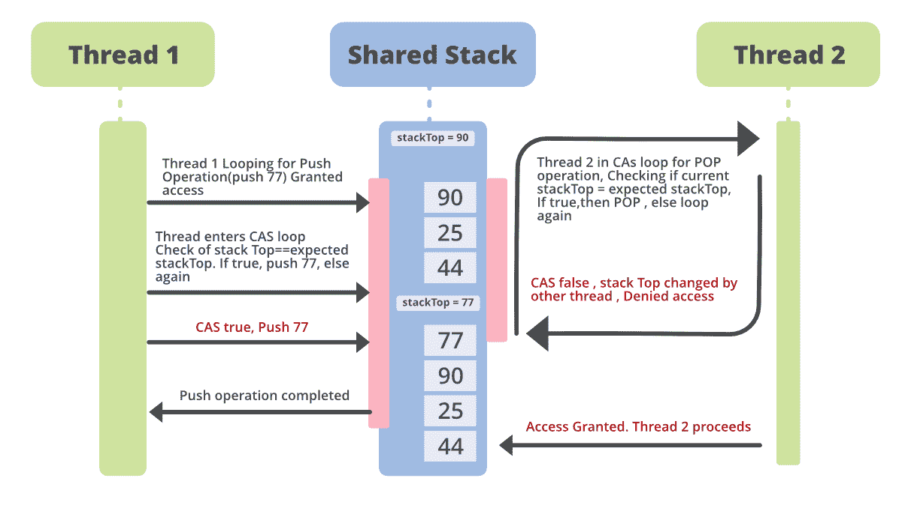

# 使用 Java 锁定自由堆栈

> 原文:[https://www.geeksforgeeks.org/lock-free-stack-using-java/](https://www.geeksforgeeks.org/lock-free-stack-using-java/)

在多线程环境中，无锁算法提供了一种方式，线程可以访问共享资源，而没有锁的复杂性，也不会永远阻塞线程。这些算法成为程序员的选择，因为它们提供了更高的吞吐量并防止了死锁。

这主要是因为设计基于锁的算法，对于并发性带来了自己的挑战。编写高效的锁和同步以减少线程争用的复杂性不是每个人都喜欢的。此外，即使在编写了复杂的代码之后，在生产环境中也会出现很多难以发现的错误，其中涉及多个线程，这变得更加难以解决。

从这个角度来看，我们将讨论如何将无锁算法应用于 [Java](https://www.geeksforgeeks.org/java/) 中广泛使用的数据结构之一，称为 [*堆栈*](https://www.geeksforgeeks.org/stack-data-structure/) 。众所周知，堆栈用于许多实际应用中，如文字处理器中的撤消/重做功能、表达式求值和语法分析、语言处理、支持递归，我们自己的 [JVM](https://www.geeksforgeeks.org/jvm-works-jvm-architecture/) 也是面向堆栈的。因此，让我们深入了解一下如何编写无锁堆栈。希望它能点燃你的心，让你进一步阅读并获得这方面的知识。

**Java 中的原子类**

Java 提供了大量支持无锁和线程安全编程的类。Java 提供的原子 API，***Java . util . concurrent . Atomic***包包含许多高级类和特性，无需使用锁即可提供并发控制。 ***原子引用*** 也是应用编程接口中的一个这样的类，它提供了对可以原子读写的底层对象引用的引用。原子的意思是，对这些变量的读写是线程安全的。详情请参考以下链接。

**CAS Inside–CompareAndSwap 操作:**

最重要的操作是比较和交换，它是无锁算法的基本构件。它编译成单个硬件操作，这使得同步在粒度级别上更快。此外，该操作在所有原子类中都可用。CAS 旨在通过与当前值进行比较来更新变量/引用的值。

**为非阻塞堆栈应用 CAS:**

非阻塞堆栈基本上意味着堆栈的操作对所有线程都可用，并且没有线程被阻塞。为了在堆栈操作中使用 CAS，编写了一个循环，其中使用 CAS 检查堆栈顶部节点(称为堆栈顶部)的值。如果 stackTop 的值如预期的那样，它将被替换为新的顶值，否则什么都不会改变，线程将再次进入循环。

假设我们有一个整数堆栈。假设 thread1 想在栈顶值为 90 时将值 77 推送到栈上。thread2 想要弹出堆栈的顶部，目前是 90。如果线程 1 试图访问堆栈，并且因为当时没有其他线程访问而被授予访问权限，那么线程首先获得堆栈顶部的最新值。然后，它进入 CAS 循环，用期望值检查堆栈顶部(90)。如果两个值相同，即:CAS 返回 true，这意味着没有其他线程修改它，新值(在我们的例子中是 77)被推送到堆栈上。而 77 成为新的栈顶。同时，线程 2 继续循环 CAS，直到 CAS 返回 true，以便从堆栈顶部弹出一个项目。这是下图。



**非阻塞堆栈的代码示例:**

*堆栈*代码示例如下所示。在本例中，定义了两个堆栈。一个使用*传统同步(*命名为*经典堆栈*这里 *)* 来实现并发控制。另一个堆栈使用 ***原子引用*** 类的比较和设置操作来建立无锁算法(这里命名为*无锁堆栈*)。这里，我们正在计算堆栈在 1/2 秒的跨度内执行的操作数。我们比较了以下两种堆栈的性能:

## Java 语言(一种计算机语言，尤用于创建网站)

```
// Java program to demonstrate Lock-Free
// Stack implementation
import java.io.*;
import java.util.List;
import java.util.ArrayList;
import java.util.Random;
import java.util.concurrent.atomic.AtomicInteger;
import java.util.concurrent.atomic.AtomicReference;
import java.util.concurrent.locks.LockSupport;

class GFG {

    public static void main(String[] args)
        throws InterruptedException
    {

        // Defining two stacks
        // Uncomment the following line to see the
        // standard stack implementation.
        // ClassicStack<Integer> operStack = new
        // ClassicStack<Integer>(); Lock-Free Stack
        // definition.

        LockFreeStack<Integer> operStack
            = new LockFreeStack<Integer>();
        Random randomIntegerGenerator = new Random();

        for (int j = 0; j < 10; j++) {
            operStack.push(Integer.valueOf(
                randomIntegerGenerator.nextInt()));
        }

        // Defining threads for Stack Operations
        List<Thread> threads = new ArrayList<Thread>();
        int stackPushThreads = 2;
        int stackPopThreads = 2;

        for (int k = 0; k < stackPushThreads; k++) {
            Thread pushThread = new Thread(() -> {
                System.out.println("Pushing into stack...");

                while (true) {
                    operStack.push(Integer.valueOf(
                        randomIntegerGenerator.nextInt()));
                }
            });

            // making the threads low priority before
            // starting them
            pushThread.setDaemon(true);
            threads.add(pushThread);
        }

        for (int k = 0; k < stackPopThreads; k++) {
            Thread popThread = new Thread(() -> {
                System.out.println(
                    "Popping from stack ...");
                while (true) {
                    operStack.pop();
                }
            });

            popThread.setDaemon(true);
            threads.add(popThread);
        }

        for (Thread thread : threads) {
            thread.start();
        }
        Thread.sleep(500);

        System.out.println(
            "The number of stack operations performed in 1/2 a second-->"
            + operStack.getNoOfOperations());
    }

    // Class defining the implementation of Lock Free Stack
    private static class LockFreeStack<T> {

        // Defining the stack nodes as Atomic Reference
        private AtomicReference<StackNode<T> > headNode
            = new AtomicReference<StackNode<T> >();
        private AtomicInteger noOfOperations
            = new AtomicInteger(0);

        public int getNoOfOperations()
        {
            return noOfOperations.get();
        }

        // Push operation
        public void push(T value)
        {
            StackNode<T> newHead = new StackNode<T>(value);

            // CAS loop defined
            while (true) {
                StackNode<T> currentHeadNode
                    = headNode.get();
                newHead.next = currentHeadNode;

                // perform CAS operation before setting new
                // value
                if (headNode.compareAndSet(currentHeadNode,
                                           newHead)) {
                    break;
                }
                else {
                    // waiting for a nanosecond
                    LockSupport.parkNanos(1);
                }
            }

            // getting the value atomically
            noOfOperations.incrementAndGet();
        }

        // Pop function
        public T pop()
        {
            StackNode<T> currentHeadNode = headNode.get();

            // CAS loop defined
            while (currentHeadNode != null) {
                StackNode<T> newHead = currentHeadNode.next;
                if (headNode.compareAndSet(currentHeadNode,
                                           newHead)) {
                    break;
                }
                else {
                    // waiting for a nanosecond
                    LockSupport.parkNanos(1);
                    currentHeadNode = headNode.get();
                }
            }
            noOfOperations.incrementAndGet();
            return currentHeadNode != null
                ? currentHeadNode.value
                : null;
        }
    }

    // Class defining the implementation
    // of a Standard stack for concurrency
    private static class ClassicStack<T> {

        private StackNode<T> headNode;

        private int noOfOperations;

        // Synchronizing the operations
        // for concurrency control
        public synchronized int getNoOfOperations()
        {
            return noOfOperations;
        }

        public synchronized void push(T number)
        {
            StackNode<T> newNode = new StackNode<T>(number);
            newNode.next = headNode;
            headNode = newNode;
            noOfOperations++;
        }

        public synchronized T pop()
        {
            if (headNode == null)
                return null;
            else {
                T val = headNode.getValue();
                StackNode<T> newHead = headNode.next;
                headNode.next = newHead;
                noOfOperations++;
                return val;
            }
        }
    }

    private static class StackNode<T> {
        T value;
        StackNode<T> next;
        StackNode(T value) { this.value = value; }

        public T getValue() { return this.value; }
    }
}
```

**输出:**

```
Pushing into stack...
Pushing into stack...
Popping from stack ...
Popping from stack ...
The number of stack operations performed in 1/2 a second-->28514750

```

上面的输出是通过实现无锁堆栈数据结构获得的。我们看到有 4 个不同的线程，2 个用于推动，2 个用于从[栈](https://www.geeksforgeeks.org/stack-class-in-java/)弹出。操作数量意味着堆栈上的弹出或推送操作。
为了与使用传统同步实现并发的标准堆栈版本进行比较，我们可以取消第一行代码的注释，并对第二行代码进行如下注释。

## Java 语言(一种计算机语言，尤用于创建网站)

```
// Lock Based Stack programming
// This will invoke the lock-based version of the stack.
import java.io.*;

class GFG {
    public static void main(String[] args)
    {
        ClassicStack<Integer> operStack = new ClassicStack<Integer>();

        // LockFreeStack<Integer> operStack = new LockFreeStack<Integer>();
    }
}
```

**基于锁的堆栈**的输出如下。它清楚地表明，无锁实现(上图)提供了几乎 3 倍多的输出。

**输出:**

```
Pushing into stack...
Pushing into stack...
Popping from stack ...
Popping from stack ...
The number of stack operations performed in 1/2 a second-->8055597

```

尽管无锁编程提供了无数的好处，但正确编程并不是一件小事。

**优点:**

*   真正的无锁编程。
*   死锁预防。
*   更高的吞吐量。

cons

*   A-B-A 问题仍然可能发生在无锁算法中(这是一个变量的值从 A 变为 B，然后回到 A，而两个线程正在读取相同的值 A，而另一个线程却不知道)
*   无锁算法可能并不总是很容易编码。

在 Java 世界中，无锁算法和数据结构是一个备受争议的话题。当使用基于锁或无锁的算法时，必须彻底了解系统。一个人必须非常注意使用它们中的任何一个。对于不同类型的并发问题，没有“一刀切”的解决方案或算法。因此，决定什么算法最适合某种情况，是多线程世界中编程的关键部分。

**参考文献:**

*   [并发原子包-汇总](https://docs.oracle.com/javase/7/docs/api/java/util/concurrent/atomic/package-summary.html)
*   [锁定支持](https://docs.oracle.com/javase/7/docs/api/java/util/concurrent/locks/LockSupport.html)
*   driver _ stack
*   [非阻塞算法介绍](https://www.ibm.com/developerworks/library/j-jtp04186/index.html)