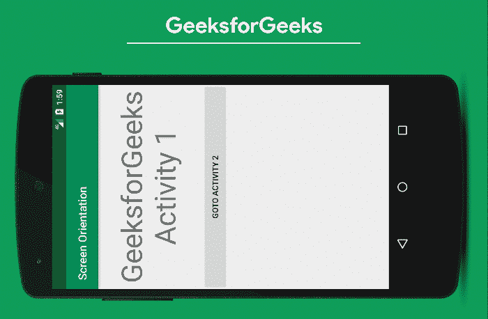
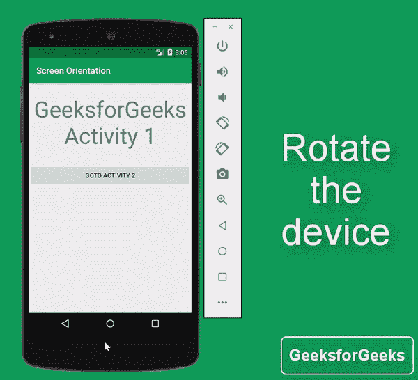
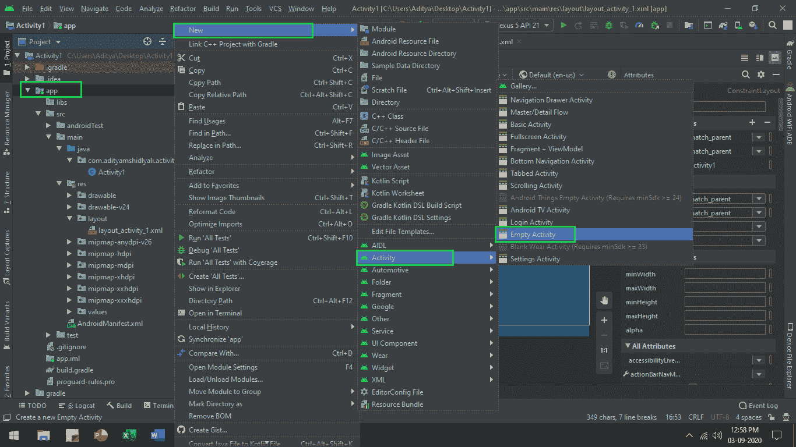
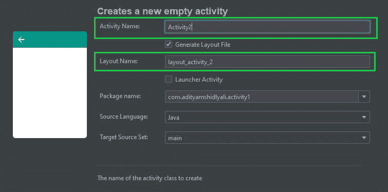

# 安卓锁定屏幕方向

> 原文:[https://www . geeksforgeeks . org/锁定-屏幕-安卓定位/](https://www.geeksforgeeks.org/locking-screen-orientation-in-android/)

如果有一个场景，你需要你的**整个应用程序处于纵向模式或横向模式，或者一个活动应该处于纵向模式，所有其他活动应该设置在自动屏幕方向，**那么在这里，本文让你用简单的步骤做到这一点。因此，在本文中，我们将学习以下两件事。

*   **如何让整个应用处于人像模式或风景模式？**这里是整个应用程序处于纵向模式的预览:



*   **如何让** **其中一个活动处于人像模式，其他所有活动设置为自动屏幕方向？**下面是同样的预览:



### 锁定屏幕方向的步骤

**第一步:创建新项目**

在安卓工作室创建新项目请参考 [**【如何在安卓工作室创建/启动新项目】**](https://www.geeksforgeeks.org/android-how-to-create-start-a-new-project-in-android-studio/) 。**注意，选择** [**Java**](https://www.geeksforgeeks.org/java/) **作为编程语言。**将 **MainActivity** 文件重命名为 **Activity1** ，将**activity _ main**重命名为 **layout_activity_1** (重命名是为了避免两个活动混淆)。

> **注意:**要重命名文件，请单击**主活动- >右键- >重构- >重命名**并对 acticity _ main 文件执行类似操作。

**第二步:创建另一个空活动**

现在通过**右键单击 app - >新建- >活动- >空活动**和**创建另一个空活动，用活动 2** 重命名活动，同时**将布局名称重命名为 layout_activity_2。**如果无法获得上述步骤，请参考下图。




**第三步:使用 layout_activity_1.xml 文件**

需要在**布局 _ 活动 _1 中包含文本和按钮。**所以打开**布局 _ 活动 _1.xml** 并添加小部件 [**文本视图**](https://www.geeksforgeeks.org/textview-widget-in-android-using-java-with-examples/) 和 [**按钮**](https://www.geeksforgeeks.org/button-in-kotlin/) 因为这些都包含在内，所以我们可以区分这两个活动。

## layout_activity_1.xml

```
<?xml version="1.0" encoding="utf-8"?>
<RelativeLayout 
    xmlns:android="http://schemas.android.com/apk/res/android"
    xmlns:app="http://schemas.android.com/apk/res-auto"
    xmlns:tools="http://schemas.android.com/tools"
    android:layout_width="match_parent"
    android:layout_height="match_parent"
    tools:context=".Activity1"
    tools:ignore="HardCodedText">

    <TextView
        android:id="@+id/text_1"
        android:layout_width="wrap_content"
        android:layout_height="wrap_content"
        android:layout_alignParentStart="true"
        android:layout_alignParentEnd="true"
        android:layout_marginTop="24dp"
        android:gravity="center_horizontal"
        android:text="GeeksforGeeks\nActivity 1"
        android:textSize="50sp"
        app:layout_constraintBottom_toBottomOf="parent"
        app:layout_constraintLeft_toLeftOf="parent"
        app:layout_constraintRight_toRightOf="parent"
        app:layout_constraintTop_toTopOf="parent" />

    <!--make sure you give the button widget id-->
    <Button
        android:id="@+id/goto_activity_2"
        android:layout_width="wrap_content"
        android:layout_height="wrap_content"
        android:layout_below="@+id/text_1"
        android:layout_alignParentStart="true"
        android:layout_alignParentEnd="true"
        android:layout_marginTop="32dp"
        android:text="Goto Activity 2"
        app:layout_constraintLeft_toLeftOf="parent"
        app:layout_constraintRight_toRightOf="parent" />

</RelativeLayout>
```