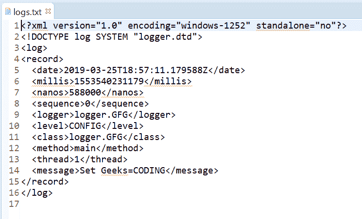
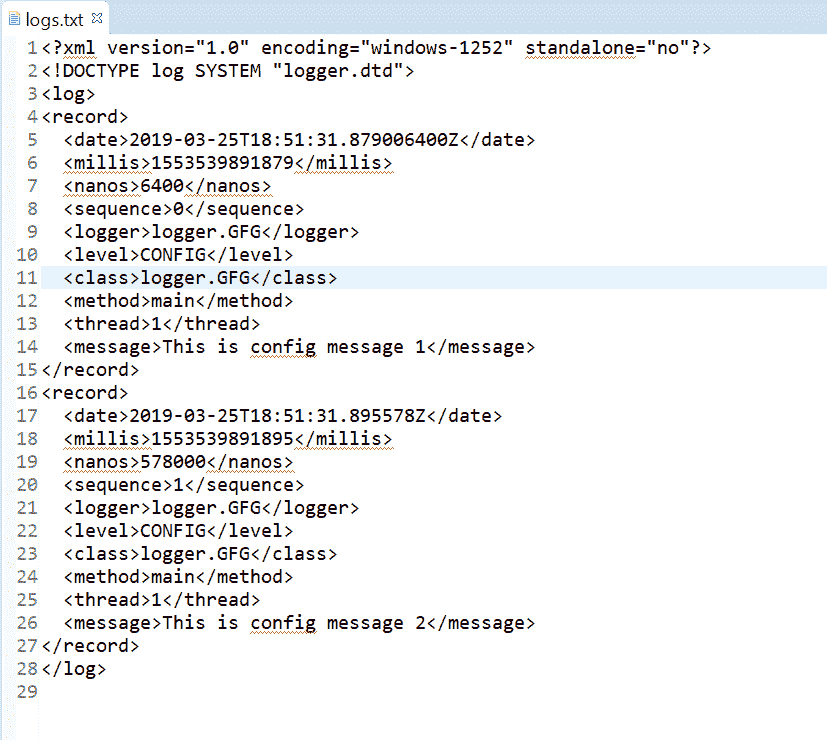
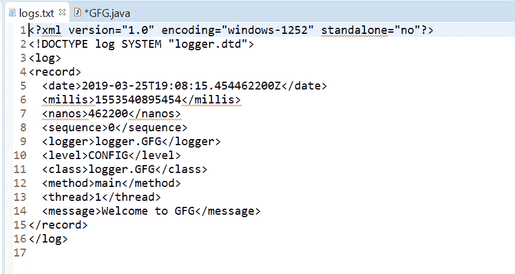

# Java 中的 Logger config()方法，示例

> 原文:[https://www . geesforgeks . org/logger-config-method-in-Java-with-examples/](https://www.geeksforgeeks.org/logger-config-method-in-java-with-examples/)

用于记录配置消息的**记录器**类的**配置()**方法。此方法用于将配置类型日志传递给所有注册的输出处理程序对象。

**配置级别:**配置信息可能像应用程序运行在哪个 CPU 上，磁盘和内存空间有多少。

根据传递的参数数量，config()方法有两种类型。

1.  **配置(字符串消息)**:此方法用于记录配置消息。如果为记录配置级消息启用了记录器，那么给定的消息将被转发到所有注册的输出处理程序对象。

**语法:**

```
public void config(String msg)

```

**参数:**该方法接受单个参数字符串，即字符串消息。

**返回值:**此方法不返回任何内容。

下面的程序说明了配置(字符串消息)方法:

**程序 1:**

```
// Java program to demonstrate
// Logger.config(String msg) method

import java.io.IOException;
import java.util.logging.*;

public class GFG {

    public static void main(String[] args)
        throws SecurityException, IOException
    {

        // Create a Logger
        Logger logger
            = Logger.getLogger(
                GFG.class.getName());

        // Create a file handler object
        FileHandler handler
            = new FileHandler("logs.txt");

        // Add file handler as
        // handler of logs
        logger.addHandler(handler);

        // Set Logger level()
        logger.setLevel(Level.CONFIG);

        // Call config method
        logger.config("Set Geeks=CODING");
    }
}
```

logs.txt 文件上打印的输出如下所示。
**输出:**


**程序 2:**

```
// Java program to demonstrate
// Logger.config(String msg) method

import java.io.IOException;
import java.util.logging.*;

public class GFG {

    public static void main(String[] args)
        throws SecurityException, IOException
    {

        // Create a Logger
        Logger logger
            = Logger.getLogger(
                GFG.class.getName());

        // Create a file handler object
        FileHandler handler
            = new FileHandler("logs.txt");

        // Add file handler as
        // handler of logs
        logger.addHandler(handler);

        // Set Logger level()
        logger.setLevel(Level.CONFIG);

        // Call config method
        logger.config("This is config message 1");
        logger.config("This is config message 2");
    }
}
```

logs.txt 文件上打印的输出如下所示。
**输出:**


*   **config(Supplier msgSupplier)**: This method is used Log a CONFIG message, constructed only if the logging level is such that the message will actually be logged. It means If the logger is enabled for the CONFIG message level then the message is constructed by invoking the provided supplier function and forwarded to all the registered output Handler objects.

    **语法:**

    ```
    public void config(Supplier msgSupplier)

    ```

    **参数:**该方法接受单个参数**msgssupplier**，这是一个函数，当调用该函数时，会产生所需的日志消息。

    **返回值:**此方法不返回任何内容。

    以下程序说明了配置方法:

    **程序 1:**

    ```
    // Java program to demonstrate
    // Logger.config(Supplier<String>) method

    import java.io.IOException;
    import java.util.function.Supplier;
    import java.util.logging.*;

    public class GFG {

        public static void main(String[] args)
            throws SecurityException, IOException
        {

            // Create a Logger
            Logger logger
                = Logger.getLogger(
                    GFG.class.getName());

            // Create a file handler object
            FileHandler handler
                = new FileHandler("logs.txt");

            // Add file handler as
            // handler of logs
            logger.addHandler(handler);

            // Set Logger level()
            logger.setLevel(Level.CONFIG);

            // Create a supplier<String> method
            Supplier<String> StrSupplier
                = () -> new String("Welcome to GFG");

            // Call config(Supplier<String>)
            logger.config(StrSupplier);
        }
    }
    ```

    log.txt 上打印的输出如下所示。
    **输出:**
    

    **参考文献:**

    *   [https://docs . Oracle . com/javase/10/docs/API/Java/util/logging/logger . html # config(Java . lang . string)](https://docs.oracle.com/javase/10/docs/api/java/util/logging/Logger.html#config(java.lang.String))
    *   [https://docs . Oracle . com/javase/10/docs/API/Java/util/log ing/logger . html # config(Java . util . function . supplier)](https://docs.oracle.com/javase/10/docs/api/java/util/logging/Logger.html#config(java.util.function.Supplier))