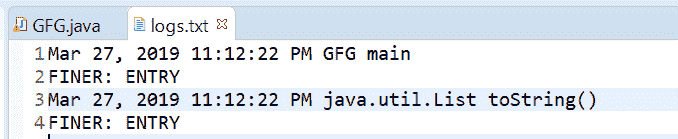
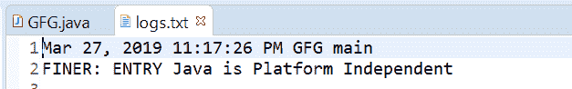
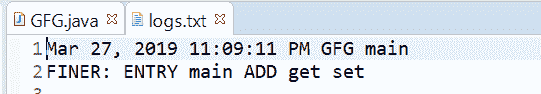

# 用示例在 Java 中输入()方法的记录器

> 原文:[https://www . geeksforgeeks . org/logger-in-method-in-Java-with-examples/](https://www.geeksforgeeks.org/logger-entering-method-in-java-with-examples/)

用于记录方法条目的**记录器**类的**输入()**方法。

根据传递的参数，有三种类型的 entering()方法。

1.  **entering(String sourceClass, String sourceMethod)**: This method is used to Log a method entry.Actually many times in application development we need to log when we enter in a method of class so this is a convenience method that can be used to log entry to a method. This method logs with message “ENTRY”, log level FINER, and the given sourceMethod and sourceClass are also logged.

    **语法:**

    ```java
    public void entering(String sourceClass,
                         String sourceMethod)

    ```

    **参数:**该方法接受两个参数:

    *   **sourceClass** 是发出日志记录请求的类的名称
    *   **sourceMethod** 是正在输入的方法的名称。

    **返回值:**此方法不返回任何内容。

    下面的程序举例说明了输入(字符串源类，字符串源方法)的方法:
    **程序 1:**

    ```java
    // Java program to demonstrate
    // entering(String, String) method

    import java.io.IOException;
    import java.util.List;
    import java.util.logging.*;

    public class GFG {

        public static void main(String[] args)
            throws SecurityException, IOException
        {

            // Create a Logger
            Logger logger
                = Logger.getLogger(
                    GFG.class.getName());

            // Create a file handler object
            FileHandler handler
                = new FileHandler("logs.txt");
            handler.setFormatter(new SimpleFormatter());

            // Add file handler as
            // handler of logs
            logger.addHandler(handler);

            // set Logger level()
            logger.setLevel(Level.FINER);

            // call entering methods with class
            // name =  GFG and method name = main
            logger.entering(GFG.class.getName(), "main");

            // calling again for List class toString()
            logger.entering(List.class.getName(), "toString()");
        }
    }
    ```

    log.txg 文件上打印的输出如下所示。
    **输出:**
    

2.  **entering(String sourceClass, String sourceMethod, Object param1)**: This method is used to Log a method entry, with one parameter where parameter passed is an object we want to log. Actually many times in application development we need to log when we enter in a method of class so this is a convenience method that can be used to log entry to a method. This method logs with message “ENTRY {0}”, log level FINER, and the given sourceMethod, sourceClass, and parameter are logged.

    **语法:**

    ```java
    public void entering(String sourceClass,
                         String sourceMethod,
                         Object param1)

    ```

    **参数:**该方法接受三个参数:

    *   **sourceClass** 是发出日志记录请求的类的名称
    *   **sourceMethod** 是正在输入的方法的名称。
    *   **参数 1:** 是正在输入的方法的参数。

    **返回值:**此方法不返回任何内容。

    以下程序说明了输入(字符串源类、字符串源方法、对象参数 1)方法:

    **程序 1:**

    ```java
    // Java program to demonstrate
    // entering(String, String, Object) method

    import java.io.IOException;
    import java.util.logging.*;

    public class GFG {

        public static void main(String[] args)
            throws SecurityException, IOException
        {

            // Create a Logger
            Logger logger
                = Logger.getLogger(
                    GFG.class.getName());

            // Create a file handler object
            FileHandler handler
                = new FileHandler("logs.txt");
            handler.setFormatter(new SimpleFormatter());

            // Add file handler as
            // handler of logs
            logger.addHandler(handler);

            // set Logger level()
            logger.setLevel(Level.FINER);

            // call entering method with class
            // name =  GFG and method name = main
            logger.entering(
                GFG.class.getName(), "main",
                new String("Java is Platform Independent"));
        }
    }
    ```

    log.txt 上打印的输出如下所示。
    

3.  **输入(字符串源类、字符串源方法、对象[]参数)**:该方法用于记录一个方法条目，带有一个参数数组。实际上，在应用程序开发中，当我们输入一个类的方法时，我们需要记录很多次，所以这是一个方便的方法，可以用来记录方法的输入。此方法使用消息“ENTRY”(后跟参数数组中每个条目的格式{N}指示符)、日志级别 FINER 进行记录，并记录给定的 sourceMethod、sourceClass 和参数。

    **语法:**

    ```java
    public void entering(String sourceClass,
                         String sourceMethod,
                         Object[] params)

    ```

    **参数:**该方法接受三个参数:

    *   **sourceClass** 是发出日志记录请求的类的名称
    *   **sourceMethod** 是正在输入的方法的名称。
    *   **参数:**是正在输入的方法的参数数组。

    **返回值:**此方法不返回任何内容。

    以下程序说明了输入(字符串源类、字符串源方法、对象[]参数)方法:
    **程序 1:**

    ```java
    // Java program to demonstrate
    // entering(String, String, Object[])  method

    import java.io.IOException;
    import java.util.logging.*;

    public class GFG {

        public static void main(String[] args)
            throws SecurityException, IOException
        {

            // Create a Logger
            Logger logger
                = Logger.getLogger(
                    GFG.class.getName());

            // Create a file handler object
            FileHandler handler
                = new FileHandler("logs.txt");
            handler.setFormatter(new SimpleFormatter());

            // Add file handler as
            // handler of logs
            logger.addHandler(handler);

            // set Logger level()
            logger.setLevel(Level.FINER);

            // create a array of String object
            String[] methods = {
                "main", "ADD", "get", "set"
            };

            // call entering method with class
            // name =  GFG and method name = main
            logger.entering(GFG.class.getName(), "main",
                            methods);
        }
    }
    ```

    log.txt 上打印的输出如下所示。
    

**参考文献:**

*   [https://docs . Oracle . com/javase/10/docs/API/Java/util/logging/logger . html # enter(Java . lang . string，java.lang.String)](https://docs.oracle.com/javase/10/docs/api/java/util/logging/Logger.html#entering(java.lang.String, java.lang.String))
*   [https://docs . Oracle . com/javase/10/docs/API/Java/util/logging/logger . html # enter(java.lang.String，Java . lang . string，java.lang.Object)](https://docs.oracle.com/javase/10/docs/api/java/util/logging/Logger.html#entering(java.lang.String, java.lang.String, java.lang.Object))
*   [https://docs . Oracle . com/javase/10/docs/API/Java/util/logging/logger . html # enter(java.lang.String，Java . lang . string，java.lang.Object%5B%5D)](https://docs.oracle.com/javase/10/docs/api/java/util/logging/Logger.html#entering(java.lang.String, java.lang.String, java.lang.Object%5B%5D))