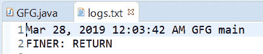
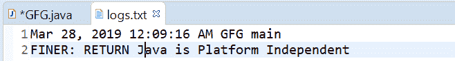

# 在 Java 中退出()方法的记录器，示例

> 原文:[https://www . geesforgeks . org/logger-existing-method-in-Java-with-examples/](https://www.geeksforgeeks.org/logger-exiting-method-in-java-with-examples/)

用于记录方法返回的**记录器**类的**退出()**方法。

根据传递的参数，有两种类型的 exiting()方法。

1.  **exiting(String sourceClass, String sourceMethod)**: This method is used to Log a method return. we need to log what method returns and this is a convenience method that can be used to log returning from a method. This method logs with the message “RETURN”, log level FINER, and the given sourceMethod and sourceClass are also logged.

    **语法:**

    ```
    public void exiting(String sourceClass,
                        String sourceMethod)

    ```

    **参数:**该方法接受两个参数:

    *   **sourceClass** 是发出日志记录请求的类的名称，
    *   **sourceMethod** 是方法的名称

    **返回值:**此方法不返回任何内容。

    下面的程序说明了退出(字符串源类，字符串源方法)的方法:
    **程序 1:**

    ```
    // Java program to demonstrate
    // exiting(String, String)  method

    import java.io.IOException;
    import java.util.logging.FileHandler;
    import java.util.logging.Level;
    import java.util.logging.Logger;
    import java.util.logging.SimpleFormatter;

    public class GFG {

        public static void main(String[] args)
            throws SecurityException, IOException
        {

            // Create a Logger
            Logger logger
                = Logger.getLogger(
                    GFG.class.getName());

            // Create a file handler object
            FileHandler handler
                = new FileHandler("logs.txt");
            handler.setFormatter(new SimpleFormatter());

            // Add file handler as
            // handler of logs
            logger.addHandler(handler);

            // set Logger level()
            logger.setLevel(Level.FINER);

            // call exiting methods with class
            // name =  GFG and method name = main
            logger.exiting(GFG.class.getName(),
                           GFG.class.getMethods()[0].getName());
        }
    }
    ```

    log.txg 文件上打印的输出如下所示。
    **输出:**
    

2.  **exiting(String sourceClass, String sourceMethod, Object result)**: This method is used to Log a method entry, with result object. This is a very helpful method to log entry related to a method of a class with its return value. This method logs with the message “RETURN {0}”, log level FINER, and the gives sourceMethod, sourceClass, and result object is logged.

    **语法:**

    ```
    public void exiting(String sourceClass,
                        String sourceMethod,
                        Object result)

    ```

    **参数:**该方法接受三个参数:

    *   **sourceClass** 是发出日志记录请求的类的名称，
    *   **sourceMethod** 是方法的名称，并且
    *   **正在返回的对象**。

    **返回值:**此方法不返回任何内容。

    以下程序说明了退出(字符串源类、字符串源方法、对象结果)方法:
    **程序 1:**

    ```
    // Java program to demonstrate
    // exiting(String, String, Object)  method

    import java.io.IOException;
    import java.util.logging.FileHandler;
    import java.util.logging.Level;
    import java.util.logging.Logger;
    import java.util.logging.SimpleFormatter;

    public class GFG {

        public static void main(String[] args)
            throws SecurityException, IOException
        {

            // Create a Logger
            Logger logger
                = Logger.getLogger(
                    GFG.class.getName());

            // Create a file handler object
            FileHandler handler
                = new FileHandler("logs.txt");
            handler.setFormatter(new SimpleFormatter());

            // Add file handler as
            // handler of logs
            logger.addHandler(handler);

            // set Logger level()
            logger.setLevel(Level.FINER);

            // set Logger level()
            logger.setLevel(Level.FINER);

            // call exiting method with class
            // name =  GFG and method name = main
            logger.exiting(GFG.class.getName(),
                           GFG.class.getMethods()[0].getName(),
                           new String("Java is Platform Independent"));
        }
    }
    ```

    log.txt 上打印的输出如下所示。
    **输出:**
    

**参考文献:**

*   [https://docs . Oracle . com/javase/10/docs/API/Java/util/logging/logger . html # exing(java.lang.String，Java . lang . string，java.lang.Object)](https://docs.oracle.com/javase/10/docs/api/java/util/logging/Logger.html#exiting(java.lang.String, java.lang.String, java.lang.Object))
*   [https://docs . Oracle . com/javase/10/docs/API/Java/util/logging/logger . html # exing(Java . lang . string，java.lang.String)](https://docs.oracle.com/javase/10/docs/api/java/util/logging/Logger.html#exiting(java.lang.String, java.lang.String))