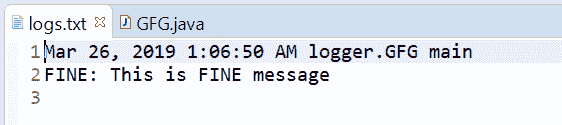
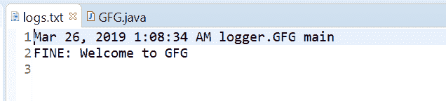

# Java 中的 Logger fine()方法，示例

> 原文:[https://www . geesforgeks . org/logger-fine-method-in-Java-with-examples/](https://www.geeksforgeeks.org/logger-fine-method-in-java-with-examples/)

用于记录精细消息的**记录器**类的**精细()**方法。此方法用于将 FINE 类型日志传递给所有注册的输出处理程序对象。

**FINE** 、**FINE**和**FINE**在我们的应用程序中提供了正在发生/已经发生的跟踪信息。**精细**显示其中最重要的信息。

根据传递的参数数量，有两种类型的 fine()方法。

1.  **fine(字符串 msg)** :此方法用于记录 fine 消息。如果记录器被启用来记录精细级别的消息，那么给定的消息被转发到所有注册的输出处理程序对象。

**语法:**

```java
public void fine(String msg)

```

**参数:**该方法接受单个参数字符串，即字符串消息。

**返回值:**此方法不返回任何内容。

下面的程序说明了精细(字符串消息)方法:

**程序 1:**

```java
// Java program to demonstrate
// Logger.fine(String msg) method

import java.io.IOException;
import java.util.logging.*;

public class GFG {

    public static void main(String[] args)
        throws SecurityException, IOException
    {

        // Create a Logger
        Logger logger
            = Logger.getLogger(
                GFG.class.getName());

        // Create a file handler object
        FileHandler handler
            = new FileHandler("logs.txt");
        handler.setFormatter(new SimpleFormatter());

        // Add file handler as
        // handler of logs
        logger.addHandler(handler);

        // Set Logger level()
        logger.setLevel(Level.FINE);

        // Call fine method
        logger.fine("This is FINE message");
    }
}
```

logs.txt 文件上打印的输出如下所示。
**输出:**


*   **fine(Supplier msgSupplier)**: This method is used Log a FINE message, constructed only if the logging level is such that the message will actually be logged. It means If the logger is enabled for the FINE message level then the message is constructed by invoking the provided supplier function and forwarded to all the registered output Handler objects.

    **语法:**

    ```java
    public void fine(Supplier msgSupplier)

    ```

    **参数:**该方法接受单个参数**msgssupplier**，这是一个函数，当调用该函数时，会产生所需的日志消息。

    **返回值:**此方法不返回任何内容。

    以下程序说明了精细(供应商 msgSupplier)方法:

    **程序 1:**

    ```java
    // Java program to demonstrate
    // Logger.fine(String msg) method

    import java.io.IOException;
    import java.util.function.Supplier;
    import java.util.logging.*;

    public class GFG {

        public static void main(String[] args)
            throws SecurityException, IOException
        {

            // Create a Logger
            Logger logger
                = Logger.getLogger(
                    GFG.class.getName());

            // Create a file handler object
            FileHandler handler
                = new FileHandler("logs.txt");
            handler.setFormatter(
                new SimpleFormatter());

            // Add file handler as
            // handler of logs
            logger.addHandler(handler);

            // Set Logger level()
            logger.setLevel(Level.FINE);

            // Create a supplier<String> method
            Supplier<String> StrSupplier
                = () -> new String("Welcome to GFG");

            // Call fine(Supplier<String>)
            logger.fine(StrSupplier);
        }
    }
    ```

    log.txt 上打印的输出如下所示。
    **输出:**
    

    **参考文献:**

    *   [https://docs . Oracle . com/javase/10/docs/API/Java/util/logging/logger . html # fine(Java . lang . string)](https://docs.oracle.com/javase/10/docs/api/java/util/logging/Logger.html#fine(java.lang.String))
    *   [https://docs . Oracle . com/javase/10/docs/API/Java/util/logging/logger . html # fine(Java . util . function . supplier)](https://docs.oracle.com/javase/10/docs/api/java/util/logging/Logger.html#fine(java.util.function.Supplier))