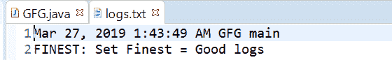
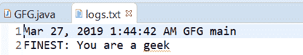

# Java 中最精细的 Logger()方法，示例

> 原文:[https://www . geeksforgeeks . org/logger-finest-in-Java-method-in-with-examples/](https://www.geeksforgeeks.org/logger-finest-method-in-java-with-examples/)

一个**记录器**类用来记录[最精细消息的**最精细()**方法。](https://www.geeksforgeeks.org/logging-in-java/)此方法用于将最精细类型的日志传递给所有注册的输出处理程序对象。

**最细消息:**最细提供高度详细的追踪消息。

根据传递的参数数量，有两种类型的最细()方法。

1.  **最细(字符串消息)**:此方法用于记录最细的消息。如果记录器被允许记录最精细级别的消息，那么给定的消息被转发到所有注册的输出处理程序对象。

**语法:**

```
public void finest(String msg)

```

**参数:**该方法接受单个参数字符串，即字符串消息。

**返回值:**此方法不返回任何内容。

下面的程序说明了最精细的(字符串消息)方法:
**程序 1:**

```
// Java program to demonstrate
// Logger.finest(String msg) method

import java.io.IOException;
import java.util.logging.*;

public class GFG {

    public static void main(String[] args)
        throws SecurityException, IOException
    {

        // Create a Logger
        Logger logger
            = Logger.getLogger(
                GFG.class.getName());

        // Create a file handler object
        // and set formatter to simple formatter
        FileHandler handler = new FileHandler("logs.txt");
        handler.setFormatter(new SimpleFormatter());

        // Add file handler as
        // handler of logs
        logger.addHandler(handler);

        // Set Logger level()
        logger.setLevel(Level.FINEST);

        // Call finest method
        logger.finest("Set Geeks=CODING");
    }
}
```

logs.txt 文件上打印的输出如下所示。
**输出:**


*   **finest(Supplier msgSupplier)**: This method is used Log a FINEST message, constructed only if the logging level is such that the message will actually be logged. It means If the logger is enabled for the FINEST message level then the message is constructed by invoking the provided supplier function and forwarded to all the registered output Handler objects.

    **语法:**

    ```
    public void finest(Supplier msgSupplier)

    ```

    **参数:**这个方法接受一个单参数 msgSupplier，它是一个函数，当被调用时，会产生想要的日志消息。

    **返回值:**此方法不返回任何内容。

    以下程序说明了最佳(供应商 msgSupplier)方法:
    **程序 1:**

    ```
    // Java program to demonstrate
    // Logger.finest(Supplier<String>) method

    import java.io.IOException;
    import java.util.function.Supplier;
    import java.util.logging.*;

    public class GFG {

        public static void main(String[] args)
            throws SecurityException, IOException
        {

            // Create a Logger
            Logger logger
                = Logger.getLogger(
                    GFG.class.getName());

            // Create a file handler object
            // and set formatter to simple formatter
            FileHandler handler
                = new FileHandler("logs.txt");
            handler.setFormatter(new SimpleFormatter());

            // Add file handler as
            // handler of logs
            logger.addHandler(handler);

            // Set Logger level()
            logger.setLevel(Level.FINEST);

            // Create a supplier<String> method
            Supplier<String> StrSupplier
                = () -> new String("You are a geek");

            // Call finest(Supplier<String>)
            logger.finest(StrSupplier);
        }
    }
    ```

    log.txt 上打印的输出如下所示。
    **输出:**
    

    **参考文献:**

    *   [https://docs . Oracle . com/javase/10/docs/API/Java/util/logging/logger . html # best(Java . lang . string)](https://docs.oracle.com/javase/10/docs/api/java/util/logging/Logger.html#finest(java.lang.String))
    *   [https://docs . Oracle . com/javase/10/docs/API/Java/util/logging/logger . html # finest(Java . util . function . supplier)](https://docs.oracle.com/javase/10/docs/api/java/util/logging/Logger.html#finest(java.util.function.Supplier))