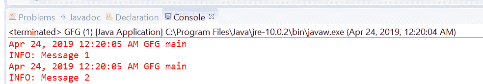
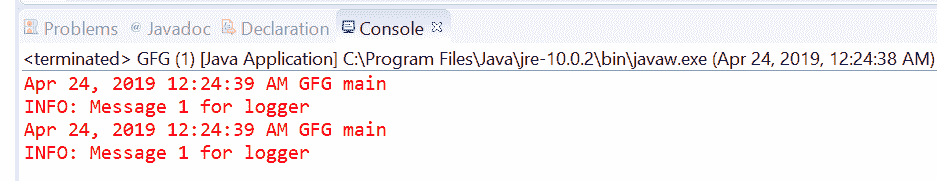

# Java 中的 Logger getAnonymousLogger()方法，带示例

> 原文:[https://www . geeksforgeeks . org/logger-getanonymous logger-method-in-Java-with-examples/](https://www.geeksforgeeks.org/logger-getanonymouslogger-method-in-java-with-examples/)

用于创建匿名记录器的 **[记录器](https://www.geeksforgeeks.org/logging-in-java/)** 类的 **getAnonymousLogger()** 方法。

有两种类型的 getAnonymousLogger()方法，具体取决于传递的参数数量。

1.  **getAnonymousLogger()**: This method is used to create an **anonymous** Logger. This newly created anonymous Logger is not registered in the LogManager namespace and no access checks on updates to the logger. So the question is why we need this logger if there are no access checks because the factory method is primarily intended for use from applets. Because the resulting Logger is anonymous it can be kept private by the creating class. This removes the need for normal security checks, which in turn allows untrusted applet code to update the control state of the Logger. For example, an applet can do a setLevel or an addHandler on an anonymous Logger.

    此记录器被配置为将根记录器("")作为其父记录器。它从根记录器继承其有效级别和处理程序。通过 setParent 方法更改其父级仍然需要该方法指定的安全权限。

    **语法:**

    ```
    public static Logger getAnonymousLogger()

    ```

    **参数:**此方法不接受**任何东西**

    **返回值:**这个方法返回一个**新创建的私有记录器**。

    下面的程序说明了 getAnonymousLogger(Java . lang . string)方法:
    **程序 1:**

    ```
    // Java program to demonstrate
    // Logger.getAnonymousLogger() method

    import java.util.logging.*;

    public class GFG {

        public static void main(String[] args)
        {

            // Create a Logger with class name GFG
            Logger logger = Logger.getAnonymousLogger();

            // Call info method
            logger.info("Message 1");
            logger.info("Message 2");
        }
    }
    ```

    控制台上打印的输出如下所示。
    **输出:**
    

    **程序 2:**

    ```
    // Java program to demonstrate Exception thrown by
    // Logger.getAnonymousLogger(java.lang.String) method

    import java.util.logging.*;

    public class GFG {

        public static void main(String[] args)
        {

            String LoggerName = null;

            // Create a Logger with a null value
            try {
                Logger logger
                    = Logger
                          .getAnonymousLogger(LoggerName);
            }
            catch (NullPointerException e) {
                System.out.println("Exception Thrown :" + e);
            }
        }
    }
    ```

    控制台上打印的输出如下所示。
    **输出:**
    

2.  **getAnonymousLogger(String resourceBundleName)**: This method is used to create an anonymous Logger. This newly created anonymous Logger is not registered in the LogManager namespace and no access checks on updates to the logger. This Logger has ResourceBundle passed as a parameter to be used for localizing messages for this logger.

    **语法:**

    ```
    public static Logger getAnonymousLogger(String resourceBundleName)

    ```

    **参数:**此方法接受单个参数**resourcebendlename**，这是用于定位此记录器消息的 ResourceBundle 的名称。

    **返回值:**这个方法返回一个合适的 Logger。

    **异常:**如果 resourceBundleName 为非空且找不到对应的资源，此方法将抛出**missingresourceeexception:**。

    下面的程序说明了 getAnonymousLogger(String resourcebendlename)方法:

    **程序 1:**

    ```
    // Java program to demonstrate
    // getAnonymousLogger(String resourceBundleName) method

    import java.util.ResourceBundle;
    import java.util.logging.*;

    public class GFG {

        public static void main(String[] args)
        {

            // Create ResourceBundle using getBundle
            // myResource is a properties file
            ResourceBundle bundle
                = ResourceBundle
                      .getBundle("resourceBundle");

            // Create a Logger with resourceBundle
            Logger logger
                = Logger
                      .getAnonymousLogger(
                          bundle.getBaseBundleName());

            // Log the info
            logger.info("Message 1 for logger");
            logger.info("Message 1 for logger");
        }
    }
    ```

    对于上面的程序，有一个属性文件名 resourceBundle。我们必须在类旁边添加这个文件来执行程序。
    

**参考文献:**

*   [https://docs . Oracle . com/javase/10/docs/API/Java/util/logging/logger . html # Getannonymouslogger()](https://docs.oracle.com/javase/10/docs/api/java/util/logging/Logger.html#getAnonymousLogger())
*   [https://docs . Oracle . com/javase/10/docs/API/Java/util/logging/logger . html # getAnonymousLogger(Java . lang . string)](https://docs.oracle.com/javase/10/docs/api/java/util/logging/Logger.html#getAnonymousLogger(java.lang.String))