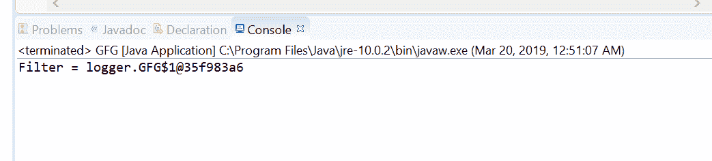
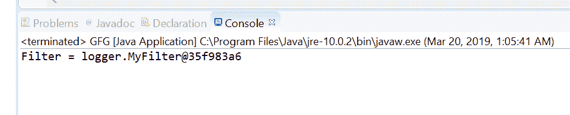

# Java 中的 Logger getFilter()方法，示例

> 原文:[https://www . geesforgeks . org/logger-getfilter-method-in-Java-with-examples/](https://www.geeksforgeeks.org/logger-getfilter-method-in-java-with-examples/)

**记录器**类的 **getFilter()** 方法用于获取该记录器实例的当前过滤器。过滤器对于过滤掉日志消息很有用。我们可以说过滤器决定消息是否被记录。过滤器由 Java 接口表示

**语法:**

```java
public Filter getFilter()

```

**参数:**此方法接受不接受任何参数。

**返回值:**该方法返回该记录器的当前过滤器。

下面的程序说明了 getFilter()方法:
**程序 1:**

```java
// Java program to demonstrate
// Logger.getFilter() method

import java.util.logging.*;
import java.io.IOException;

public class GFG {

    public static void main(String[] args)
        throws SecurityException, IOException
    {

        // create a logger
        Logger logger = Logger.getLogger("com.core");

        // set a new filter
        logger.setFilter(new Filter() {
            @Override
            public boolean isLoggable(LogRecord record)
            {
                return true;
            }
        });

        // get Filter
        Filter filter = logger.getFilter();

        // check filter is null or not by printing
        System.out.println("Filter = " + filter);
    }
}
```

**输出:**
eclipse IDE 上打印的输出如下所示-


**程序 2:**

```java
// Java program to demonstrate
// Logger.getFilter() method

import java.util.logging.*;
import java.io.IOException;

public class GFG {

    public static void main(String[] args)
        throws SecurityException, IOException
    {

        // create a logger
        Logger logger
            = Logger.getLogger("com.javacode.core");

        // set a new filter
        logger.setFilter(new MyFilter());

        // get Filter
        Filter filter = logger.getFilter();

        // check filter is null or not by printing
        System.out.println("Filter = " + filter);
    }
}
class MyFilter implements Filter {
    public boolean isLoggable(LogRecord record)
    {
        return false;
    }
}
```

**输出:**
eclipse IDE 上打印的输出如下所示-


**参考:**[https://docs . Oracle . com/javase/10/docs/API/Java/util/logging/logger . html # getFilter()](https://docs.oracle.com/javase/10/docs/api/java/util/logging/Logger.html#getFilter())