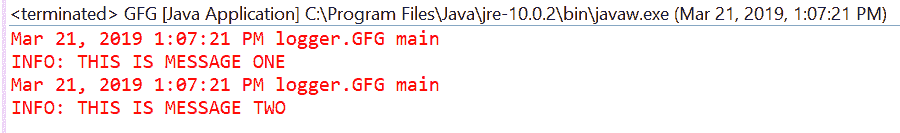
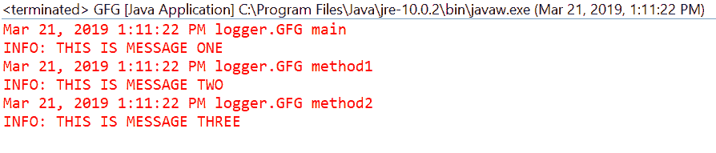

# Java 中 Logger getGlobal()方法，带示例

> 原文:[https://www . geesforgeks . org/logger-get global-method-in-Java-with-examples/](https://www.geeksforgeeks.org/logger-getglobal-method-in-java-with-examples/)

**getGlobal()** 一个 **logger** 类的方法用来获取名为 Logger 的全局 Logger 对象。GLOBAL_LOGGER_NAME。“全局”Logger 对象对于临时使用 Logging 包的开发人员很有帮助。为了认真使用日志记录包，开发人员必须创建和使用他们自己的日志记录对象，并使用适当的名称，以便可以在适当的每日志记录粒度上控制日志记录。
在登录应用程序时，定义了更细粒度的记录器，通常是针对每个 Java 包或类。如果您不想为每个 Java 包或类定义更长的时间，您可以使用这个全局记录器，它将处理所有日志记录语句，无论它们包含在哪个库、包或类中。

**语法:**

```
public static final Logger getGlobal()

```

**参数:**此方法不接受任何内容。

**返回值:**此方法返回全局记录器对象。

下面的程序说明了 getGlobal()方法:
**程序 1:**

```
// Java program to demonstrate
// Logger.getGlobal() method

import java.util.logging.*;

public class GFG {

    public static void main(String[] args)
    {
        // Create a logger using getGLobal()
        Logger logger = Logger.getGlobal();

        logger.info("THIS IS MESSAGE ONE");
        logger.info("THIS IS MESSAGE TWO");
    }
}
```

**输出:**
输出打印在 eclipse IDE 上如下所示-


**程序 2:**

```
// Java program to demonstrate
// Logger.getGlobal() method

import java.util.logging.*;

public class GFG {

    // Create a logger using getGLobal()
    static Logger logger = Logger.getGlobal();

    public static void main(String[] args)
    {
        logger.info("THIS IS MESSAGE ONE");
        method1();
        method2();
    }

    public static void method1()
    {
        logger.info("THIS IS MESSAGE TWO");
    }

    public static void method2()
    {
        logger.info("THIS IS MESSAGE THREE");
    }
}
```

**输出:**
输出打印在 eclipse IDE 上如下所示-


**参考:**[https://docs . Oracle . com/javase/10/docs/API/Java/util/logging/logger . html # getGlobal()](https://docs.oracle.com/javase/10/docs/api/java/util/logging/Logger.html#getGlobal())