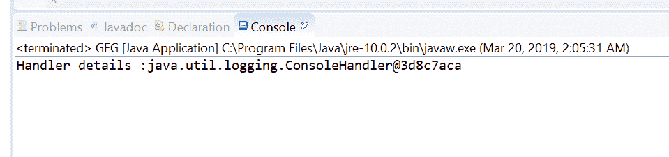

# Java 中的 Logger getHandler()方法，示例

> 原文:[https://www . geesforgeks . org/logger-gethandler-method-in-Java-with-examples/](https://www.geeksforgeeks.org/logger-gethandler-method-in-java-with-examples/)

**记录器**类的 **getHandlers()** 方法用于获取与该记录器链接的 Handlers。处理程序用于处理实际的日志记录。一个或多个处理程序可以添加到记录器中。当通过记录器记录消息时，消息被转发给处理程序。此方法有助于获取所有已注册处理程序的数组。

**语法:**

```
public Handler[] getHandlers()

```

**参数:**此方法不接受任何内容。

**返回值:**这个方法返回一个所有注册处理程序的数组。

下面的程序说明了 getHandlers()方法:
**程序 1:**

```
// Java program to demonstrate
// Logger.getHandler() method

import java.util.logging.*;
import java.io.IOException;

public class GFG {

    public static void main(String[] args)
        throws SecurityException, IOException
    {

        // Create a logger
        Logger logger
            = Logger.getLogger(
                GFG.class.getName());

        // Log some logs
        logger.info("This is message 1");
        logger.info("This is message 2");
        logger.info("This is message 3");

        // Get handler details using getHandler
        Handler[] handlers = logger.getHandlers();

        // Log handler length
        logger.info("length of Handler "
                    + handlers.length);
    }
}
```

**输出:**
eclipse IDE 上打印的输出如下所示-


**程序 2:**

```
// Java program to demonstrate
// Logger.getHandler() method

import java.util.logging.*;
import java.io.IOException;

public class GFG {

    public static void main(String[] args)
        throws SecurityException, IOException
    {

        // Create a logger
        Logger logger
            = Logger.getLogger(
                GFG.class.getName());

        // Set a console Handler
        logger.addHandler(new ConsoleHandler());

        // Get handler details using getHandler
        Handler[] handlers = logger.getHandlers();

        // Print handler details
        for (int i = 0; i < handlers.length; i++) {
            System.out.println("Handler details: "
                               + handlers[i].toString());
        }
    }
}
```

**输出:**
eclipse IDE 上打印的输出如下所示-


**参考:**[https://docs . Oracle . com/javase/10/docs/API/Java/util/logging/logger . html # getHandlers()](https://docs.oracle.com/javase/10/docs/api/java/util/logging/Logger.html#getHandlers())