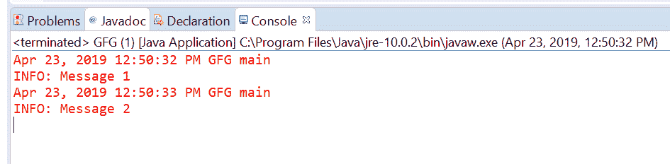
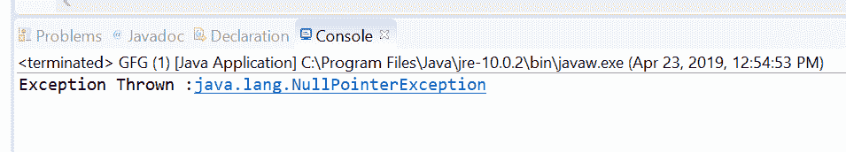
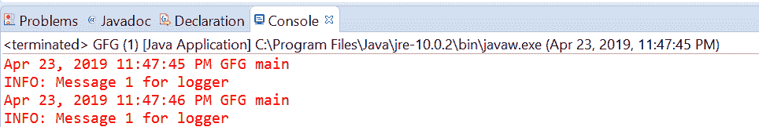

# Java 中的 Logger getLogger()方法，示例

> 原文:[https://www . geesforgeks . org/logger-get logger-method-in-Java-with-examples/](https://www.geeksforgeeks.org/logger-getlogger-method-in-java-with-examples/)

一个 **[Logger](https://www.geeksforgeeks.org/logging-in-java/)** 类的 **getLogger()** 方法用于查找或创建一个 Logger。如果存在一个具有传递名称的记录器，那么该方法将返回该记录器，否则该方法将创建一个具有该名称的新记录器并返回它。

有两种类型的 getLogger()方法，具体取决于传递的参数数量。

1.  **getLogger(java.lang.String)**: This method is used to find or create a logger with the name passed as parameter. It will create a new logger if logger does not exist with the passed name. If a new logger is created by this method then its log level will be configured based on the LogManager configuration and it will be configured to also send logging output to its parent’s Handlers. It will be registered in the LogManager global namespace.

    **语法:**

    ```java
    public static Logger getLogger(String name)

    ```

    **参数:**该方法接受单个参数**名称**，这是代表记录器名称的字符串。这应该是一个点分隔的名称，通常应该基于子系统的包名或类名，例如[java.net](https://www.geeksforgeeks.org/tag/java-net-package/)或 [javax.swing](https://www.geeksforgeeks.org/tag/java-swing/)

    **返回值:**这个方法返回一个合适的 Logger。

    **异常:**如果传递的名称为空，该方法将抛出**空指针异常**。

    下面的程序说明了 getLogger(java.lang.String)方法:
    **程序 1:**

    ```java
    // Java program to demonstrate
    // Logger.getLogger(java.lang.String) method

    import java.util.logging.*;

    public class GFG {

        public static void main(String[] args)
        {

            // Create a Logger with class name GFG
            Logger logger
                = Logger.getLogger(GFG.class.getName());

            // Call info method
            logger.info("Message 1");
            logger.info("Message 2");
        }
    }
    ```

    控制台上打印的输出如下所示。
    **输出:**
    

    **程序 2:**

    ```java
    // Java program to demonstrate Exception thrown by
    // Logger.getLogger(java.lang.String) method
    import java.util.logging.*;

    public class GFG {

        public static void main(String[] args)
        {

            String LoggerName = null;

            // Create a Logger with a null value
            try {
                Logger logger
                    = Logger.getLogger(LoggerName);
            }
            catch (NullPointerException e) {
                System.out.println("Exception Thrown: "
                                   + e);
            }
        }
    }
    ```

    控制台上打印的输出如下所示。
    **输出:**
    

2.  **getLogger(String name, String resourceBundleName)**: This method is used to find or creates a logger with the passed name. If a logger has already been created with the given name it is returned. Otherwise, a new logger is created. If the Logger with the passed name already exists and does not have a localization resource bundle then the given resource bundle name is used as a localization resource bundle for this logger. If the named Logger has a different resource bundle name then an IllegalArgumentException is thrown by this method.

    **语法:**

    ```java
    public static Logger getLogger(String name, String resourceBundleName)

    ```

    **参数:**该方法接受两个不同的参数:

    *   **名称**:是记录器的名称。这个名称应该是一个点分隔的名称，通常应该基于子系统的包名或类名，比如 java.net 或 javax.swing
    *   **resourceBundleName:** 是用于本地化此记录器消息的 ResourceBundle 的名称。

    **返回值:**这个方法返回一个合适的 Logger。

    **异常:**该方法将抛出以下异常:

    1.  **NullPointRexception:**如果传递的名称为空。
    2.  **missingresourceeexception:**如果 resourceBundleName 为非空且找不到对应的资源。
    3.  **IllegalArgumentException:**如果记录器已经存在并使用不同的资源包名称；或者，如果 resourceBundleName 为空，但命名的记录器具有资源包集，则为。

    下面的程序说明了 getLogger(字符串名称，字符串资源名称)方法:

    **程序 1:**

    ```java
    // Java program to demonstrate
    // getLogger(String name, String resourceBundleName) method

    import java.util.ResourceBundle;
    import java.util.logging.*;

    public class GFG {

        public static void main(String[] args)
        {

            // Create ResourceBundle using getBundle
            // myResource is a properties file
            ResourceBundle bundle
                = ResourceBundle
                      .getBundle("resourceBundle");

            // Create a Logger
            // with GFG.class and resourceBundle
            Logger logger
                = Logger.getLogger(
                    GFG.class.getName(),
                    bundle.getBaseBundleName());

            // Log the info
            logger.info("Message 1 for logger");
        }
    }
    ```

    对于上面的程序，有一个属性文件名 resourceBundle。我们必须在类旁边添加这个文件来执行程序。
    **输出:**
    

**参考文献:**

*   [https://docs . Oracle . com/javase/10/docs/API/Java/util/logging/logger . html # getLogger(Java . lang . string，java.lang.String)](https://docs.oracle.com/javase/10/docs/api/java/util/logging/Logger.html#getLogger(java.lang.String, java.lang.String))
*   [https://docs . Oracle . com/javase/10/docs/API/Java/util/logging/logger . html # getLogger(Java . lang . string)](https://docs.oracle.com/javase/10/docs/api/java/util/logging/Logger.html#getLogger(java.lang.String))