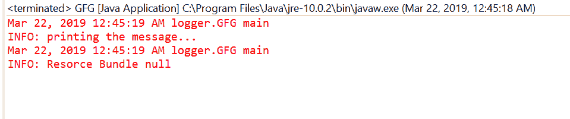

# Java 中的 Logger getResourceBundle()方法，带示例

> 原文:[https://www . geesforgeks . org/logger-getresourcebund-method-in-Java-with-examples/](https://www.geeksforgeeks.org/logger-getresourcebundle-method-in-java-with-examples/)

**GetResourceBound()**一个**记录器**类的方法用于本地化这个记录器的资源包。我们可以通过 set ResourceBundle 方法设置 ResourceBundle，或者通过 getLogger 工厂方法从当前默认区域设置的资源包名称进行映射，该方法将通过上述方式返回一个 ResourceBundle 集。如果结果为空，则记录器将使用从其父级继承的资源包或资源包名称。
**语法:**

```java
public ResourceBundle getResourceBundle()
```

**参数:**此方法不接受任何内容。
**返回值:**此方法返回本地化捆绑包。
以下程序说明了 getResourceBundle()方法:
**程序 1:**

## Java 语言(一种计算机语言，尤用于创建网站)

```java
// Java program to demonstrate
// Logger.getParent() method

import java.util.logging.*;
import java.util.ResourceBundle;

public class GFG {

    private static Logger logger
        = Logger.getLogger(
            String
                .class
                .getPackage()
                .getName());

    public static void main(String args[])
    {

        logger.info("printing the message...");

        ResourceBundle rs
            = logger.getResourceBundle();

        logger.info("Resource Bundle " + rs);
    }
}
```

**输出:**
输出打印在 eclipse IDE 上如下所示-



**节目 2:**

## Java 语言(一种计算机语言，尤用于创建网站)

```java
// Java program to demonstrate
// Logger.getParent() method

import java.util.logging.*;
import java.util.ResourceBundle;

public class GFG {

    private static Logger logger
        = Logger.getLogger(
            GFG
                .class
                .getPackage()
                .getName());

    public static void main(String args[])
    {

        // Create ResourceBundle using getBundle
        // myResource is a properties file
        ResourceBundle bundle
            = ResourceBundle
                  .getBundle("myResource");

        // Set ResourceBundle to logger
        logger.setResourceBundle(bundle);

        // Get ResourceBundle from logger
        ResourceBundle rs
            = logger.getResourceBundle();

        // Log the ResourceBundle details
        logger.info("Resource Bundle "
                    + rs.getBaseBundleName());
    }
}
```

对于上面的程序，有一个名为 myResource 的属性文件。我们必须在类的旁边添加这个文件来执行程序。
**输出:**
输出打印在 eclipse IDE 上如下所示-


**参考:**T2【https://docs . Oracle . com/javase/10/docs/API/Java/util/logging/logger . html # getresourcebunder()T4】