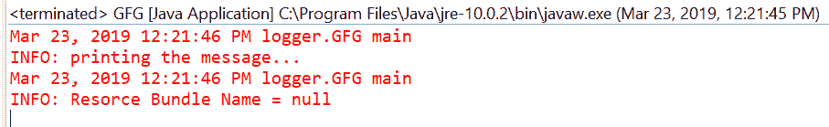

# Java 中 Logger getResourceBundleName()方法，带示例

> 原文:[https://www . geesforgeks . org/logger-getresourcebundlename-method-in-Java-with-examples/](https://www.geeksforgeeks.org/logger-getresourcebundlename-method-in-java-with-examples/)

**一个**记录器**类的 getresourcebendlename()**方法用于检索这个记录器的本地化资源包名称。我们可以通过 set ResourceBundle 方法设置 ResourceBundle，也可以通过当前默认区域设置的 getLogger 工厂方法从资源包名称集进行映射。该方法返回通过上述方式设置的指定基本 ResourceBundle 的名称。
请注意，如果结果为空，则记录器将使用从其父级继承的资源包或资源包名称。
**语法:**

```
public String getResourceBundleName()
```

**参数:**此方法不接受任何内容。
**返回值:**此方法返回本地化包名称。
以下程序说明信息(字符串)方法:
**程序 1:**

## Java 语言(一种计算机语言，尤用于创建网站)

```
// Java program to demonstrate
// Logger.getResourceBundleName() method

import java.util.logging.Logger;

public class GFG {

    private static Logger logger
        = Logger.getLogger(
            String
                .class
                .getPackage()
                .getName());

    public static void main(String args[])
    {

        logger.info("printing the message...");

        String resourceBundleName
            = logger.getResourceBundleName();

        logger.info("Resource Bundle Name = "
 + resourceBundleName);
    }
}
```

在 eclipse IDE 上打印的输出如下所示-
**输出:**



**节目 2:**

## Java 语言(一种计算机语言，尤用于创建网站)

```
// Java program to demonstrate
// Logger.getResourceBundleName() method

import java.util.logging.*;
import java.util.ResourceBundle;

public class GFG {

    private static Logger logger
        = Logger.getLogger(
            GFG
                .class
                .getPackage()
                .getName());

    public static void main(String args[])
    {

        // Create ResourceBundle using getBundle
        // myResource is a properties file
        ResourceBundle bundle
            = ResourceBundle
                  .getBundle("myResource");

        // Set ResourceBundle to logger
        logger.setResourceBundle(bundle);

        // Get ResourceBundle Name from logger
        String rsBundleNAme
            = logger.getResourceBundleName();

        // Log the ResourceBundle name
        logger.info("Resource Bundle Name - "
                    + rsBundleNAme);
    }
}
```

对于上面的程序，有一个名为 myResource 的属性文件。我们必须在类旁边添加这个文件来执行程序。
输出打印在 eclipse IDE 上如下所示-
**输出:**


**参考:**[https://docs . Oracle . com/javase/10/docs/API/Java/util/logging/logger . html # getResourceBundleName()](https://docs.oracle.com/javase/10/docs/api/java/util/logging/Logger.html#getResourceBundleName())