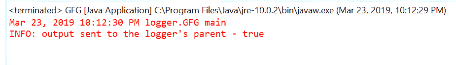
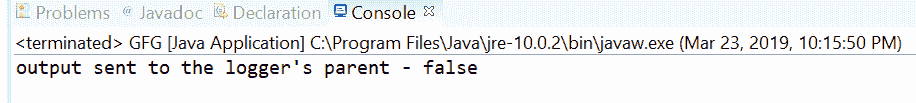

# Java 中的 Logger getUseParentHandlers()方法，带示例

> 原文:[https://www . geesforgeks . org/logger-getuseparenthandlers-method-in-Java-with-examples/](https://www.geeksforgeeks.org/logger-getuseparenthandlers-method-in-java-with-examples/)

**getuseParentAndlers()**一个**记录器**类的方法，用于获取布尔值，该值回答该记录器是否将其输出发送给其父记录器。

**语法:**

```java
public boolean getUseParentHandlers()

```

**参数:**此方法不接受任何内容。

**返回值:**如果输出要发送到记录器的父级，该方法返回真。

下面的程序说明了 getUseParentHandlers()方法:

**程序 1:**

```java
// Java program to demonstrate
// Logger.getUseParentHandlers() method

import java.util.logging.Logger;

public class GFG {

    private static Logger logger
        = Logger.getLogger(
            GFG.class
                .getPackage()
                .getName());

    public static void main(String args[])
    {

        // Check output is to be
        // sent to the logger's parent
        boolean flag
            = logger.getUseParentHandlers();

        // Log the flag value
        logger.info("output sent to the"
                    + " logger's parent - "
                    + flag);
    }
}
```

在 eclipse IDE 上打印的输出如下所示-


**程序 2:**

```java
// Java program to demonstrate
// Logger.getUseParentHandlers() method

import java.util.logging.Logger;

public class GFG {

    private static Logger logger
        = Logger.getLogger(
            GFG.class
                .getPackage()
                .getName());

    public static void main(String args[])
    {

        // Set setUseParentHandlers
        logger.setUseParentHandlers(false);

        // Check output is to be
        // sent to the logger's parent
        boolean flag = logger.getUseParentHandlers();

        // Print value
        System.out.println("output sent to the"
                           + " logger's parent - "
                           + flag);
    }
}
```

在 eclipse IDE 上打印的输出如下所示-


**参考:**[https://docs . Oracle . com/javase/10/docs/API/Java/util/logging/logger . html # getUseParentHandlers()](https://docs.oracle.com/javase/10/docs/api/java/util/logging/Logger.html#getUseParentHandlers())