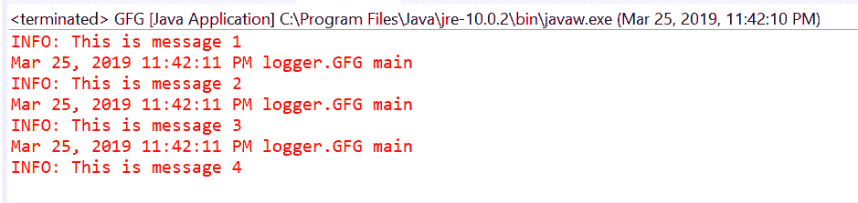
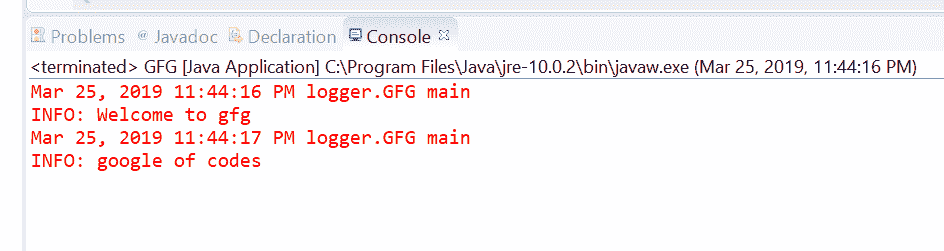
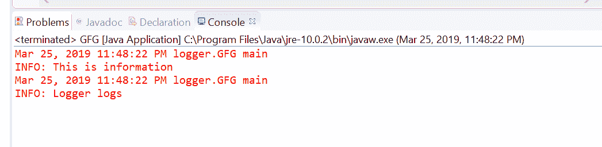

# Java 中的记录器信息(字符串)方法，示例

> 原文:[https://www . geesforgeks . org/logger-infostring-method-in-Java-with-examples/](https://www.geeksforgeeks.org/logger-infostring-method-in-java-with-examples/)

用于记录信息消息的**记录器**类的 **info()** 方法。此方法用于将日志转发给所有已注册的输出处理程序对象。

**INFO 消息:** Info 供管理员或高级用户使用。它主要表示导致应用程序状态改变的操作。

根据传递的参数数量，有两种类型的 info()方法。

1.  **信息(字符串消息)**:该方法用于将作为 paratemer to 方法传递的字符串转发给所有注册的输出 Handler 对象。

**语法:**

```
public void info(String msg)

```

**参数:**该方法接受单个参数字符串，这是我们要传递给日志的信息。

**返回值:**此方法不返回任何内容。

下面的程序说明了信息(字符串消息)方法:

**程序 1:**

```
// Java program to demonstrate
// Logger.info(String msg) method

import java.util.logging.Logger;

public class GFG {

    public static void main(String[] args)
    {

        // Create a Logger
        Logger logger
            = Logger.getLogger(
                GFG.class.getName());

        // Call info method
        logger.info("This is message 1");
        logger.info("This is message 2");
        logger.info("This is message 3");
        logger.info("This is message 4");
    }
}
```

eclipse ide 上打印的输出如下所示。
**输出:**


**程序 2:**

```
// Java program to demonstrate
// Logger.info(String msg) method

import java.util.logging.Logger;

public class GFG {

    public static void main(String[] args)
    {

        // Create a Logger
        Logger logger
            = Logger
                  .getLogger("com.api.jar");

        // Call info method
        logger.info("Welcome to gfg");
        logger.info("google of codes");
    }
}
```

打印在 IDE 上的输出如下所示。
**输出:**


*   **info(Supplier msgSupplier)**: This method is used Log an INFO message, constructed only if the logging level is such that the message will actually be logged. It means If the logger is enabled for the INFO message level then the message is constructed by invoking the provided supplier function and forwarded to all the registered output Handler objects.

    **语法:**

    ```
    public void info(Supplier msgSupplier)

    ```

    **参数:**这个方法接受一个单参数 msgSupplier，它是一个函数，当被调用时，会产生想要的日志消息。

    **返回值:**此方法不返回任何内容。

    以下程序说明信息(字符串消息)方法:
    **程序 1:**

    ```
    // Java program to demonstrate
    // Logger.info(Supplier) method

    import java.util.logging.Logger;
    import java.util.function.Supplier;

    public class GFG {

        public static void main(String[] args)
        {

            // Create a Logger
            Logger logger
                = Logger.getLogger(
                    GFG.class.getName());

            // Create a supplier<String> method
            Supplier<String> StrSupplier
                = () -> new String("Logger logs");

            // Call info(Supplier<String>)
            logger.info(StrSupplier);
        }
    }
    ```

    eclipse ide 上打印的输出如下所示。
    **输出:**
    

    **参考文献:**

    *   [https://docs . Oracle . com/javase/10/docs/API/Java/util/logging/logger . html # info(Java . lang . string)](https://docs.oracle.com/javase/10/docs/api/java/util/logging/Logger.html#info(java.lang.String))
    *   [https://docs . Oracle . com/javase/10/docs/API/Java/util/logging/logger . html # info(Java . util . function . supplier)](https://docs.oracle.com/javase/10/docs/api/java/util/logging/Logger.html#info(java.util.function.Supplier))