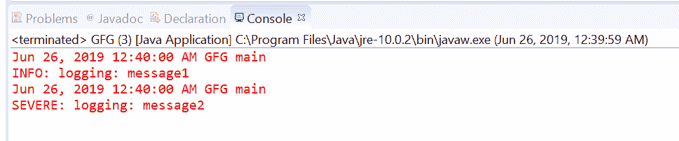
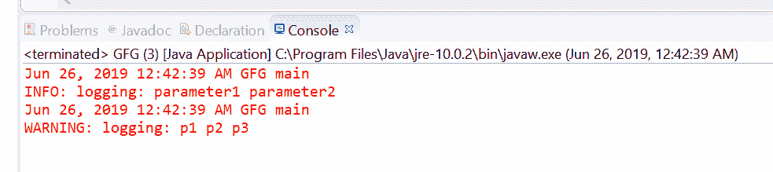
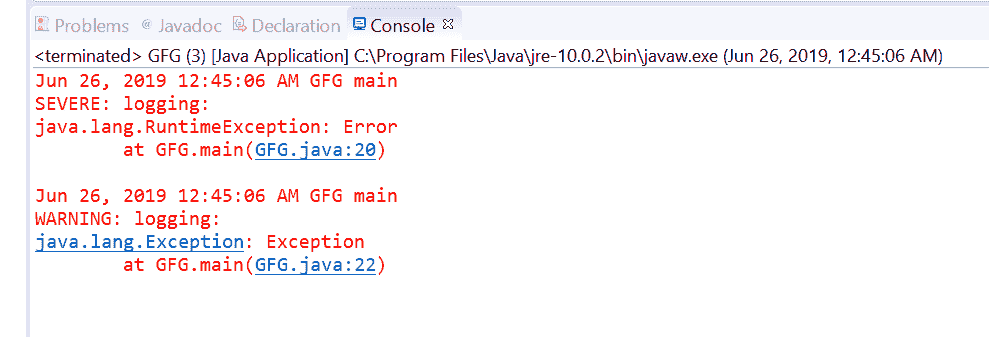
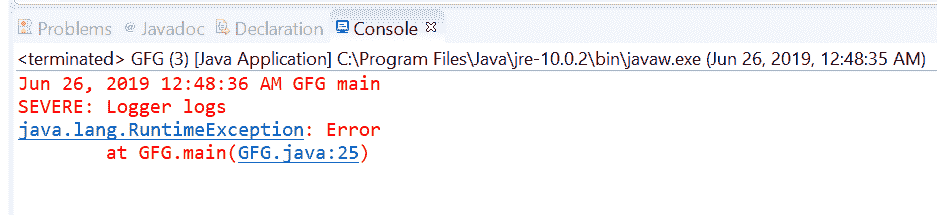
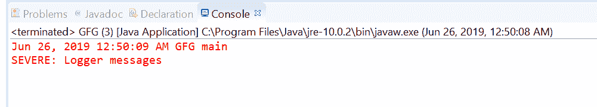
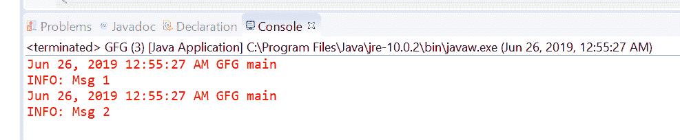

# Java 中的 Logger log()方法，示例

> 原文:[https://www . geesforgeks . org/logger-log-method-in-Java-with-examples/](https://www.geeksforgeeks.org/logger-log-method-in-java-with-examples/)

的**日志()**方法用于记录消息。如果记录器当前为作为参数传递的给定消息级别启用，则创建相应的日志记录，并将其转发给所有注册的输出处理程序对象。但是在 logger 类中，根据传递给方法的参数，有七种不同的 log()方法。

1.  **<u>log(Level level, String msg)</u>**: This method is used to Log a message, with no arguments.only message will be written in logger Output.
    **Syntax:**

    ```java
    public void log(Level level, String msg)

    ```

    **参数:**该方法接受两个参数**级别**，这是消息级别标识符之一，例如，严重和**消息**，这是字符串消息(或消息目录中的一个键)。

    **返回值:**此方法不返回任何内容

    **程序 1:** 方法日志(级别级别，字符串消息)

    ```java
    // Java program to demonstrate
    // Logger.log(Level level, String msg)  method

    import java.util.logging.Level;
    import java.util.logging.Logger;

    public class GFG {

        public static void main(String[] args)
        {

            // Create a Logger
            Logger logger
                = Logger.getLogger(
                    GFG.class.getName());

            // log messages using log(Level level, String msg)
            logger.log(Level.INFO, "This is message 1");
            logger.log(Level.WARNING, "This is message 2");
        }
    }
    ```

    **输出**

    [](https://media.geeksforgeeks.org/wp-content/uploads/20190626005731/1003.png)

2.  **<u>log(Level level, String msg, Object param1)</u>**: This method is used to Log a message, with one object parameter.

    **语法:**

    ```java
    public void log(Level level, String msg, Object param1)

    ```

    **参数:**此方法接受三个参数**级别**，它是消息级别标识符之一，例如，严重、**消息**，它是字符串消息(或消息目录中的一个键)和**参数 1** ，它是消息的参数

    **返回值:**此方法不返回任何内容

    **程序 2:** 方法日志(级别级别，字符串消息，对象参数 1)

    ```java
    // Java program to demonstrate
    // Logger.log(Level level, String msg, Object param1)

    import java.util.logging.Level;
    import java.util.logging.Logger;

    public class GFG {

        public static void main(String[] args)
        {

            // Create a Logger
            Logger logger
                = Logger.getLogger(
                    GFG.class.getName());

            // log messages using
            // log(Level level, String msg, Object param1)
            logger.log(Level.INFO, "logging: {0} ", "message1");
            logger.log(Level.SEVERE, "logging: {0} ", "message2");
        }
    }
    ```

    **输出:**
    [](https://media.geeksforgeeks.org/wp-content/uploads/20190626005747/200.png)

3.  **<u>log(Level level, String msg, Object[] params)</u>**: This method is used to Log a message, with an array of object arguments.

    **语法:**

    ```java
    public void log(Level level, String msg, Object[] params)

    ```

    **参数:**该方法接受三个参数**级别**，它是消息级别标识符之一，例如，严重，**消息**，它是字符串消息(或消息目录中的一个键)和**参数 1** ，它是消息的参数数组

    **返回值:**此方法不返回任何内容

    **程序 3:** 方法日志(级别级别，字符串消息，对象[]参数 1)

    ```java
    // Java program to demonstrate
    // Logger.log(Level level, String msg, Object[] param1)

    import java.util.logging.Level;
    import java.util.logging.Logger;

    public class GFG {

        public static void main(String[] args)
        {

            // Create a Logger
            Logger logger
                = Logger.getLogger(
                    GFG.class.getName());

            // log messages using
            // log(Level level, String msg, Object[] param1)
            logger.log(Level.INFO, "logging: {0} {1}",
                       new Object[] { "parameter1", "parameter2" });
            logger.log(Level.WARNING, "logging: {0} {1} {2}",
                       new Object[] { "p1", "p2", "p3" });
        }
    }
    ```

    **输出:**

    [](https://media.geeksforgeeks.org/wp-content/uploads/20190626005806/300.png)

4.  **<u>log(Level level, String msg, [Throwable](https://www.geeksforgeeks.org/tag/java-throwable/) thrown)</u>**: This method is used to Log a message, with associated Throwable information.

    **语法:**

    ```java
    public void log(Level level, String msg, Throwable thrown)

    ```

    **参数:**该方法接受三个参数**级别**，它是消息级别标识符之一，例如，严重，**消息**，它是字符串消息(或消息目录中的一个键)和**抛出的**，它是与日志消息相关联的可抛出的。

    **返回值:**此方法不返回任何内容

    **程序 4:** 方法日志(级别级别，字符串消息，可抛出)

    ```java
    // Java program to demonstrate
    // Logger.log(Level level, String msg, Throwable thrown)

    import java.util.logging.Level;
    import java.util.logging.Logger;

    public class GFG {

        public static void main(String[] args)
        {

            // Create a Logger
            Logger logger
                = Logger.getLogger(
                    GFG.class.getName());

            // log messages using
            // log(Level level, String msg, Throwable thrown)
            logger.log(Level.SEVERE, "logging:",
                       new RuntimeException("Error"));
            logger.log(Level.WARNING, "logging: ",
                       new Exception("Exception"));
        }
    }
    ```

    **输出:**
    [](https://media.geeksforgeeks.org/wp-content/uploads/20190626005855/400.png)

5.  **<u>log(Level level, [Throwable](https://www.geeksforgeeks.org/tag/java-throwable/) thrown, [Supplier](https://www.geeksforgeeks.org/supplier-interface-in-java-with-examples/) msgSupplier)</u>**: This method is used to Log a lazily constructed message, with associated Throwable information.The message and the given Throwable are then stored in a LogRecord which is forwarded to all registered Output handlers.

    **语法:**

    ```java
    public void log(Level level, Throwable thrown, Supplier msgSupplier)

    ```

    **参数:**该方法接受三个参数**级别**，它是消息级别标识符之一，例如，SEVERE，**抛出**，它是与日志消息相关联的可抛出的，以及**msgssupplier**，它是一个函数，当被调用时，它产生所需的日志消息。

    **返回值:**此方法不返回任何内容

    **程序 5:** 方法日志(级别级别，可投掷，供应商 msgSupplier)

    ```java
    // Java program to demonstrate
    // Logger.log(Level level, Throwable thrown, Supplier<String> msgSupplier)

    import java.util.function.Supplier;
    import java.util.logging.Level;
    import java.util.logging.Logger;

    public class GFG {

        public static void main(String[] args)
        {

            // Create a Logger
            Logger logger
                = Logger.getLogger(
                    GFG.class.getName());

            // Create a supplier<String> method
            Supplier<String> StrSupplier
                = () -> new String("Logger logs");

            // log messages using
            // log(Level level, Throwable thrown, Supplier<String> msgSupplier)
            logger.log(Level.SEVERE,
                       new RuntimeException("Error"),
                       StrSupplier);
        }
    }
    ```

    **输出:**

    [](https://media.geeksforgeeks.org/wp-content/uploads/20190626005911/500.png)

6.  **<u>log(Level level, [Supplier](https://www.geeksforgeeks.org/supplier-interface-in-java-with-examples/) msgSupplier)</u>**: This method is used to Log a message, which is only to be constructed if the logging level is such that the message will actually be logged.

    **语法:**

    ```java
    public void log(Level level, Supplier msgSupplier)

    ```

    **参数:**该方法接受两个参数**级别**，它是消息级别标识符之一，例如，重度和 **msgSupplier** ，它是一个函数，当被调用时，产生所需的日志消息。

    **返回值:**此方法不返回任何内容

    **程序 6:** 方法日志(级别级别，供应商 msgSupplier)

    ```java
    // Java program to demonstrate
    // Logger.log(Level level, <String> msgSupplier)

    import java.util.function.Supplier;
    import java.util.logging.Level;
    import java.util.logging.Logger;

    public class GFG {

        public static void main(String[] args)
        {

            // Create a Logger
            Logger logger
                = Logger.getLogger(
                    GFG.class.getName());

            // Create a supplier<String> method
            Supplier<String> StrSupplier
                = () -> new String("Logger messages");

            // log messages using
            // log(Level level, Supplier<String> msgSupplier)
            logger.log(Level.SEVERE,
                       StrSupplier);
        }
    }
    ```

    **输出:**
    [](https://media.geeksforgeeks.org/wp-content/uploads/20190626005930/600.png)

7.  **<u>log(LogRecord record)</u>**: This method is used to Log a LogRecord.Using logRecord we will log the info to logger Outputs.

    **语法:**

    ```java
    public void log(LogRecord record)

    ```

    **参数:**该方法接受一个参数**记录**，即待发布的日志记录。

    **返回值:**此方法不返回任何内容

    **程序 7:** 方法日志(日志记录记录)

    ```java
    // Java program to demonstrate
    // Logger.log(LogRecord record)

    import java.util.logging.Level;
    import java.util.logging.LogRecord;
    import java.util.logging.Logger;

    public class GFG {

        public static void main(String[] args)
        {

            // Create a Logger
            Logger logger
                = Logger.getLogger(
                    GFG.class.getName());

            // create logRecords
            LogRecord record1 = new LogRecord(Level.INFO,
                                              "Msg 1");
            LogRecord record2 = new LogRecord(Level.INFO,
                                              "Msg 2");

            // log messages using
            // log(LogRecord record)
            logger.log(record1);
            logger.log(record2);
        }
    }
    ```

    **输出:**

    [](https://media.geeksforgeeks.org/wp-content/uploads/20190626005946/7002.png)

**参考文献:**T2