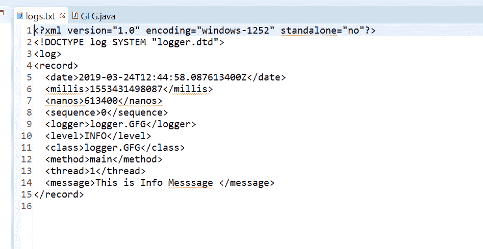
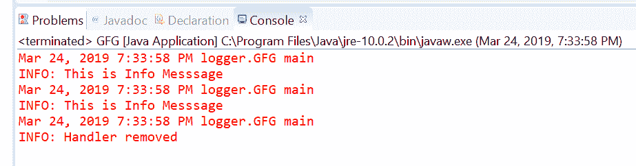

# Java 中的 Logger removeHandler()方法，示例

> 原文:[https://www . geesforgeks . org/logger-remove handler-method-in-Java-with-examples/](https://www.geeksforgeeks.org/logger-removehandler-method-in-java-with-examples/)

**removeHandler()** 一个**记录器**类的方法用于从记录器中移除一个日志处理程序。处理程序是 JVM 的一个组件，负责实际记录到定义的输出编写器，如文件、控制台输出等。如果找不到给定的处理程序或该处理程序为空，它将静默返回。
**语法:**

```java
public void removeHandler(Handler handler)
                   throws SecurityException
```

**参数:**该方法接受一个参数**处理程序**，代表一个日志处理程序。
**返回值:**此方法不返回任何内容。
**异常:**这个方法抛出 **SecurityException** 如果存在安全管理器，这个记录器不是匿名的，调用者没有 LoggingPermission(“控件”)。
。
以下程序说明了 removeHandler()方法:
**程序 1:**

## Java 语言(一种计算机语言，尤用于创建网站)

```java
// Java program to demonstrate
// Logger.removeHandler() method

import java.util.logging.*;
import java.io.IOException;

public class GFG {

    private static Logger logger
        = Logger.getLogger(
            GFG.class.getName());

    public static void main(String args[])
        throws SecurityException, IOException
    {

        FileHandler filehandler
            = new FileHandler("logs.txt");

        // Add file handler as
        // handler of logs
        logger.addHandler(filehandler);

        // Log message
        logger.info("This is Info Message ");

        // Remove file handler.
        logger.removeHandler(filehandler);

        logger.info("This message will "
                    + "not print on filehandler");
    }
}
```

**输出:**
log . txt 文件上打印的输出如下所示-



**节目 2:**

## Java 语言(一种计算机语言，尤用于创建网站)

```java
// Java program to demonstrate
// Logger.addHandler() method

import java.util.logging.*;
import java.io.IOException;

public class GFG {

    private static Logger logger
        = Logger.getLogger(
            GFG.class.getName());

    public static void main(String args[])
        throws SecurityException, IOException
    {

        // Create a ConsoleHandler object
        ConsoleHandler handler
            = new ConsoleHandler();

        // Add console handler as
        // handler of logs
        logger.addHandler(handler);

        // Log message
        logger.info("This is Info Message ");

        // Remove consolehandler
        logger.removeHandler(handler);

        // After removing logs print message
        logger.info("Handler removed");
    }
}
```

**输出:**
输出打印在控制台输出如下所示-



**参考:**[https://docs . Oracle . com/javase/10/docs/API/Java/util/logging/logger . html # remove handler(Java . util . logging . handler)](https://docs.oracle.com/javase/10/docs/api/java/util/logging/Logger.html#removeHandler(java.util.logging.Handler))