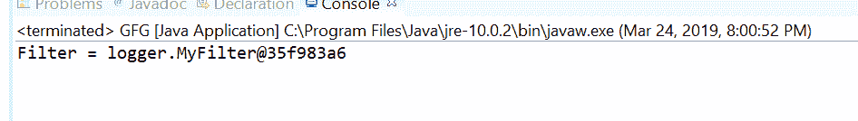
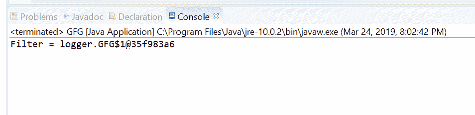

# Java 中的 Logger setFilter()方法，示例

> 原文:[https://www . geesforgeks . org/logger-set filter-method-in-Java-with-examples/](https://www.geeksforgeeks.org/logger-setfilter-method-in-java-with-examples/)

**设置过滤器()**一个**记录器**类的方法用于设置一个过滤器来控制这个记录器的输出。过滤器作为参数传递。过滤器对于过滤掉日志消息很有用。可以说，过滤器决定了消息是否被记录。过滤器由 Java 接口 java.util.logging.Filter 表示。通过初始“级别”检查后，Logger 将调用此 Filter 来检查日志记录是否真的应该发布。

**语法:**

```java
public void setFilter(Filter newFilter)
               throws SecurityException

```

**参数:**该方法接受一个参数**新滤镜**，代表一个滤镜对象。

**返回值:**此方法不返回任何内容。

**异常:**此方法抛出**安全异常**如果存在安全管理器，则此记录器不是匿名的，并且调用方没有 LoggingPermission(“控制”)。

下面的程序说明了 setFilter()方法:
**程序 1:**

```java
// Java program to demonstrate
// Logger.setFilter() method

import java.util.logging.*;
import java.io.IOException;

public class GFG {

    public static void main(String[] args)
        throws SecurityException, IOException
    {

        // Create a logger
        Logger logger
            = Logger.getLogger(GFG.class.getName());

        // set a new filter
        logger.setFilter(new MyFilter());

        // check filter is null or not by printing
        System.out.println("Filter = "
                           + logger.getFilter());
    }
}
class MyFilter implements Filter {
    public boolean isLoggable(LogRecord record)
    {
        return false;
    }
}
```

**输出:**
Eclipse 控制台上打印的输出如下所示-


**程序 2:**

```java
// Java program to demonstrate
// Logger.setFilter() method

import java.util.logging.*;
import java.io.IOException;

public class GFG {

    public static void main(String[] args)
        throws SecurityException, IOException
    {

        // Create a logger
        Logger logger
            = Logger.getLogger(
                GFG.class.getName());

        // Set a new filter
        logger.setFilter(new Filter() {
            @Override
            public boolean isLoggable(LogRecord record)
            {
                return true;
            }
        });

        // Check filter is null
        // or not by printing
        System.out.println("Filter = "
                           + logger.getFilter());
    }
}
```

**输出:**
控制台输出上打印的输出如下所示-


**参考文献:**[https://docs . Oracle . com/javase/10/docs/API/Java/util/logging/logger . html # setFilter(Java . util . logging . filter)](https://docs.oracle.com/javase/10/docs/api/java/util/logging/Logger.html#setFilter(java.util.logging.Filter))