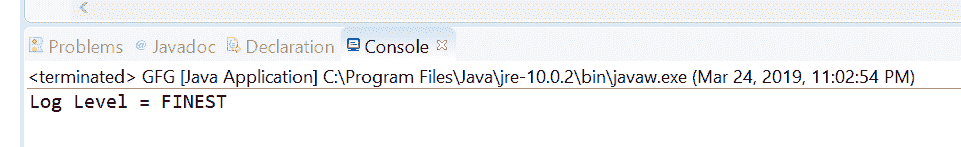
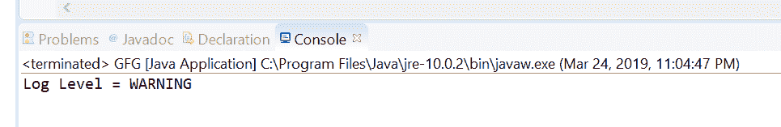

# Java 中的 Logger setLevel()方法，示例

> 原文:[https://www . geesforgeks . org/logger-set level-method-in-Java-with-examples/](https://www.geeksforgeeks.org/logger-setlevel-method-in-java-with-examples/)

**设置级别()**一个**记录器**类的方法，用于设置日志级别，以描述该记录器将记录哪些消息级别。我们要设置的级别作为参数传递。低于传递的日志级别值的消息级别将被记录器丢弃。级别值级别。关闭可用于关闭日志记录。

**日志级别:**日志级别控制日志详细信息。它们决定日志文件生成的深度。每个级别都与一个数值相关联，有 7 个基本日志级别和 2 个特殊日志级别。我们需要每次都指定期望的日志记录级别，我们寻求与日志系统进行交互。要了解更多关于日志级别的信息，请参考日志中的[日志级别。](https://www.geeksforgeeks.org/logging-in-java/)

**语法:**

```
public void setLevel(Level newLevel)
              throws SecurityException

```

**参数:**该方法接受一个参数**新等级**，代表日志等级的新值。

**返回值:**此方法不返回任何内容。

**异常:**此方法抛出**安全异常**如果存在安全管理器，则此记录器不是匿名的，并且调用方没有 LoggingPermission(“控制”)。

下面的程序说明了 setLevel()方法:
**程序 1:**

```
// Java program to demonstrate
// Logger.setLevel() method

import java.util.logging.*;

public class GFG {

    public static void main(String[] args)
        throws SecurityException
    {

        // Create a logger
        Logger logger
            = Logger.getLogger(
                GFG.class.getName());

        // Set log levels
        logger.setLevel(Level.FINEST);

        // Print log level
        System.out.println("Log Level = "
                           + logger.getLevel());
    }
}
```

**输出:**
Eclipse 控制台上打印的输出如下所示-


**程序 2:**

```
// Java program to demonstrate
// Logger.setLevel() method

import java.util.logging.*;

public class GFG {

    public static void main(String[] args)
        throws SecurityException
    {

        // Create a logger
        Logger logger
            = Logger.getLogger(
                GFG.class.getName());

        // Set log levels
        logger.setLevel(Level.WARNING);

        // Print log level
        System.out.println("Log Level = "
                           + logger.getLevel());
    }
}
```

**输出:**
控制台输出上打印的输出如下所示-


**参考:**[https://docs . Oracle . com/javase/10/docs/API/Java/util/logging/logger . html # setLevel(Java . util . logging . level)](https://docs.oracle.com/javase/10/docs/api/java/util/logging/Logger.html#setLevel(java.util.logging.Level))