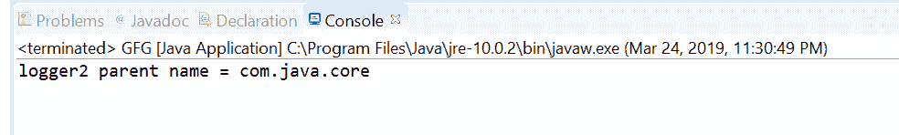
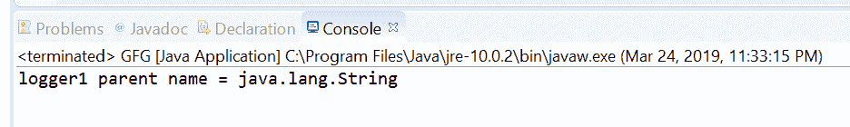

# Java 中的 Logger setParent()方法，示例

> 原文:[https://www . geesforgeks . org/logger-set parent-method-in-Java-with-examples/](https://www.geeksforgeeks.org/logger-setparent-method-in-java-with-examples/)

**设置父类**记录器**类的**方法，用于设置当前记录器的父记录器。我们想要设置的父 Logger 作为参数传递。当命名空间改变时，日志管理器使用这个方法来更新日志。

**语法:**

```java
public void setParent(Logger parent)

```

**参数:**该方法接受一个参数**父级**，代表新的父级记录器。

**返回值:**此方法不返回任何内容。

**异常:**如果存在安全管理器，并且调用方没有登录权限(“控制”)，则此方法引发**安全异常**。

下面的程序说明了 setParent()方法:
**程序 1:**

```java
// Java program to demonstrate
// Logger.setParent() method

import java.util.logging.*;

public class GFG {

    public static void main(String[] args)
    {

        // Create a logger1 using getLogger()
        Logger logger1
            = Logger.getLogger("com.java.core");

        // Assign other package to logger
        Logger logger2
            = Logger
                  .getLogger("com.java.core.api");

        // Set logger1 as parent to logger2
        logger2.setParent(logger1);

        // Print parent name
        System.out.println("logger2 parent name = "
                           + logger2
                                 .getParent()
                                 .getName());
    }
}
```

**输出:**
Eclipse 控制台上打印的输出如下所示-


**程序 2:**

```java
// Java program to demonstrate
// Logger.setParent() method

import java.util.logging.*;

public class GFG {

    public static void main(String[] args)
    {

        // Create a logger1 using getLogger()
        Logger logger1
            = Logger.getLogger(GFG.class.getName());

        // Assign other package to logger
        Logger logger2
            = Logger
                  .getLogger(String.class.getName());

        // Set logger2 as parent to logger1
        logger1.setParent(logger2);

        // Print parent name
        System.out.println("logger1 parent name = "
                           + logger1
                                 .getParent()
                                 .getName());
    }
}
```

**输出:**
控制台输出上打印的输出如下所示-


**参考:**[https://docs . Oracle . com/javase/10/docs/API/Java/util/logging/logger . html # setParent(Java . util . logging . logger)](https://docs.oracle.com/javase/10/docs/api/java/util/logging/Logger.html#setParent(java.util.logging.Logger))