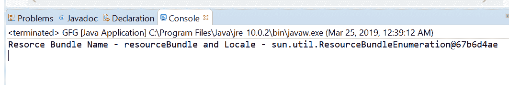

# Java 中的 Logger setResourceBundle()方法，示例

> 原文:[https://www . geesforgeks . org/logger-setresourcebund-method-in-Java-with-examples/](https://www.geeksforgeeks.org/logger-setresourcebundle-method-in-java-with-examples/)

**setresourcebund()**一个 **Logger** 类的方法用来在这个 Logger 上设置一个资源包，我们必须把资源包对象作为参数传递给这个方法。设置资源包后，所有消息都将使用特定地区的给定资源包进行记录。
**语法:**

```
public void setResourceBundle(ResourceBundle bundle)
```

**参数:**该方法接受一个参数**包**，代表该记录器应使用的资源包。
**返回值:**此方法不返回任何内容。
**异常:**此方法抛出以下异常:

*   **NullPointRexception**–如果给定的包为空。
*   **IllegalArgumentException**–如果给定的包没有基本名称，或者如果这个记录器已经有一个资源包集，但是给定的包有不同的基本名称。
*   **security exception**–如果存在安全管理器，则此记录器不是匿名的，并且调用者没有 LoggingPermission(“控制”)。

下面的程序说明了 setResourceBundle()方法:
**程序 1:**

## Java 语言(一种计算机语言，尤用于创建网站)

```
// Java program to demonstrate
// Logger.setResourceBundle() method

import java.util.logging.*;
import java.util.ResourceBundle;

public class GFG {

    private static Logger logger
        = Logger.getLogger(
            GFG
                .class
                .getPackage()
                .getName());

    public static void main(String args[])
    {

        // Create ResourceBundle using getBundle
        // myResource is a properties file
        ResourceBundle bundle
            = ResourceBundle
                  .getBundle("myResource");

        // Set ResourceBundle to logger
        logger.setResourceBundle(bundle);

        // Log the ResourceBundle Name details
        logger.info("Resource Bundle "
                    + logger.getResourceBundleName());
    }
}
```

**输出:**
对于上面的程序，有一个属性文件名 resourceBundle.properties .我们必须在类旁边添加这个文件来执行程序。
Eclipse 控制台上打印的输出如下所示-


**节目 2:**

## Java 语言(一种计算机语言，尤用于创建网站)

```
import java.util.ResourceBundle;
// Java program to demonstrate
// Logger.setResourceBundle() method

import java.util.logging.Logger;

public class GFG {

    private static Logger logger
        = Logger.getLogger(
            GFG
                .class
                .getPackage()
                .getName());

    public static void main(String args[])
    {

        // Create ResourceBundle using getBundle
        // Resource is a properties file
        ResourceBundle resbundle
            = ResourceBundle.getBundle("resourceBundle");

        // Set ResourceBundle to logger
        logger.setResourceBundle(resbundle);

        // Log the ResourceBundle Name details
        System.out.println("Resource Bundle Name - "
                           + logger.getResourceBundleName()
                           + " and Locale - "
                           + logger
                                 .getResourceBundle()
                                 .getKeys());
    }
}
```

**输出:**
对于上面的程序，有一个属性文件名 myResource。我们必须在类旁边添加这个文件来执行程序。
控制台输出上打印的输出如下所示-



**参考:**[https://docs . Oracle . com/javase/10/docs/API/Java/util/logging/logger . html # setresourcebund(Java . util . logging . logger)](https://docs.oracle.com/javase/10/docs/api/java/util/logging/Logger.html#setResourceBundle(java.util.logging.Logger))