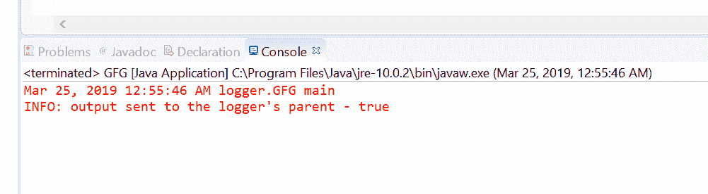
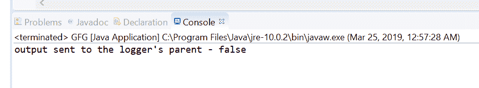

# Java 中的 Logger setUseParentHandlers()方法，示例

> 原文:[https://www . geesforgeks . org/logger-setuseparenthandlers-method-in-Java-with-examples/](https://www.geeksforgeeks.org/logger-setuseparenthandlers-method-in-java-with-examples/)

**用于设置配置的**记录器**类的 setUseParentHandlers()** 方法，该配置定义该记录器是否将其输出发送到其父记录器。如果我们想将输出发送到它的父 Logger，那么我们必须将这个方法的参数设置为 true。这意味着任何日志记录也将被写入父级的处理程序，并潜在地写入其父级，递归地向上进入命名空间。

**语法:**

```java
public void setUseParentHandlers(boolean useParentHandlers)

```

**参数:**该方法接受一个参数 **useParentHandlers** ，如果输出要发送到记录器的父级，则该参数为 true。

**返回值:**此方法不返回任何内容。

**异常:**此方法抛出**安全异常**如果存在安全管理器，则此记录器不是匿名的，并且调用方没有 LoggingPermission(“控制”)。

下面的程序说明了 setUseParentHandlers()方法:

**程序 1:**

```java
// Java program to demonstrate
// Logger.setUseParentHandlers() method

import java.util.logging.Logger;

public class GFG {

    private static Logger logger
        = Logger.getLogger(
            GFG.class
                .getPackage()
                .getName());

    public static void main(String args[])
    {

        // Set that this logger will
        // sent logs to its parent logger.
        logger.setUseParentHandlers(true);

        // Log the flag value
        logger.info("output sent to the"
                    + " logger's parent - "
                    + logger.getUseParentHandlers());
    }
}
```

**输出:**
Eclipse 控制台上打印的输出如下所示-


**程序 2:**

```java
// Java program to demonstrate
// Logger.setUseParentHandlers() method

import java.util.logging.Logger;

public class GFG {

    private static Logger logger
        = Logger.getLogger(
            GFG.class
                .getPackage()
                .getName());

    public static void main(String args[])
    {

        // Set that this logger will not
        // send logs to its parent logger.
        logger.setUseParentHandlers(false);

        // Print the flag value
        System.out.println("output sent to the"
                           + " logger's parent - "
                           + logger.getUseParentHandlers());
    }
}
```

**输出:**
控制台输出上打印的输出如下所示-


**参考:**[https://docs . Oracle . com/javase/10/docs/API/Java/util/logging/logger . html # setUseParentHandlers(布尔型)](https://docs.oracle.com/javase/10/docs/api/java/util/logging/Logger.html#setUseParentHandlers(boolean))