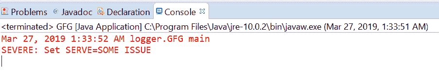

# Java 中的 Logger 重度()方法，示例

> 原文:[https://www . geesforgeks . org/logger-重度-java 中的方法-示例/](https://www.geeksforgeeks.org/logger-severe-method-in-java-with-examples/)

用于记录严重消息的**记录器**类的**严重()**方法。此方法用于将严重类型日志传递给所有注册的输出处理程序对象。

**[严重信息](https://www.geeksforgeeks.org/logging-in-java/) :** 当发生了可怕的事情，应用程序无法继续运行时，就会出现严重情况。比如数据库不可用，内存不足。

根据传递的参数数量，有两种类型的严重()方法。

1.  **严重(字符串消息)**:此方法用于记录严重消息。如果记录器能够记录严重级别的消息，那么给定的消息将被转发到所有注册的输出处理程序对象。

**语法:**

```java
public void severe(String msg)

```

**参数:**该方法接受单个参数**字符串**，即字符串消息。

**返回值:**此方法不返回任何内容。

下面的程序说明了严重(字符串消息)的方法:

**程序 1:**

```java
// Java program to demonstrate
// Logger.severe(String msg) method

import java.io.IOException;
import java.util.logging.*;

public class GFG {

    public static void main(String[] args)
        throws SecurityException, IOException
    {

        // Create a Logger
        Logger logger
            = Logger.getLogger(
                GFG.class.getName());

        // Set Logger level()
        logger.setLevel(Level.SEVERE);

        // Call severe method
        logger.severe("Set SERVE=SOME ISSUE");
    }
}
```

控制台上打印的输出如下所示。
**输出:**


*   **severe(Supplier msgSupplier)**: This method is used Log a SEVERE message, constructed only if the logging level is such that the message will actually be logged. It means If the logger is enabled for the SEVERE message level then the message is constructed by invoking the provided supplier function and forwarded to all the registered output Handler objects.

    **语法:**

    ```java
    public void severe(Supplier msgSupplier)

    ```

    **参数:**这个方法接受一个单参数 msgSupplier，它是一个函数，当被调用时，会产生想要的日志消息。

    **返回值:**此方法不返回任何内容。

    以下程序说明了严格的(供应商 msgSupplier)方法:

    **程序 1:**

    ```java
    // Java program to demonstrate
    // Logger.severe(Supplier<String>) method

    import java.io.IOException;
    import java.util.function.Supplier;
    import java.util.logging.*;

    public class GFG {

        public static void main(String[] args)
            throws SecurityException, IOException
        {

            // Create a Logger
            Logger logger
                = Logger.getLogger(
                    GFG.class.getName());

            // Set Logger level()
            logger.setLevel(Level.SEVERE);

            // Create a supplier<String> method
            Supplier<String> StrSupplier
                = () -> new String("Welcome to GFG");

            // Call severe(Supplier<String>)
            logger.severe(StrSupplier);
        }
    }
    ```

    控制台上打印的输出如下所示。
    **输出:**
    

    **参考文献:**

    *   [https://docs . Oracle . com/javase/10/docs/API/Java/util/logging/logger . html #重度(java.lang.String)](https://docs.oracle.com/javase/10/docs/api/java/util/logging/Logger.html#severe(java.lang.String))
    *   [https://docs . Oracle . com/javase/10/docs/API/Java/util/logging/logger . html #重度(Java . util . function . supplier)](https://docs.oracle.com/javase/10/docs/api/java/util/logging/Logger.html#severe(java.util.function.Supplier))