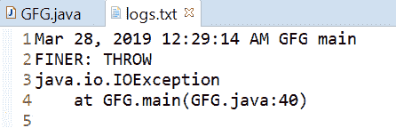
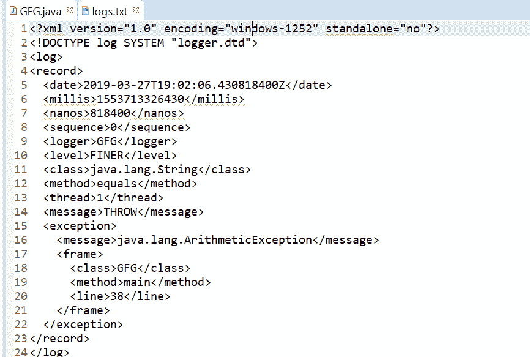

# Java 中的 Logger 抛出()方法，示例

> 原文:[https://www . geesforgeks . org/logger-throwing-method-in-Java-with-examples/](https://www.geeksforgeeks.org/logger-throwing-method-in-java-with-examples/)

**抛出(String sourceClass，String sourceMethod，Throwable 抛出)**方法用于记录抛出异常。在许多情况下，方法是通过抛出异常来关闭的，那么这是一个非常有用的方法，可以记录一个方法因抛出异常而终止。使用 FINER 级别的日志记录来完成日志记录。如果日志记录程序的级别设置为 log FINER 级别日志记录，那么给定的参数将存储在一个日志记录中，并带有一条消息 THROW，该消息将转发给所有注册的输出处理程序。

**语法:**

```
public void throwing(String sourceClass,
                     String sourceMethod,
                     Throwable thrown)

```

**参数:**该方法接受三个参数:

*   **sourceClass** 是发出日志记录请求的类的名称，
*   **sourceMethod** 是方法的名称，并且
*   **结果**是被投掷的可投掷物。

**返回值:**此方法不返回任何内容。

下面的程序说明了抛出(字符串源类、字符串源方法、对象结果)的方法:

**程序 1:**

```
// Java program to demonstrate
// throwing(String, String, Throwable) method

import java.io.IOException;
import java.util.logging.FileHandler;
import java.util.logging.Level;
import java.util.logging.Logger;
import java.util.logging.SimpleFormatter;

public class GFG {

    public static void main(String[] args)
        throws SecurityException, IOException
    {

        // Create a Logger
        Logger logger
            = Logger.getLogger(
                GFG.class.getName());

        // Create a file handler object
        FileHandler handler
            = new FileHandler("logs.txt");
        handler.setFormatter(new SimpleFormatter());

        // Add file handler as
        // handler of logs
        logger.addHandler(handler);

        // set Logger level()
        logger.setLevel(Level.FINER);

        // set Logger level()
        logger.setLevel(Level.FINER);

        // call throwing method with class
        // name =  GFG and method name = main
        // and IO Exception as Thrown object
        logger.throwing(GFG.class.getName(),
                        GFG.class.getMethods()[0].getName(),
                        new IOException());
    }
}
```

log.txt 上打印的输出如下所示。
**输出:**


**程序 2:**

```
// Java program to demonstrate
// throwing(String, String, Throwable) method

import java.io.IOException;
import java.util.logging.FileHandler;
import java.util.logging.Level;
import java.util.logging.Logger;

public class GFG {

    // Create a Logger
    static Logger logger
        = Logger.getLogger(
            GFG.class.getName());

    public static void main(String[] args)
        throws SecurityException, IOException
    {

        // Create a file handler object
        FileHandler handler
            = new FileHandler("logs.txt");

        // Add file handler as
        // handler of logs
        logger.addHandler(handler);

        // set Logger level()
        logger.setLevel(Level.FINER);

        // set Logger level()
        logger.setLevel(Level.FINER);

        // call throwing method with string
        // and ArithmeticException as Thrown object
        logger.throwing(String.class.getName(),
                        String.class.getMethods()[0].getName(),
                        new ArithmeticException());
    }
}
```

log.txt 上打印的输出如下所示。
**输出:**


**参考:**[https://docs . Oracle . com/javase/10/docs/API/Java/util/logging/logger . html # throwing(java.lang.String，Java . lang . string，java.lang.Throwable)](https://docs.oracle.com/javase/10/docs/api/java/util/logging/Logger.html#throwing(java.lang.String, java.lang.String, java.lang.Throwable))