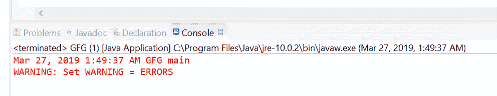
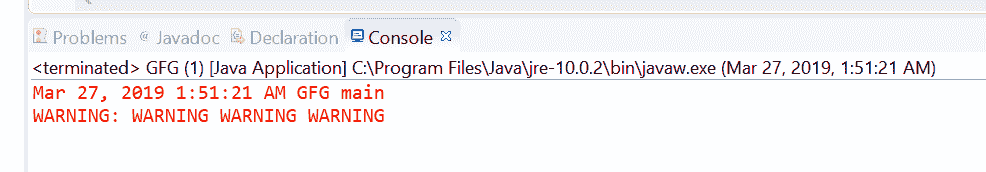

# Java 中的 Logger 警告()方法，示例

> 原文:[https://www . geesforgeks . org/logger-warning-method-in-Java-with-examples/](https://www.geeksforgeeks.org/logger-warning-method-in-java-with-examples/)

用于记录警告消息的**记录器**类的**警告()**方法。此方法用于将警告类型日志传递给所有已注册的输出处理程序对象。

**[警告消息](https://www.geeksforgeeks.org/logging-in-java/) :** 只要用户输入了错误的输入或凭据，就会出现警告。

根据传递的参数的数量，有两种类型的警告()方法。

1.  **警告(字符串消息)**:此方法用于记录警告消息。如果记录器启用了记录警告级别的消息，那么给定的消息将被转发到所有注册的输出处理程序对象。

**语法:**

```java
public void warning(String msg)

```

**参数:**该方法接受单个参数字符串，即字符串消息。

**返回值:**此方法不返回任何内容。

以下程序说明警告(字符串消息)方法:
**程序 1:**

```java
// Java program to demonstrate
// Logger.warning(String msg) method

import java.io.IOException;
import java.util.logging.*;

public class GFG {

    public static void main(String[] args)
        throws SecurityException, IOException
    {

        // Create a Logger
        Logger logger
            = Logger.getLogger(
                GFG.class.getName());

        // Set Logger level()
        logger.setLevel(Level.WARNING);

        // Call warning method
        logger.warning("Set WARNING = ERRORS");
    }
}
```

控制台上打印的输出如下所示。
**输出:**


*   **warning(Supplier msgSupplier)**: This method is used Log a WARNING message, constructed only if the logging level is such that the message will actually be logged. It means If the logger is enabled for the WARNING message level then the message is constructed by invoking the provided supplier function and forwarded to all the registered output Handler objects.

    **语法:**

    ```java
    public void warning(Supplier msgSupplier)

    ```

    **参数:**这个方法接受一个单参数 msgSupplier，它是一个函数，当被调用时，会产生想要的日志消息。

    **返回值:**此方法不返回任何内容。

    以下程序说明了警告(供应商 msgSupplier)方法:

    **程序 1:**

    ```java
    // Java program to demonstrate
    // Logger.warning(Supplier<String>) method

    import java.io.IOException;
    import java.util.function.Supplier;
    import java.util.logging.*;

    public class GFG {

        public static void main(String[] args)
            throws SecurityException, IOException
        {

            // Create a Logger
            Logger logger
                = Logger.getLogger(
                    GFG.class.getName());

            // Set Logger level()
            logger.setLevel(Level.WARNING);

            // Create a supplier<String> method
            Supplier<String> StrSupplier
                = () -> new String("WARNING WARNING WARNING");

            // Call warning(Supplier<String>)
            logger.warning(StrSupplier);
        }
    }
    ```

    控制台上打印的输出如下所示。
    **输出:**
    

    **参考文献:**

    *   [https://docs . Oracle . com/javase/10/docs/API/Java/util/logging/logger . html #警告(java.lang.String)](https://docs.oracle.com/javase/10/docs/api/java/util/logging/Logger.html#warning(java.lang.String))
    *   [https://docs . Oracle . com/javase/10/docs/API/Java/util/logging/logger . html #警告(Java . util . function . supplier)](https://docs.oracle.com/javase/10/docs/api/java/util/logging/Logger.html#warning(java.util.function.Supplier))