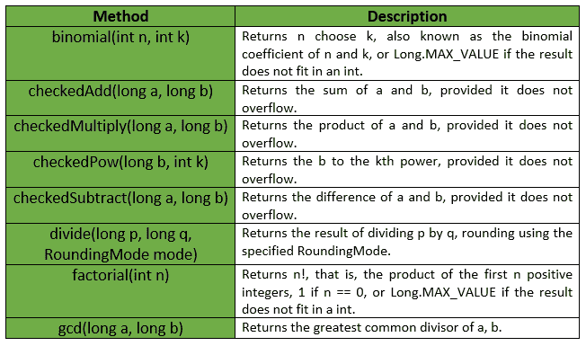
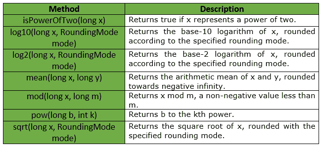

# LongMath 类|番石榴| Java

> 原文:[https://www.geeksforgeeks.org/longmath-class-guava-java/](https://www.geeksforgeeks.org/longmath-class-guava-java/)

**LongMath** 用于对 Long 值进行数学运算。基本的独立数学函数根据所涉及的主要数值类型分为类***【IntMath】【long math】【double math】和类*** 。这些类具有并行结构，但每个都只支持相关的函数子集。

**申报:**申报为 ***的班级为:***

```java
@GwtCompatible(emulated = true)
public final class LongMath
   extends Object

```

下表显示了番石榴 LongMath Class 提供的一些方法:

**例外:**

*   **log2:***IllegalArgumentException*if x<= 0
*   **log10:***IllegalArgumentException*if x<= 0
*   **pow:**T2】IllegalArgumentExceptionif k<0
*   **sqrt :** *非法参数异常* if x < 0
*   **除:** *算术异常*如果 q == 0，或者如果 mode ==不必要且 a 不是 b 的整数倍
*   **修改:** *算术异常*如果 m < = 0
*   **gcd:***IllegalArgumentException*如果 a < 0 或 b < 0
*   **如果 a + b 在有符号长算术中溢出，则检查 dd :** *算术异常*
*   **检查子管道:** *算术异常*如果 a–b 在有符号长算术中溢出
*   **检查倍数:** *算术异常*如果 a * b 在有符号长算术中溢出
*   **检查电流:** *算术异常*如果 b 到 k 次方在有符号长算术中溢出
*   **阶乘:**T2【IllegalargumentExceptionif n<0
*   **二项式:***IllegalArgumentException*if n<0，k < 0 或 k > n

番石榴 LongMath 类提供的其他一些方法有:

**例 1 :**

```java
// Java code to show implementation of
// LongMath Class of Guava
import java.math.RoundingMode;
import com.google.common.math.LongMath;

class GFG {

    // Driver code
    public static void main(String args[])
    {

        // Creating an object of GFG class
        GFG obj = new GFG();

        // Function calling
        obj.examples();
    }

    private void examples()
    {

        try {

            // exception will be thrown as 80 is not
            // completely divisible by 3
            // thus rounding is required, and
            // RoundingMode is set as UNNESSARY
            System.out.println(LongMath.divide(80, 3, RoundingMode.UNNECESSARY));
        }
        catch (ArithmeticException ex) {
            System.out.println("Error Message is : " + ex.getMessage());
        }
    }
}
```

输出:

```java
Error Message is : mode was UNNECESSARY, but rounding was necessary

```

**例 2 :**

```java
// Java code to show implementation of
// LongMath Class of Guava
import java.math.RoundingMode;
import com.google.common.math.LongMath;

class GFG {

    // Driver code
    public static void main(String args[])
    {

        // Creating an object of GFG class
        GFG obj = new GFG();

        // Function calling
        obj.examples();
    }

    private void examples()
    {

        // As 120 is divisible by 4, so
        // no exception is thrown
        System.out.println(LongMath.divide(120, 4, RoundingMode.UNNECESSARY));

        // To compute GCD of two integers
        System.out.println("GCD is : " + LongMath.gcd(70, 14));

        // To compute log to base 10
        System.out.println("Log10 is : " + LongMath.log10(1000, RoundingMode.HALF_EVEN));

        // To compute remainder
        System.out.println("modulus is : " + LongMath.mod(125, 5));

        // To compute factorial
        System.out.println("factorial is : " + LongMath.factorial(7));

        // To compute log to base 2
        System.out.println("Log2 is : " + LongMath.log2(8, RoundingMode.HALF_EVEN));

        // To compute square root
        System.out.println("sqrt is : " + LongMath.sqrt(LongMath.pow(12, 2), RoundingMode.HALF_EVEN));
    }
}
```

输出:

```java
30
GCD is : 14
Log10 is : 3
modulus is : 0
factorial is : 5040
Log2 is : 3
sqrt is : 12

```

**参考:**T2】谷歌番石榴