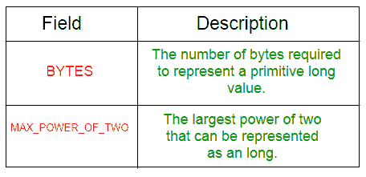
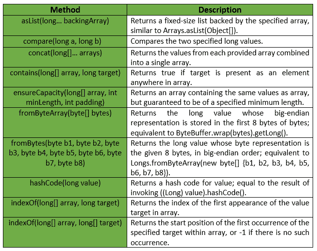
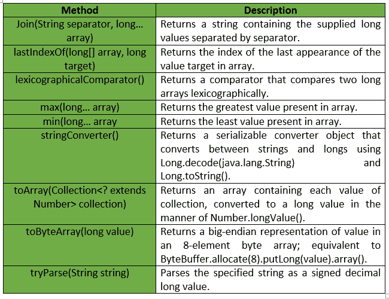

# 朗斯班|番石榴|爪哇

> 原文:[https://www.geeksforgeeks.org/longs-class-guava-java/](https://www.geeksforgeeks.org/longs-class-guava-java/)

**Longs** 是一个用于基元类型 long 的效用类。它提供了属于长原语的**静态实用方法，这些方法在长原语或数组中都没有找到。**

****申报:****

```
@GwtCompatible(emulated=true)
public final class Longs
extends Object 
```

**下表显示了番石榴朗斯级的字段摘要:**

**
番石榴龙类提供的一些方法有:

**例外:****

*   ****min:***IllegalArgumentException*若阵为空。**
*   ****max:***IllegalArgumentException*如果数组为空。**
*   ****from bytearray:***IllegalArgumentException*如果字节少于 8 个元素。**
*   ****确保容量:** *如果最小长度或填充值为负，则显示“异常”。***
*   ****to array:***NullPointerException*如果集合或其任何元素为空。**

**下表显示了番石榴 Longs 类提供的一些其他方法:

下面给出了一些示例，显示了番石榴 Longs 类的方法的实现:
**示例 1 :****

```
// Java code to show implementation
// of Guava Longs.asList() method

import com.google.common.primitives.Longs;
import java.util.*;

class GFG {
    // Driver method
    public static void main(String[] args)
    {
        long arr[] = { 3L, 4L, 5L, 6L, 7L };

        // Using Longs.asList() method which wraps
        // the primitive long array as List of
        // long Type
        List<Long> myList = Longs.asList(arr);

        // Displaying the elements
        System.out.println(myList);
    }
}
```

**输出:**

```
[3, 4, 5, 6, 7] 
```

****例 2 :****

```
// Java code to show implementation
// of Guava Longs.toArray() method

import com.google.common.primitives.Longs;
import java.util.*;

class GFG {
    // Driver method
    public static void main(String[] args)
    {
        List<Long> myList = Arrays.asList(3L, 4L, 5L, 6L, 7L);

        // Using Longs.toArray() method which
        // converts a List of Longs to an
        // array of long
        long[] arr = Longs.toArray(myList);

        // Displaying the elements
        System.out.println(Arrays.toString(arr));
    }
}
```

**输出:**

```
[3, 4, 5, 6, 7] 
```

****例 3 :****

```
// Java code to show implementation
// of Guava Longs.concat() method

import com.google.common.primitives.Longs;
import java.util.*;

class GFG {
    // Driver method
    public static void main(String[] args)
    {
        long[] arr1 = { 3L, 4L, 5L };
        long[] arr2 = { 6L, 7L };

        // Using Longs.concat() method which
        // combines arrays from specified
        // arrays into a single array
        long[] arr = Longs.concat(arr1, arr2);

        // Displaying the elements
        System.out.println(Arrays.toString(arr));
    }
}
```

**输出:**

```
[3, 4, 5, 6, 7] 
```

****例 4 :****

```
// Java code to show implementation
// of Guava Longs.contains() method

import com.google.common.primitives.Longs;

class GFG {
    // Driver method
    public static void main(String[] args)
    {
        long[] arr = { 3L, 4L, 5L, 6L };

        // Using Longs.contains() method which
        // checks if element is present in array
        // or not
        System.out.println(Longs.contains(arr, 4L));
        System.out.println(Longs.contains(arr, 7L));
    }
}
```

**输出:**

```
true
false 
```

****例 5 :****

```
// Java code to show implementation
// of Guava Longs.min() method

import com.google.common.primitives.Longs;

class GFG {
    // Driver method
    public static void main(String[] args)
    {
        long[] arr = { 3L, 4L, 5L, 6L };

        // Using Longs.min() method
        System.out.println(Longs.min(arr));
    }
}
```

**输出:**

```
3 
```

****例 6 :****

```
// Java code to show implementation
// of Guava Longs.max() method

import com.google.common.primitives.Longs;

class GFG {
    // Driver method
    public static void main(String[] args)
    {
        long[] arr = { 3L, 4L, 5L, 6L };

        // Using Longs.max() method
        System.out.println(Longs.max(arr));
    }
}
```

**输出:**

```
6 
```