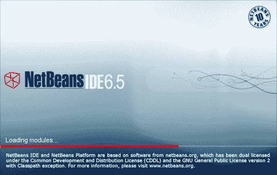
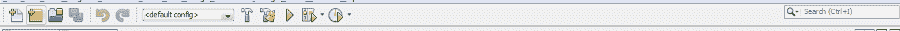
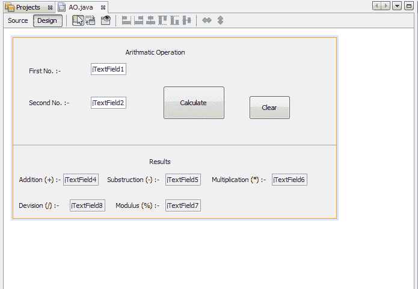
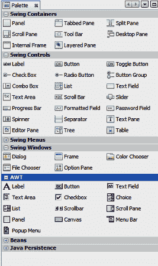
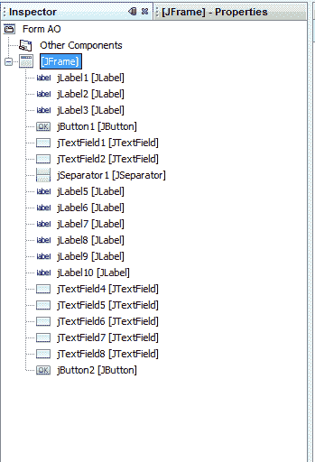
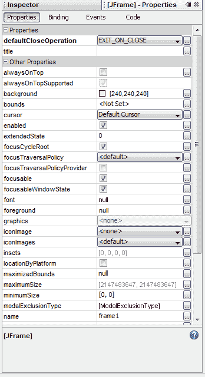

# Java Netbeans IDE 主要组件

> 原文:[https://www . geesforgeks . org/main-components-of-Java-netbeans-ide/](https://www.geeksforgeeks.org/main-components-of-java-netbeans-ide/)

在有人开始开发应用程序之前，请确保我们的计算机上安装了 JAVA SDK 和 NetBeans IDE。
下载后即可安装软件。一旦安装了软件，现在让我们检查安装后的所有 5 个组件。软件安装后，我们可以按照以下步骤开始工作
1。开始
2。所有程序
3。
网豆 4。网豆集成开发环境
最初，等待一段时间，直到程序(网豆集成开发环境)窗口在全功能模式下打开。它包括许多功能&通过使用它，我们能够准备所有类型的程序(桌面应用程序&网络应用程序)和游戏。让我们逐一讨论以下组件:

1.  标题栏
2.  菜单栏和下拉菜单
3.  工具栏
4.  图形用户界面建筑
5.  调色板

**开始窗口**

**组件 1:** 标题栏

它显示应用程序的标题。Netbeans 将命名为 JavaApplication1、JavaApplication2、……..等等。，对你的项目来说，随机任意如下图所示

**标题栏**

**组件 2:** 菜单栏和下拉菜单
工作环境与熟悉菜单栏的环境相同，因为您已经使用过微软视窗操作系统。菜单栏显示在标题栏的正下方，包括许多选项。菜单栏上的每个选项都有一个项目下拉列表(称为下拉菜单)，可帮助您执行各种任务。

菜单条

**组件 3:** 工具栏
工具栏是显示常用任务图标的栏。Netbeans IDE 的标准工具栏显示 Netbeans 中最常用命令的图标。

**工具栏**

**构件 4:** 桂楼
又称设计区或设计空间。设计区是您可以直观构建图形用户界面的地方。它是在集成开发环境中进行图形用户界面设计的主要工作空间。图形用户界面构建器使您能够通过将组件放置在您想要的位置并以指南的形式提供视觉反馈来布局表单。它有两个视图:源代码视图和设计视图。“设计视图”是默认值，如上所示。源代码视图为您打开代码编辑器，您可以在其中添加/编辑应用程序的代码。您可以随时通过单击视图各自的选项卡在视图之间切换。

**GUI 建筑设计视图**

**组件 5:** 调色板
调色板包含创建图形用户界面应用程序所需的所有组件。在讨论调色板之前，让我们先谈谈窗口/框架和控件。

**5(a)** 帧

a**<u>–</u>**框架是一个窗口，通常有边框、标题和用于关闭和图标化自身的按钮等装饰。图形用户界面应用程序通常至少使用一个框架。框架用于显示标签、文本字段、按钮和其他控件

**5(b)** 对照

控件是组件对象，如文本字段、标签列表框等。，绘制在框架上以获取数据输入或显示输出。在介绍了框架和控件之后，现在让我们来谈谈调色板，如下图所示，调色板显示了一组可用于在框架上放置控件的组件工具。

**控制窗口**

**5(c)** 检查器窗口

此窗口显示当前打开的中包含的所有组件的树层次结构。显示的项目包括可视组件和容器，如按钮、标签、菜单和面板，以及非可视组件，如计时器和数据源。

**检查器窗口**

**5(d)** 属性窗口

此窗口显示当前选定组件的可编辑设置。右图显示了 JFrame 对象的属性编辑器。

**属性窗口**

**5(e)** 代码编辑器窗口

代码 <u>e</u> 编辑器窗口是您为应用程序编写 Java 代码的地方。我们所说的代码是指语言语句、常量<u>和声明。“代码编辑器”窗口充当输入应用程序代码的编辑器。将为您在应用程序中创建的每个顶级框架创建一个单独的代码编辑器窗口。使用代码编辑器窗口，您可以快速查看和编辑应用程序中的任何代码。若要打开“代码”窗口，可以双击选择为其编写代码的控件。或者在图形用户界面构建器窗口中，单击源选项卡。您也可以按下“ *Ctrl + Alt +向上翻页/向下翻页”*。</u>