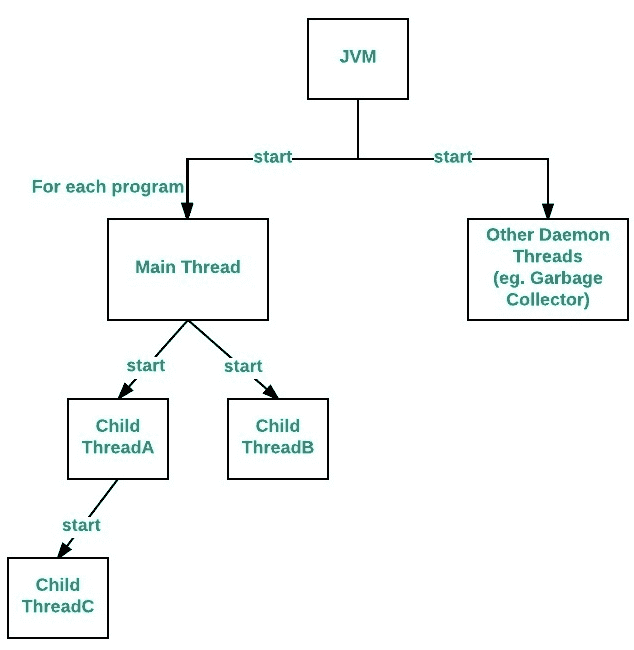
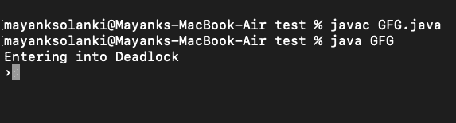

# Java 中的主线程

> 原文:[https://www.geeksforgeeks.org/main-thread-java/](https://www.geeksforgeeks.org/main-thread-java/)

Java 为多线程编程提供内置支持。多线程程序包含两个或多个可以并发运行的部分。这种程序的每个部分都称为一个线程，每个线程都定义了一个单独的执行路径。
当一个 Java 程序启动时，一个线程立即开始运行。这通常被称为我们程序的*主*线程，因为它是我们程序开始时执行的线程。

与主线程相关联的某些属性如下:

*   它是其他“子”线程将从中衍生出来的线程。
*   通常，它必须是最后一个完成执行的线程，因为它执行各种关闭操作

流程图如下:



**如何控制主线**

主线程是在我们的程序启动时自动创建的。为了控制它，我们必须获得对它的引用。这可以通过调用 Thread 类中的方法 *currentThread( )* 来实现。此方法返回对调用它的线程的引用。主线程的默认优先级是 5，对于所有剩余的用户线程，优先级将从父线程继承到子线程。

**例**

## Java 语言(一种计算机语言，尤用于创建网站)

```java
// Java program to control the Main Thread

// Importing required classes
import java.io.*;
import java.util.*;

// Class 1
// Main class extending thread class
public class Test extends Thread {

    // Main driver method
    public static void main(String[] args)
    {

        // Getting reference to Main thread
        Thread t = Thread.currentThread();

        // Getting name of Main thread
        System.out.println("Current thread: "
                           + t.getName());

        // Changing the name of Main thread
        t.setName("Geeks");
        System.out.println("After name change: "
                           + t.getName());

        // Getting priority of Main thread
        System.out.println("Main thread priority: "
                           + t.getPriority());

        // Setting priority of Main thread to MAX(10)
        t.setPriority(MAX_PRIORITY);

        // Print and display the main thread priority
        System.out.println("Main thread new priority: "
                           + t.getPriority());

        for (int i = 0; i < 5; i++) {
            System.out.println("Main thread");
        }

        // Main thread creating a child thread
        Thread ct = new Thread() {
            // run() method of a thread
            public void run()
            {

                for (int i = 0; i < 5; i++) {
                    System.out.println("Child thread");
                }
            }
        };

        // Getting priority of child thread
        // which will be inherited from Main thread
        // as it is created by Main thread
        System.out.println("Child thread priority: "
                           + ct.getPriority());

        // Setting priority of Main thread to MIN(1)
        ct.setPriority(MIN_PRIORITY);

        System.out.println("Child thread new priority: "
                           + ct.getPriority());

        // Starting child thread
        ct.start();
    }
}

// Class 2
// Helper class extending Thread class
// Child Thread class
class ChildThread extends Thread {

    @Override public void run()
    {

        for (int i = 0; i < 5; i++) {

            // Print statement whenever child thread is
            // called
            System.out.println("Child thread");
        }
    }
}
```

**Output**

```java
Current thread: main
After name change: Geeks
Main thread priority: 5
Main thread new priority: 10
Main thread
Main thread
Main thread
Main thread
Main thread
Child thread priority: 10
Child thread new priority: 1
Child thread
Child thread
Child thread
Child thread
Child thread
```

现在让我们讨论一下 Java 中 main()方法和主线程之间的关系。对于每个程序，一个主线程由 [JVM](https://www.geeksforgeeks.org/jvm-works-jvm-architecture/) (Java 虚拟机)创建。“main”线程首先验证 Main()方法的存在，然后初始化类。请注意，从 JDK 6 开始，main()方法在独立的 java 应用程序中是必需的。

**使用主线程死锁(仅单线程)**

我们可以通过只使用 Main 线程来创建死锁，即只使用一个线程。

**例**

## Java 语言(一种计算机语言，尤用于创建网站)

```java
// Java program to demonstrate deadlock
// using Main thread

// Main class
public class GFG {

  // Main driver method
  public static void main(String[] args) {

    // Try block to check for exceptions
    try {

      // Print statement
      System.out.println("Entering into Deadlock");

      // Joining the current thread
      Thread.currentThread().join();

      // This statement will never execute
      System.out.println("This statement will never execute");
    }

    // Catch block to handle the exceptions
    catch (InterruptedException e) {

      // Display the exception along with line number
      // using printStackTrace() method
      e.printStackTrace();
    }
  }
}
```

**输出:**



输出解释:
语句“Thread.currentThread()。join()”，将告诉 Main 线程等待这个线程(即等待它自己)死亡。因此主线程等待自己死亡，这只是一个死锁。

**相关文章:**[Java 中的守护线程](https://www.geeksforgeeks.org/daemon-thread-java/)。
本文由**高拉夫·米格拉尼**供稿。如果你喜欢 GeeksforGeeks 并想投稿，你也可以使用[write.geeksforgeeks.org](https://write.geeksforgeeks.org)写一篇文章或者把你的文章邮寄到 review-team@geeksforgeeks.org。看到你的文章出现在极客博客主页上，帮助其他极客。
如果发现有不正确的地方，或者想分享更多关于上述话题的信息，请写评论。