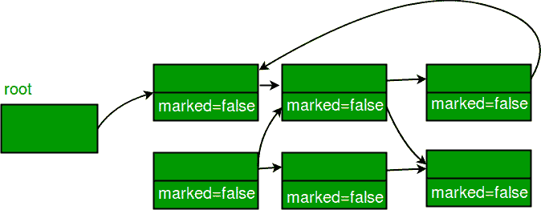
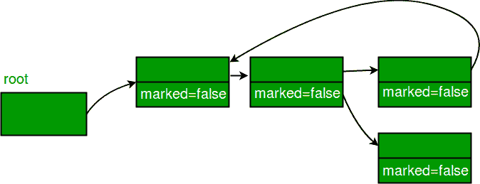

# 标记和清除:垃圾收集算法

> 原文:[https://www . geesforgeks . org/mark-and-sweep-垃圾收集-算法/](https://www.geeksforgeeks.org/mark-and-sweep-garbage-collection-algorithm/)

后台运行的[垃圾回收](https://www.geeksforgeeks.org/garbage-collection-java/)算法有很多，其中一个就是标记和清除。

所有动态创建的对象(在 C++和 Java 中使用 new)都在堆中分配内存。如果我们继续创建对象，我们可能会出现内存不足错误，因为不可能将堆内存分配给对象。因此，我们需要通过释放程序不再引用的所有对象(或不可访问的对象)的内存来清除堆内存，以便为后续的新对象腾出空间。这个内存可以由程序员自己释放，但是对程序员来说这似乎是一个开销，这里垃圾收集来拯救我们，它会自动释放所有未引用对象的堆内存。

### 标记和扫描算法

任何垃圾收集算法都必须执行 2 个基本操作。首先，它应该能够检测所有不可到达的对象，其次，它必须回收垃圾对象使用的堆空间，并使该空间再次可供程序使用。上述操作由标记和扫描算法分两个阶段执行，如下所示:

*   标记阶段
*   扫描阶段

### 阶段 1:标记阶段

创建对象时，其标记位设置为 0(假)。在标记阶段，我们将所有可到达对象(或用户可以引用的对象)的标记位设置为 1(真)。现在要执行这个操作，我们只需要遍历一个图，深度优先搜索方法对我们来说是可行的。在这里，我们可以将每个对象视为一个节点，然后从这个节点(对象)可到达的所有节点(对象)都被访问，并且一直持续到我们访问了所有可到达的节点。

*   根是一个引用对象的变量，可由局部变量直接访问。我们将假设我们只有一个根。
*   我们可以通过*‘标记位(obj)’*来访问对象的标记位。

**算法:**标记相位

```java
Mark(root)
If markedBit(root) = false then
                     markedBit(root) = true
                                       For each v referenced by root
                                       Mark(v)
```

> **注意:**如果我们有多个根，那么我们只需要为所有的根变量调用 Mark()。

### 阶段 2:扫描阶段

顾名思义，它“扫描”不可达对象，即清除所有不可达对象的堆内存。标记值设置为 false 的所有对象都从堆内存中清除，对于所有其他对象(可达对象)，标记位设置为 true。
现在所有可到达对象的标记值被设置为 false，因为我们将运行算法(如果需要)，并且我们将再次通过标记阶段来标记所有可到达对象。

**算法:**扫描阶段

```java
Sweep()
For each object p in heap
If markedBit(p) = true then
                  markedBit(p) = false
                                 else
                                     heap.release(p)
```

标记和清除算法被称为跟踪垃圾收集器，因为它跟踪程序可以直接或间接访问的整个对象集合。

**示例:**

**A.** 所有对象的标记位都设置为假。



**B.** 可达对象标记为真


**C.** 从堆中清除不可访问的对象。



**标记和扫描算法的优势如下:**

*   它处理循环引用的情况，即使在循环的情况下，这个算法也不会在无限循环中结束。
*   算法执行过程中不会产生额外的开销。

**标记和扫描算法的缺点如下:**

*   标记和清除方法的主要缺点是，当垃圾收集算法运行时，正常的程序执行被暂停。
*   另一个缺点是，在一个程序上多次运行标记和扫描算法后，可到达的对象最终会被许多小的未使用的内存区域分隔开。请看下图，以便更好地理解。


这里白色块表示空闲内存，而灰色块表示所有可到达对象占用的内存。

现在自由段(用白色表示)的大小不同，假设 5 个自由段的大小为 1、1、2、3、5(单位大小)。
现在我们需要创建一个占用 10 个内存单元的对象，现在假设内存只能以块的连续形式分配，虽然我们有 12 个单元的可用内存空间，但创建一个对象是不可能的，这将导致 **OutOfMemory 错误**。

这个问题被称为“碎片化”。我们在“片段”中有可用的内存，但是我们无法利用这些内存空间。我们可以通过压缩来减少碎片；我们对内存内容进行洗牌，将所有空闲内存块放在一起，形成一个大块。现在考虑上面的例子，在压缩之后，我们有一个大小为 12 个单位的连续空闲内存块，所以现在我们可以为一个大小为 10 个单位的对象分配内存。

本文由 **Chirag Agarwal 供稿。**如果你喜欢 GeeksforGeeks 并想投稿，你也可以写一篇文章，把你的文章邮寄到 review-team@geeksforgeeks.org。看到你的文章出现在极客博客主页上，帮助其他极客。如果你发现任何不正确的地方，或者你想分享更多关于上面讨论的话题的信息，请写评论。