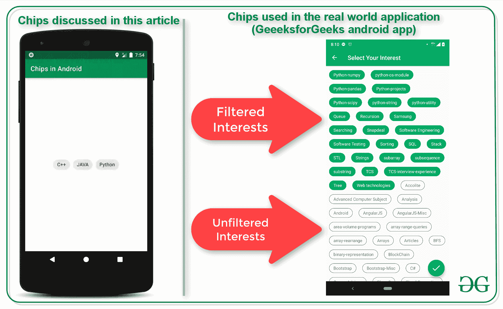
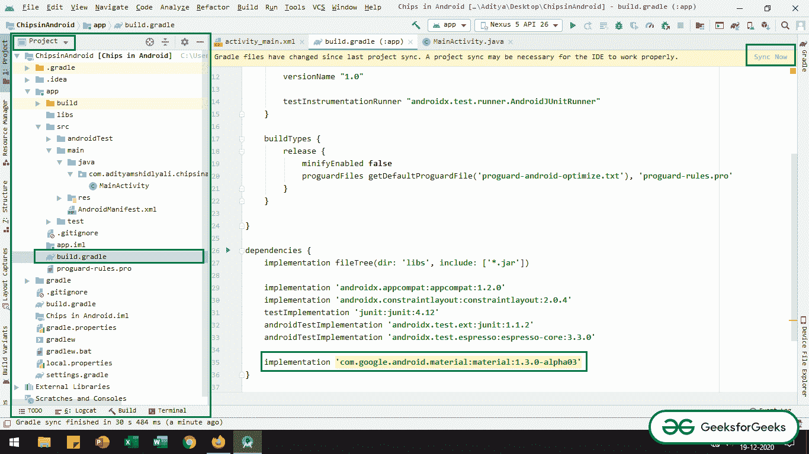

# 安卓系统中的材料设计组件芯片示例

> 原文:[https://www . geesforgeks . org/material-design-components-chips-in-Android-with-example/](https://www.geeksforgeeks.org/material-design-components-chips-in-android-with-example/)

安卓系统中的芯片是用来制作选择过滤器、动作和在安卓窗口的紧凑区域显示可选选项的组件之一。在本文中，已经讨论了如何实现用于选项过滤的基本可选芯片。请看下面的图片，了解进一步讨论的内容。注意，我们将使用 **Java** 语言来实现这个项目。



## **在安卓系统中实现可选芯片的步骤**

**第一步:创建一个空项目**

*   创建一个空的活动安卓工作室项目。参考[安卓|如何在安卓工作室创建/启动新项目？](https://www.geeksforgeeks.org/android-how-to-create-start-a-new-project-in-android-studio/)了解如何创建一个空的活动 Android Studio 项目。
*   注意选择 **Java** 作为编程语言。

**第二步:将依赖项添加到应用级渐变文件**

*   当前项目需要材料设计相关性。
*   在应用级渐变文件中调用以下依赖项。
*   确保系统连接到网络，以便安卓工作室可以下载所需的文件。
*   点击右上角的**“立即同步”**按钮。

> **实现‘com . Google . Android . material:material:1 . 3 . 0-alpha 03’**

*   如果找不到应用程序级渐变文件并调用依赖关系，请参考下图。



**步骤 3:使用 activity_main.xml 文件**

*   在 Android 中实现基本芯片所需的标签如下:

> **com . Google . Android . material . chip . chip**

*   若要在布局中实现相同的，请调用以下代码。这个布局包括一个非常基本的芯片，来自材料设计依赖。

## 可扩展标记语言

```java
<?xml version="1.0" encoding="utf-8"?>
<RelativeLayout 
    xmlns:android="http://schemas.android.com/apk/res/android"
    xmlns:tools="http://schemas.android.com/tools"
    android:layout_width="match_parent"
    android:layout_height="match_parent"
    tools:context=".MainActivity"
    tools:ignore="HardcodedText">

    <com.google.android.material.chip.Chip
        android:id="@+id/chipCpp"
        android:layout_width="wrap_content"
        android:layout_height="wrap_content"
        android:layout_centerHorizontal="true"
        android:layout_marginTop="64dp"
        android:text="GEEKS FOR GEEKS" />

</RelativeLayout>
```

**输出 UI:**

<video class="wp-video-shortcode" id="video-532539-1" width="640" height="360" preload="metadata" controls=""><source type="video/mp4" src="https://media.geeksforgeeks.org/wp-content/uploads/20201222083917/GFG_nexus_5.mp4?_=1">[https://media.geeksforgeeks.org/wp-content/uploads/20201222083917/GFG_nexus_5.mp4](https://media.geeksforgeeks.org/wp-content/uploads/20201222083917/GFG_nexus_5.mp4)</video>

**第四步:处理 MainActivity.java 文件中的芯片**

*   与普通按钮一样，使用“**OnClickListener”**处理材料设计芯片按钮。
*   调用**MainaActivity.java**文件中的以下代码来处理芯片按钮，它显示了简单的 Toast 消息。

## Java 语言(一种计算机语言，尤用于创建网站)

```java
import androidx.appcompat.app.AppCompatActivity;
import android.os.Bundle;
import android.view.View;
import android.widget.Toast;
import com.google.android.material.chip.Chip;

public class MainActivity extends AppCompatActivity {

    Chip chip1;

    @Override
    protected void onCreate(Bundle savedInstanceState) {
        super.onCreate(savedInstanceState);
        setContentView(R.layout.activity_main);

          // chips is handled using the 
          // normal OnClickListener callback
        chip1 = findViewById(R.id.chipGfg);
        chip1.setOnClickListener(new View.OnClickListener() {
            @Override
            public void onClick(View v) {
                Toast.makeText(MainActivity.this, "Action Completed", Toast.LENGTH_SHORT).show();
            }
        });
    }
}
```

### **输出:在仿真器上运行**

<video class="wp-video-shortcode" id="video-532539-2" width="640" height="360" preload="metadata" controls=""><source type="video/mp4" src="https://media.geeksforgeeks.org/wp-content/uploads/20201222091308/GFG_nexus_5.mp4?_=2">[https://media.geeksforgeeks.org/wp-content/uploads/20201222091308/GFG_nexus_5.mp4](https://media.geeksforgeeks.org/wp-content/uploads/20201222091308/GFG_nexus_5.mp4)</video>

## **使芯片可选**

*   为了使芯片在安卓系统中可选，芯片组需要实现而不是单个芯片。
*   这有助于过滤用户选择的选项。
*   要在 android 中实现芯片组，请调用 **activity_main.xml** 文件中的以下代码。

## 可扩展标记语言

```java
<?xml version="1.0" encoding="utf-8"?>
<RelativeLayout 
    xmlns:android="http://schemas.android.com/apk/res/android"
    xmlns:tools="http://schemas.android.com/tools"
    android:layout_width="match_parent"
    android:layout_height="match_parent"
    tools:context=".MainActivity"
    tools:ignore="HardcodedText">

    <!--make sure to group the chips-->
    <!--style attribute is mandatory
         for each of the chips-->
    <com.google.android.material.chip.ChipGroup
        android:layout_width="wrap_content"
        android:layout_height="wrap_content"
        android:layout_centerInParent="true">

        <com.google.android.material.chip.Chip
            android:id="@+id/chipCpp"
            style="@style/Widget.MaterialComponents.Chip.Filter"
            android:layout_width="wrap_content"
            android:layout_height="wrap_content"
            android:text="C++" />

        <com.google.android.material.chip.Chip
            android:id="@+id/chipJava"
            style="@style/Widget.MaterialComponents.Chip.Filter"
            android:layout_width="wrap_content"
            android:layout_height="wrap_content"
            android:text="JAVA" />

        <com.google.android.material.chip.Chip
            android:id="@+id/chipPython"
            style="@style/Widget.MaterialComponents.Chip.Filter"
            android:layout_width="wrap_content"
            android:layout_height="wrap_content"
            android:text="Python" />

    </com.google.android.material.chip.ChipGroup>

</RelativeLayout>
```

*   要处理芯片的选择，无论芯片是否被用户过滤，调用**MainActivity.java**文件中的以下代码。

## Java 语言(一种计算机语言，尤用于创建网站)

```java
import androidx.appcompat.app.AppCompatActivity;
import android.os.Bundle;
import android.view.View;
import android.widget.Toast;
import com.google.android.material.chip.Chip;

public class MainActivity extends AppCompatActivity {

    Chip chipCpp, chipJava, chipPython;

    @Override
    protected void onCreate(Bundle savedInstanceState) {
        super.onCreate(savedInstanceState);
        setContentView(R.layout.activity_main);

        chipCpp = findViewById(R.id.chipCpp);
        chipJava = findViewById(R.id.chipJava);
        chipPython = findViewById(R.id.chipPython);

        chipCpp.setOnClickListener(new View.OnClickListener() {
            @Override
            public void onClick(View v) {
                // check whether the chips is filtered by user
                  // or not and give the suitable Toast message
                if (chipCpp.isChecked()) {
                    Toast.makeText(MainActivity.this, "C++ selected", Toast.LENGTH_SHORT).show();
                } else {
                    Toast.makeText(MainActivity.this, "C++ deselected", Toast.LENGTH_SHORT).show();
                }
            }
        });

        chipJava.setOnClickListener(new View.OnClickListener() {
            @Override
            public void onClick(View v) {
                // check whether the chips is filtered by user or
                  // not and give the suitable Toast message
                if (chipJava.isChecked()) {
                    Toast.makeText(MainActivity.this, "JAVA selected", Toast.LENGTH_SHORT).show();
                } else {
                    Toast.makeText(MainActivity.this, "JAVA deselected", Toast.LENGTH_SHORT).show();
                }
            }
        });

        chipPython.setOnClickListener(new View.OnClickListener() {
            @Override
            public void onClick(View v) {
                // check whether the chips is filtered by user or 
                  // not and give the suitable Toast message
                if (chipPython.isChecked()) {
                    Toast.makeText(MainActivity.this, "Python selected", Toast.LENGTH_SHORT).show();
                } else {
                    Toast.makeText(MainActivity.this, "Python deselected", Toast.LENGTH_SHORT).show();
                }
            }
        });

    }
}
```

### **输出:在仿真器上运行**

<video class="wp-video-shortcode" id="video-532539-3" width="640" height="360" preload="metadata" controls=""><source type="video/mp4" src="https://media.geeksforgeeks.org/wp-content/uploads/20201223195938/GFG_nexus_5.mp4?_=3">[https://media.geeksforgeeks.org/wp-content/uploads/20201223195938/GFG_nexus_5.mp4](https://media.geeksforgeeks.org/wp-content/uploads/20201223195938/GFG_nexus_5.mp4)</video>